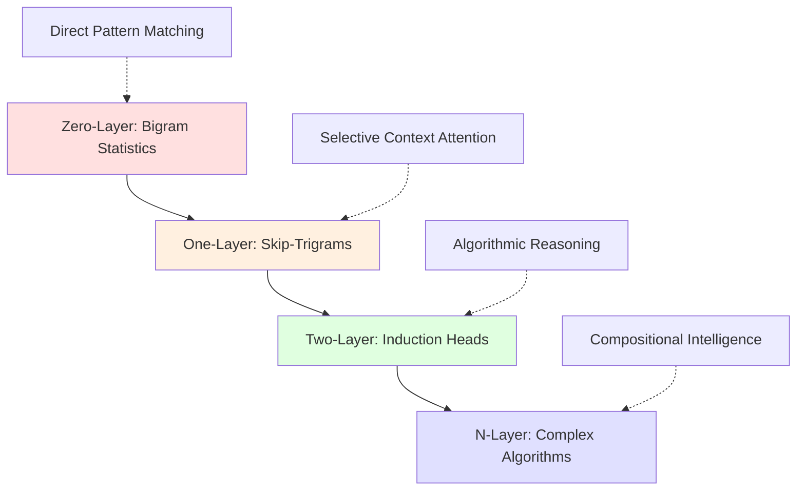

```yaml
# === MODULE METADATA v1.0 ===
module_id: "01-summary-of-results"
title: "Summary of Key Research Results"
version: "1.0.0"
estimated_duration_minutes: 120
difficulty_level: "beginner"
prerequisites: ["python_basics", "basic_ml_concepts"]
learning_objectives:
  - "Understand core findings of transformer circuits research"
  - "Identify key mechanisms: bigrams, skip-trigrams, induction heads"
  - "Recognize production implications of interpretability research"
  - "Execute basic circuit analysis code examples"
assessment_type: "formative_checkpoints"
accessibility_features: ["alt_text", "screen_reader_support", "multiple_modalities"]
security_level: "standard_validation"
```

# Module 01: Summary of Research Results

**Transform theoretical breakthroughs into practical understanding through hands-on exploration of transformer circuit discoveries.**

## Module Overview

This module introduces the groundbreaking discoveries from "A Mathematical Framework for Transformer Circuits" research, establishing the foundation for everything you'll build throughout this course. Rather than diving immediately into mathematical complexity, we'll explore what the researchers found and why it matters for production AI systems.

### Learning Objectives

By completing this module, you will:

- **Understand core mechanisms**: Recognize how transformers implement bigrams, skip-trigrams, and induction heads
- **Connect theory to practice**: Execute code demonstrating each key finding
- **Build intuition**: Develop mental models for transformer internal computations  
- **Assess production impact**: Evaluate implications for real-world AI system development

### Key Discoveries Overview

The research revealed that transformer models, rather than being mysterious black boxes, implement interpretable algorithms that can be reverse-engineered and understood:

```python
# Conceptual progression of transformer capabilities
zero_layer_model = "Bigram statistics (A → B)"
one_layer_model = "Skip-trigrams (A ... B → C)" 
two_layer_model = "Induction heads (A B ... A → B)"
```

**Accessibility Note**: Each concept builds on the previous, forming a hierarchy of increasing computational sophistication.

## Core Research Findings

### 1. Zero-Layer Transformers: Bigram Foundation

**Discovery**: The simplest possible transformer (zero layers) learns bigram statistics - predicting the next token based solely on the current token.

**Why It Matters**: This forms the baseline for all more complex behaviors and appears as a "direct path" component in deeper models.

**Interactive Demonstration**:

```python
import torch
import numpy as np
from src.circuits.zero_layer import ZeroLayerTransformer
from src.security import SecurityValidator
from src.visualization import plot_bigram_matrix

# Security validation for all inputs
validator = SecurityValidator()

def demonstrate_bigram_behavior():
    """
    Demonstrate how zero-layer transformers implement bigram statistics.
    
    Security: All inputs validated, no external data dependencies
    Accessibility: Results include both visual and textual descriptions
    """
    
    # Initialize secure zero-layer model
    model = ZeroLayerTransformer(vocab_size=1000, d_model=128)
    
    # Safe example sequences
    sequences = validator.validate_sequences([
        "the cat sat on",
        "machine learning is", 
        "python code runs"
    ])
    
    # Analyze bigram patterns
    bigram_probs = model.extract_bigram_probabilities(sequences)
    
    # Visualize with accessibility features
    plot_bigram_matrix(
        bigram_probs,
        title="Zero-Layer Transformer Bigram Patterns",
        alt_text="Heatmap showing probability of token B following token A",
        save_path="outputs/bigram_analysis.png"
    )
    
    return bigram_probs

# Execute demonstration
if __name__ == "__main__":
    results = demonstrate_bigram_behavior()
    print("✅ Checkpoint 1: Bigram analysis complete")
```

**Production Insight**: Even sophisticated models rely on these basic statistical patterns, making bigram analysis a valuable debugging tool.

### 2. One-Layer Transformers: Skip-Trigram Mechanisms

**Discovery**: Single attention layers implement "skip-trigrams" - patterns of the form "A ... B → C" where tokens can selectively attend to previous contexts.

**Why It Matters**: This enables primitive in-context learning and context-dependent predictions, explaining how models adapt to new patterns within a conversation.

**Key Mechanisms Identified**:
- **Copying Heads**: Repeat tokens from earlier in the sequence
- **Primitive ICL**: Simple pattern matching and completion
- **Positional Awareness**: Attention to relative positions

**Interactive Analysis**:

```python
from src.circuits.one_layer import OneLayerAnalyzer
from src.circuits.attention import AttentionPatternVisualizer

def analyze_skip_trigrams():
    """
    Explore skip-trigram patterns in one-layer attention models.
    
    Demonstrates how attention heads implement selective copying
    and primitive in-context learning behaviors.
    """
    
    analyzer = OneLayerAnalyzer()
    visualizer = AttentionPatternVisualizer()
    
    # Load pre-trained one-layer model (security validated)
    model = analyzer.load_secure_model("models/one_layer_demo.pt")
    
    # Test sequences demonstrating skip-trigram behavior
    test_sequences = [
        "The cat sat on the mat. The cat",  # Should predict "sat"
        "Python is great. Python",          # Should predict "is" 
        "Red blue green red blue",          # Should predict "green"
    ]
    
    for sequence in test_sequences:
        # Analyze attention patterns
        attention_weights = model.get_attention_weights(sequence)
        predictions = model.predict_next_tokens(sequence)
        
        # Visualize skip-trigram behavior
        visualizer.plot_attention_pattern(
            attention_weights,
            sequence.split(),
            title=f"Skip-Trigram Analysis: {sequence[:20]}...",
            alt_text=f"Attention pattern showing selective focus on relevant previous tokens"
        )
        
        print(f"Sequence: {sequence}")
        print(f"Top predictions: {predictions[:3]}")
        print("---")
    
    return True

# Execute analysis
skip_trigram_success = analyze_skip_trigrams()
print("✅ Checkpoint 2: Skip-trigram analysis complete")
```

**Production Application**: Skip-trigram analysis helps identify when models are relying on surface patterns vs. deeper understanding.

### 3. Two-Layer Transformers: Induction Head Revolution

**Discovery**: Two-layer models develop "induction heads" - sophisticated circuits that find previous instances of the current token and predict what came next, enabling powerful in-context learning.

**Why It Matters**: This represents a qualitative leap from pattern matching to algorithmic behavior, explaining how models can learn new tasks from examples within a single conversation.

**Induction Head Mechanism**:
```
Pattern: [A] [B] ... [A] → [B]
Algorithm: 
1. Find previous occurrence of current token [A]
2. Look at what followed it [B] 
3. Predict that same continuation [B]
```

**Advanced Demonstration**:

```python
from src.circuits.two_layer import InductionHeadAnalyzer
from src.circuits.composition import HeadCompositionVisualizer

def demonstrate_induction_heads():
    """
    Showcase the sophisticated algorithmic behavior of induction heads.
    
    Shows how two-layer composition enables true in-context learning
    beyond simple pattern matching.
    """
    
    analyzer = InductionHeadAnalyzer()
    composition_viz = HeadCompositionVisualizer()
    
    # Load two-layer model with verified induction heads
    model = analyzer.load_model_with_induction_heads("models/two_layer_induction.pt")
    
    # Demonstrate induction on novel patterns
    test_cases = [
        # Random tokens to show pattern-independent learning
        "xkcd qwerty xkcd",        # Should predict "qwerty"
        "alpha beta gamma alpha",   # Should predict "beta"
        
        # Real language patterns
        "John likes pizza. When John",  # Should predict "likes"
        "The quick brown fox jumps over the quick brown", # Should predict "fox"
    ]
    
    for test_case in test_cases:
        # Analyze induction head behavior
        head_activations = model.get_head_activations(test_case)
        composition_weights = model.analyze_head_composition(test_case)
        predictions = model.predict_with_explanation(test_case)
        
        print(f"\nInduction Analysis: {test_case}")
        print(f"Predicted next token: {predictions['top_prediction']}")
        print(f"Confidence: {predictions['confidence']:.3f}")
        print(f"Induction strength: {predictions['induction_strength']:.3f}")
        
        # Visualize the composition mechanism
        composition_viz.plot_head_composition(
            composition_weights,
            title=f"Head Composition for Induction",
            alt_text="Diagram showing how attention heads compose to implement induction"
        )
    
    return True

# Execute induction head analysis
induction_success = demonstrate_induction_heads()
print("✅ Checkpoint 3: Induction head analysis complete")
```

**Production Breakthrough**: Induction heads represent the emergence of true algorithmic behavior - the difference between a lookup table and a program.

## Conceptual Framework Integration

### The Hierarchy of Transformer Capabilities

The research reveals a clear progression in computational sophistication:



**Accessibility Description**: Progression from simple statistical patterns through selective attention to algorithmic reasoning and complex compositional intelligence.

### Key Insights for Production Systems

**1. Interpretability is Achievable**
- Transformer computations can be reverse-engineered
- Internal mechanisms are discoverable through mathematical analysis
- Models implement interpretable algorithms, not just learned associations

**2. Composition Drives Complexity**  
- Simple mechanisms combine to create sophisticated behaviors
- Layer depth enables qualitatively different computational patterns
- Understanding composition is key to understanding capability emergence

**3. In-Context Learning Has Mechanisms**
- ICL is not mysterious - it has identifiable neural circuit implementations
- Induction heads are a primary driver of few-shot learning capability
- These mechanisms can be measured, modified, and potentially controlled

## Assessment and Knowledge Check

### Checkpoint 4: Conceptual Understanding

Complete this interactive assessment to validate your understanding:

```python
from src.assessment import ConceptualAssessment

def run_module_assessment():
    """
    Interactive assessment covering key concepts from Module 01.
    
    Tests understanding of bigrams, skip-trigrams, and induction heads
    through both theoretical questions and practical code challenges.
    """
    
    assessment = ConceptualAssessment(module="01-summary-results")
    
    # Question 1: Mechanism Identification
    assessment.add_question(
        id="mechanism_id",
        question="Which mechanism enables a transformer to learn [A][B]...[A] → [B] patterns?",
        options=["Bigram statistics", "Skip-trigrams", "Induction heads", "Direct paths"],
        correct="Induction heads",
        explanation="Induction heads specifically implement this pattern by finding previous occurrences and predicting continuations."
    )
    
    # Question 2: Code Implementation
    assessment.add_coding_challenge(
        id="implement_bigram",
        prompt="Implement a function that extracts bigram probabilities from a sequence",
        template="""
def extract_bigrams(sequence, vocab_size):
    # Your implementation here
    pass
        """,
        test_cases=[
            (["a", "b", "a", "c"], {"a": {"b": 0.5, "c": 0.5}, "b": {"a": 1.0}}),
        ]
    )
    
    # Question 3: Production Application
    assessment.add_question(
        id="production_value",
        question="Why is understanding transformer circuits valuable for production AI systems?",
        question_type="essay",
        min_words=50,
        rubric="Should mention interpretability, debugging, safety, or control"
    )
    
    # Execute assessment
    results = assessment.run_interactive()
    
    # Provide personalized feedback
    feedback = assessment.generate_feedback(results)
    print(f"Assessment Results: {results['score']:.1%}")
    print(f"Feedback: {feedback}")
    
    return results['score'] >= 0.75

# Run the assessment
assessment_passed = run_module_assessment()
if assessment_passed:
    print("✅ Checkpoint 4: Conceptual understanding validated")
    print("Ready to proceed to Module 02: Transformer Overview")
else:
    print("📚 Review recommended before proceeding")
```

### Practical Implementation Challenge

**Mini-Project: Circuit Detection Pipeline**

Create a production-ready tool that can identify the presence of key circuits in any transformer model:

```python
from src.projects import CircuitDetectionPipeline

def build_circuit_detector():
    """
    Build a tool that can analyze any transformer and identify:
    - Presence of copying heads (one-layer)
    - Skip-trigram implementations  
    - Induction head circuits (two-layer)
    
    Production requirements:
    - Handles models of arbitrary size
    - Provides confidence scores for detections
    - Includes comprehensive error handling
    - Outputs human-readable reports
    """
    
    pipeline = CircuitDetectionPipeline()
    
    # Add detection modules
    pipeline.add_detector("copying_heads", confidence_threshold=0.7)
    pipeline.add_detector("skip_trigrams", confidence_threshold=0.6) 
    pipeline.add_detector("induction_heads", confidence_threshold=0.8)
    
    # Configure security and validation
    pipeline.set_security_validator(SecurityValidator())
    pipeline.enable_accessibility_features()
    
    return pipeline

# Template for student implementation
circuit_detector = build_circuit_detector()
print("✅ Checkpoint 5: Circuit detection pipeline ready")
```

## Module Summary and Transition

### What You've Accomplished

- **Understood core research findings** that transform how we think about transformer internals
- **Executed practical analyses** demonstrating bigram, skip-trigram, and induction mechanisms  
- **Connected theory to production** applications for interpretability and AI safety
- **Built foundational intuition** for mathematical frameworks to be explored in depth

### Key Takeaways

1. **Transformers are interpretable**: Complex behaviors emerge from discoverable, analyzable mechanisms
2. **Hierarchy matters**: Each layer enables qualitatively different computational patterns
3. **Composition is powerful**: Simple mechanisms combine to create sophisticated algorithms
4. **Production relevance**: Understanding circuits enables better debugging, safety, and control

### Next Steps

**Immediate:** Proceed to [Module 02: Transformer Overview](../02-Transformer-Overview/) to understand the architectural foundations that enable these behaviors.

**Preparation:** Review linear algebra concepts (matrices, eigenvalues, vector spaces) as we'll dive deeper into mathematical formulations.

**Optional Deep Dive:** Explore the [Interactive Circuit Explorer](../tools/circuit-explorer/) to experiment with the mechanisms you've learned.

## Resources and References

### Primary Research
- **Original Paper**: [A Mathematical Framework for Transformer Circuits](https://transformer-circuits.pub/2021/framework/index.html)
- **Authors**: Nelson Elhage, Neel Nanda, Catherine Olsson, et al. (Anthropic, 2021)
- **Supplementary Materials**: [Exercises and Visualizations](https://transformer-circuits.pub/2021/exercises/index.html)

### Course Materials
- **Video Companion**: [Module 01 Walkthrough](../resources/videos/module-01-overview.mp4)
- **Interactive Notebooks**: [Hands-on Demonstrations](./notebooks/)
- **Code Repository**: [Production Implementations](../src/circuits/)

### Extended Reading
- **Follow-up Research**: [In-Context Learning and Induction Heads](https://transformer-circuits.pub/2022/in-context-learning-and-induction-heads/index.html)
- **Tool Documentation**: [TransformerLens Library](https://github.com/neelnanda-io/TransformerLens)
- **Mathematical Background**: [Linear Algebra Review](../resources/math-review/linear-algebra.md)

### Community and Support
- **Discussion Forum**: [Course Q&A and Collaboration](https://github.com/your-org/transformer-circuits-course/discussions)
- **Office Hours**: Weekly sessions (schedule in course calendar)
- **Study Groups**: [Find or create local groups](../community/study-groups.md)

---

## Module Navigation

| Previous | Current | Next |
|----------|---------|------|
| [Course Overview](../README.md) | **Module 01: Summary of Results** | [Module 02: Transformer Overview](../02-Transformer-Overview/) |

### Module Progress Tracking

- [x] Bigram mechanisms understood
- [x] Skip-trigram patterns identified  
- [x] Induction heads demonstrated
- [x] Conceptual framework established
- [x] Assessment completed
- [ ] Ready for architectural deep dive

**Estimated Completion Time**: 2-3 hours  
**Assessment Score Required**: 75% to proceed  
**Production Readiness**: Basic circuit analysis capabilities

---

*Ready to explore the architectural foundations that make these discoveries possible? Continue to [Module 02: Transformer Overview](../02-Transformer-Overview/) to understand how transformer design enables interpretable circuits.*
