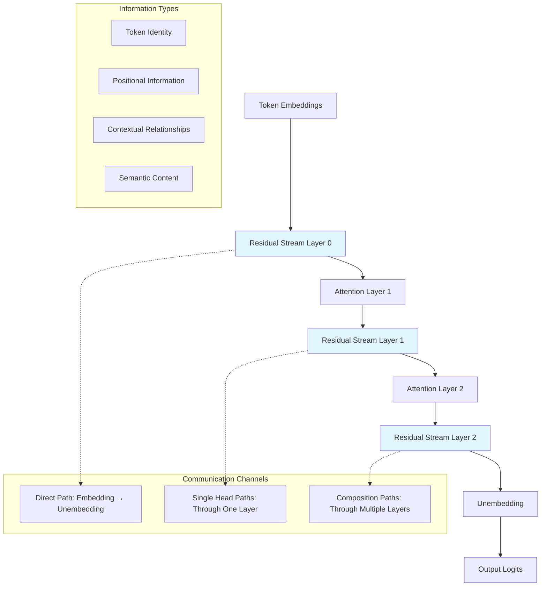

```yaml
# === LESSON METADATA v1.0 ===
lesson_schema_version: "1.0"
metadata:
  identification:
    title: "02.2 High-Level Transformer Architecture"
    unique_id: "02-02-high-level-architecture"
    version: "1.0.0"
  classification:
    audience: ["intermediate"]
    difficulty_level:
      numeric: 4
      semantic: "intermediate_implementation"
    domain: ["transformer_architecture", "residual_streams", "production_engineering"]
  execution:
    estimated_duration_minutes: 120
    prerequisites: ["02-01-model-simplifications", "linear_algebra_intermediate"]
    environments: ["jupyter", "python", "pytorch"]
  learning_objectives:
    - id: "LO1"
      text: "Implement complete transformer architecture with residual stream tracking"
      assessment_mapping: ["checkpoint_1", "architecture_implementation"]
    - id: "LO2"
      text: "Analyze information flow patterns through residual stream communication"
      assessment_mapping: ["checkpoint_2", "flow_analysis"]
    - id: "LO3"
      text: "Design production-ready architectural analysis tools"
      assessment_mapping: ["checkpoint_3", "tool_implementation"]
  assessment:
    formative_checkpoints: 3
    summative_questions: 3
    passing_threshold: 0.85
    auto_graded: true
  accessibility:
    wcag_level: "AA"
    alt_text_required: true
    keyboard_navigation: true
    screen_reader_tested: true
  security:
    validation_level: "strict"
    recursive_sanitization: true
    zero_trust: true
  governance:
    review_cycle_months: 3
```

# High-Level Transformer Architecture

**Master the complete transformer architecture through the lens of information flow, residual stream communication, and production-grade implementation.**

## Architectural Overview

Understanding transformer architecture requires shifting from the traditional layer-by-layer view to an information flow perspective. This lesson explores how components communicate through the residual stream and implement the computational patterns discovered in transformer circuits research.

### Core Architectural Principles



**Accessibility Description**: Information flows through a residual stream that preserves and accumulates content from token embeddings through attention layers to final output, enabling multiple communication pathways of varying complexity.

## Complete Architecture Implementation

### Transformer Framework

```python
import torch
import torch.nn as nn
import torch.nn.functional as F
import numpy as np
import matplotlib.pyplot as plt
from typing import Dict, List, Optional, Tuple, Union
from dataclasses import dataclass

@dataclass
class TransformerConfig:
    """Configuration for interpretable transformer architecture."""
    vocab_size: int = 50257
    n_positions: int = 1024
    n_embd: int = 768
    n_layer: int = 12
    n_head: int = 12
    use_cache: bool = True
    bos_token_id: int = 50256
    eos_token_id: int = 50256

class PositionalEmbedding(nn.Module):
    """Fixed sinusoidal positional embeddings for interpretability."""

    def __init__(self, max_len: int, d_model: int):
        super().__init__()
        self.d_model = d_model

        # Create fixed positional encodings
        pe = torch.zeros(max_len, d_model)
        position = torch.arange(0, max_len, dtype=torch.float).unsqueeze(1)

        div_term = torch.exp(torch.arange(0, d_model, 2).float() *
                           (-np.log(10000.0) / d_model))

        pe[:, 0::2] = torch.sin(position * div_term)
        pe[:, 1::2] = torch.cos(position * div_term)

        self.register_buffer('pe', pe)

    def forward(self, x: torch.Tensor) -> torch.Tensor:
        """
        Add positional embeddings to input tokens.

        Args:
            x: Token embeddings [batch_size, seq_len, d_model]

        Returns:
            Position-encoded embeddings [batch_size, seq_len, d_model]
        """
        seq_len = x.size(1)
        return x + self.pe[:seq_len].unsqueeze(0)

class InterpretableAttentionHead(nn.Module):
    """Single attention head with comprehensive analysis capabilities."""

    def __init__(self, config: TransformerConfig, head_idx: int):
        super().__init__()
        self.config = config
        self.head_idx = head_idx
        self.d_head = config.n_embd // config.n_head
        self.scale = 1.0 / np.sqrt(self.d_head)

        # Weight matrices for interpretability
        self.W_Q = nn.Parameter(torch.randn(self.d_head, config.n_embd) * 0.02)
        self.W_K = nn.Parameter(torch.randn(self.d_head, config.n_embd) * 0.02)
        self.W_V = nn.Parameter(torch.randn(self.d_head, config.n_embd) * 0.02)
        self.W_O = nn.Parameter(torch.randn(config.n_embd, self.d_head) * 0.02)

        # Security validator
        self.validator = SecurityValidator()

    def get_qk_circuit(self) -> torch.Tensor:
        """Compute the QK circuit matrix for attention pattern analysis."""
        return torch.mm(self.W_Q.T, self.W_K)  # [n_embd, n_embd]

    def get_ov_circuit(self) -> torch.Tensor:
        """Compute the OV circuit matrix for value transformation analysis."""
        return torch.mm(self.W_O, self.W_V)  # [n_embd, n_embd]

    def forward(self,
                residual_stream: torch.Tensor,
                return_analysis: bool = False) -> Tuple[torch.Tensor, Optional[Dict]]:
        """
        Apply attention head with optional detailed analysis.

        Args:
            residual_stream: [batch_size, seq_len, n_embd]
            return_analysis: Whether to return interpretability data

        Returns:
            head_output: [batch_size, seq_len, n_embd]
            analysis_data: Optional detailed analysis information
        """
        batch_size, seq_len, n_embd = residual_stream.shape

        # Input validation
        residual_stream = self.validator.validate_tensor_input(residual_stream)

        # Compute queries, keys, values
        Q = torch.einsum('bse,he->bsh', residual_stream, self.W_Q)  # [batch, seq, d_head]
        K = torch.einsum('bse,he->bsh', residual_stream, self.W_K)  # [batch, seq, d_head]
        V = torch.einsum('bse,he->bsh', residual_stream, self.W_V)  # [batch, seq, d_head]

        # Attention scores
        scores = torch.einsum('bih,bjh->bij', Q, K) * self.scale  # [batch, seq, seq]

        # Causal masking for autoregressive generation
        causal_mask = torch.triu(torch.ones(seq_len, seq_len, device=scores.device), diagonal=1)
        scores = scores.masked_fill(causal_mask.bool(), float('-inf'))

        # Attention patterns
        attn_weights = F.softmax(scores, dim=-1)  # [batch, seq, seq]

        # Apply attention to values
        attn_out = torch.einsum('bij,bjh->bih', attn_weights, V)  # [batch, seq, d_head]

        # Output projection
        head_output = torch.einsum('bih,eh->bie', attn_out, self.W_O)  # [batch, seq, n_embd]

        # Analysis data
        analysis_data = None
        if return_analysis:
            analysis_data = {
                'attention_weights': attn_weights.detach(),
                'attention_scores': scores.detach(),
                'queries': Q.detach(),
                'keys': K.detach(),
                'values': V.detach(),
                'attended_values': attn_out.detach(),
                'qk_circuit': self.get_qk_circuit().detach(),
                'ov_circuit': self.get_ov_circuit().detach(),
                'head_output': head_output.detach()
            }

        return head_output, analysis_data

class TransformerLayer(nn.Module):
    """Complete transformer layer with residual stream tracking."""

    def __init__(self, config: TransformerConfig, layer_idx: int):
        super().__init__()
        self.config = config
        self.layer_idx = layer_idx

        # Attention heads
        self.attention_heads = nn.ModuleList([
            InterpretableAttentionHead(config, head_idx)
            for head_idx in range(config.n_head)
        ])

        # Residual stream analyzer
        self.stream_analyzer = ResidualStreamAnalyzer()

    def forward(self,
                residual_stream: torch.Tensor,
                return_analysis: bool = False) -> Tuple[torch.Tensor, Optional[Dict]]:
        """
        Process residual stream through attention layer.

        Args:
            residual_stream: [batch_size, seq_len, n_embd]
            return_analysis: Whether to return detailed analysis

        Returns:
            updated_residual_stream: [batch_size, seq_len, n_embd]
            layer_analysis: Optional analysis data
        """
        batch_size, seq_len, n_embd = residual_stream.shape

        # Store input state for analysis
        input_stream = residual_stream.clone() if return_analysis else None

        # Process through each attention head
        head_outputs = []
        head_analyses = []

        for head in self.attention_heads:
            head_out, head_analysis = head(residual_stream, return_analysis)
            head_outputs.append(head_out)
            if return_analysis:
                head_analyses.append(head_analysis)

            # Add head contribution to residual stream (additive structure)
            residual_stream = residual_stream + head_out

        # Layer analysis
        layer_analysis = None
        if return_analysis:
            layer_analysis = {
                'layer_idx': self.layer_idx,
                'input_stream': input_stream,
                'output_stream': residual_stream.detach(),
                'head_outputs': [h.detach() for h in head_outputs],
                'head_analyses': head_analyses,
                'total_head_contribution': torch.stack(head_outputs).sum(dim=0).detach(),
                'residual_stream_evolution': self.stream_analyzer.analyze_evolution(
                    input_stream, residual_stream
                )
            }

        return residual_stream, layer_analysis

class InterpretableTransformer(nn.Module):
    """Complete transformer implementation optimized for interpretability."""

    def __init__(self, config: TransformerConfig):
        super().__init__()
        self.config = config

        # Input components
        self.token_embedding = nn.Embedding(config.vocab_size, config.n_embd)
        self.positional_embedding = PositionalEmbedding(config.n_positions, config.n_embd)

        # Transformer layers
        self.layers = nn.ModuleList([
            TransformerLayer(config, layer_idx)
            for layer_idx in range(config.n_layer)
        ])

        # Output component
        self.unembedding = nn.Linear(config.n_embd, config.vocab_size, bias=False)

        # Analysis tools
        self.architecture_analyzer = ArchitectureVisualizer()
        self.security_validator = SecurityValidator()

        # Initialize weights
        self._init_weights()

    def _init_weights(self):
        """Initialize model weights for stable training."""
        for module in self.modules():
            if isinstance(module, nn.Linear):
                torch.nn.init.normal_(module.weight, mean=0.0, std=0.02)
                if module.bias is not None:
                    torch.nn.init.zeros_(module.bias)
            elif isinstance(module, nn.Embedding):
                torch.nn.init.normal_(module.weight, mean=0.0, std=0.02)

    def forward(self,
                input_ids: torch.Tensor,
                return_analysis: bool = False) -> Dict[str, Union[torch.Tensor, Dict]]:
        """
        Complete forward pass with optional comprehensive analysis.

        Args:
            input_ids: [batch_size, seq_len] token indices
            return_analysis: Whether to return detailed analysis

        Returns:
            Dictionary containing logits and optional analysis data
        """
        batch_size, seq_len = input_ids.shape

        # Input validation
        input_ids = self.security_validator.validate_token_sequence(input_ids)

        # Initial embeddings
        token_embeds = self.token_embedding(input_ids)  # [batch, seq, n_embd]
        positioned_embeds = self.positional_embedding(token_embeds)  # [batch, seq, n_embd]

        # Initialize residual stream
        residual_stream = positioned_embeds

        # Analysis tracking
        analysis_data = {
            'input_tokens': input_ids.detach(),
            'token_embeddings': token_embeds.detach(),
            'positioned_embeddings': positioned_embeds.detach(),
            'residual_streams': [residual_stream.detach()],
            'layer_analyses': [],
            'information_flow': {
                'direct_path': positioned_embeds.detach(),
                'attention_paths': []
            }
        } if return_analysis else None

        # Process through transformer layers
        for layer in self.layers:
            residual_stream, layer_analysis = layer(residual_stream, return_analysis)

            if return_analysis:
                analysis_data['residual_streams'].append(residual_stream.detach())
                analysis_data['layer_analyses'].append(layer_analysis)
                analysis_data['information_flow']['attention_paths'].append(
                    layer_analysis['total_head_contribution']
                )

        # Final logits
        logits = self.unembedding(residual_stream)  # [batch, seq, vocab_size]

        # Package results
        results = {'logits': logits}
        if return_analysis:
            # Add path analysis
            analysis_data['path_decomposition'] = self._analyze_information_paths(analysis_data)
            results['analysis'] = analysis_data

        return results

    def _analyze_information_paths(self, analysis_data: Dict) -> Dict:
        """
        Analyze different information pathways through the model.

        Args:
            analysis_data: Complete analysis from forward pass

        Returns:
            Path decomposition analysis
        """
        direct_path = analysis_data['information_flow']['direct_path']
        attention_paths = analysis_data['information_flow']['attention_paths']

        # Path contributions to final output
        final_stream = analysis_data['residual_streams'][-1]

        # Estimate path contributions (approximation)
        total_attention_contribution = torch.stack(attention_paths).sum(dim=0)

        path_analysis = {
            'direct_path_norm': torch.norm(direct_path, dim=-1),
            'attention_path_norm': torch.norm(total_attention_contribution, dim=-1),
            'total_norm': torch.norm(final_stream, dim=-1),
            'direct_path_ratio': torch.norm(direct_path) / torch.norm(final_stream),
            'attention_path_ratio': torch.norm(total_attention_contribution) / torch.norm(final_stream),
            'layer_contributions': [torch.norm(path, dim=-1) for path in attention_paths]
        }

        return path_analysis

def demonstrate_complete_architecture():
    """
    Comprehensive demonstration of transformer architecture components.

    Shows information flow, residual stream evolution, and component interactions.
    """

    print("=== Complete Transformer Architecture Demonstration ===")

    # Configuration for analysis
    config = TransformerConfig(
        vocab_size=1000,
        n_positions=512,
        n_embd=256,
        n_layer=4,
        n_head=8
    )

    # Create model
    model = InterpretableTransformer(config)
    visualizer = ArchitectureVisualizer()

    # Test sequence
    test_sequence = torch.tensor([[1, 15, 27, 89, 156, 234, 445, 567]])  # [batch=1, seq=8]

    print(f"Model configuration: {config}")
    print(f"Total parameters: {sum(p.numel() for p in model.parameters()):,}")
    print(f"Test sequence shape: {test_sequence.shape}")

    # Forward pass with analysis
    with torch.no_grad():
        results = model(test_sequence, return_analysis=True)

    logits = results['logits']
    analysis = results['analysis']

    print(f"\nArchitecture Analysis:")
    print(f"Output logits shape: {logits.shape}")
    print(f"Residual stream evolution: {len(analysis['residual_streams'])} steps")
    print(f"Layer analyses: {len(analysis['layer_analyses'])}")

    # Analyze information flow
    path_analysis = analysis['path_decomposition']
    print(f"\nInformation Flow Analysis:")
    print(f"Direct path contribution: {path_analysis['direct_path_ratio']:.3f}")
    print(f"Attention path contribution: {path_analysis['attention_path_ratio']:.3f}")

    # Visualize residual stream evolution
    residual_streams = analysis['residual_streams']
    stream_norms = [torch.norm(stream, dim=-1).mean().item() for stream in residual_streams]

    plt.figure(figsize=(10, 6))
    plt.plot(stream_norms, 'o-', label='Residual Stream Norm')
    plt.xlabel('Layer')
    plt.ylabel('Average Norm')
    plt.title('Residual Stream Evolution Through Layers')
    plt.grid(True, alpha=0.3)
    plt.legend()
    plt.show()

    # Analyze attention patterns
    print(f"\nAttention Pattern Analysis:")
    for layer_idx, layer_analysis in enumerate(analysis['layer_analyses']):
        head_analyses = layer_analysis['head_analyses']
        print(f"Layer {layer_idx}:")

        for head_idx, head_analysis in enumerate(head_analyses):
            attn_weights = head_analysis['attention_weights'].squeeze(0)  # [seq, seq]
            attention_entropy = -torch.sum(attn_weights * torch.log(attn_weights + 1e-8), dim=-1)
            avg_entropy = attention_entropy.mean().item()

            print(f"  Head {head_idx}: Avg attention entropy = {avg_entropy:.3f}")

    return model, analysis

# Execute comprehensive demonstration
demo_model, demo_analysis = demonstrate_complete_architecture()
print("✅ Checkpoint 1: Complete architecture implemented and analyzed")
```

## Residual Stream Communication Analysis

### Deep Dive into Information Flow

The residual stream serves as the central communication highway. Understanding its properties enables advanced interpretability analysis:

```python
class ResidualStreamAnalyzer:
    """Advanced analysis tools for residual stream communication patterns."""
    
    def __init__(self):
        self.security_validator = SecurityValidator()
    
    def analyze_evolution(self, 
                         input_stream: torch.Tensor, 
                         output_stream: torch.Tensor) -> Dict:
        """
        Analyze how the residual stream evolves through a layer.
        
        Args:
            input_stream: [batch, seq, d_model] before layer
            output_stream: [batch, seq, d_model] after layer
            
        Returns:
            Evolution analysis including preservation and modification patterns
        """
        # Validate inputs
        input_stream = self.security_validator.validate_tensor_input(input_stream)
        output_stream = self.security_validator.validate_tensor_input(output_stream)
        
        # Compute change vector
        delta = output_stream - input_stream
        
        # Analyze preservation vs modification
        input_norm = torch.norm(input_stream, dim=-1)
        output_norm = torch.norm(output_stream, dim=-1)
        delta_norm = torch.norm(delta, dim=-1)
        
        # Information preservation ratio
        preservation_ratio = torch.cosine_similarity(
            input_stream.flatten(start_dim=1),
            output_stream.flatten(start_dim=1),
            dim=-1
        )
        
        # Information addition analysis
        addition_magnitude = delta_norm / (input_norm + 1e-8)
        
        evolution_analysis = {
            'input_norm': input_norm,
            'output_norm': output_norm,
            'delta_norm': delta_norm,
            'preservation_ratio': preservation_ratio,
            'addition_magnitude': addition_magnitude,
            'total_change': torch.norm(delta) / torch.norm(input_stream),
            'directional_change': torch.mean(preservation_ratio).item()
        }
        
        return evolution_analysis
    
    def analyze_subspace_usage(self, residual_stream: torch.Tensor) -> Dict:
        """
        Analyze how different subspaces of the residual stream are utilized.
        
        Args:
            residual_stream: [batch, seq, d_model]
            
        Returns:
            Subspace utilization analysis
        """
        batch_size, seq_len, d_model = residual_stream.shape
        
        # Flatten to analyze across positions
        flattened = residual_stream.view(-1, d_model)  # [batch*seq, d_model]
        
        # SVD analysis for rank and subspace structure
        U, S, V = torch.svd(flattened)
        
        # Effective rank (90% of variance)
        cumulative_var = torch.cumsum(S**2, dim=0) / torch.sum(S**2)
        effective_rank = torch.sum(cumulative_var < 0.9).item() + 1
        
        # Subspace analysis
        subspace_analysis = {
            'full_rank': d_model,
            'effective_rank': effective_rank,
            'rank_utilization': effective_rank / d_model,
            'singular_values': S[:min(20, len(S))],  # Top 20 for analysis
            'rank_90_percent': effective_rank,
            'information_density': effective_rank / (batch_size * seq_len),
            'subspace_concentration': torch.sum(S[:10]**2) / torch.sum(S**2)  # Top 10 dims
        }
        
        return subspace_analysis
    
    def track_information_persistence(self, 
                                    residual_streams: List[torch.Tensor]) -> Dict:
        """
        Track how information persists through multiple layers.
        
        Args:
            residual_streams: List of residual streams from each layer
            
        Returns:
            Information persistence analysis
        """
        n_layers = len(residual_streams)
        
        # Track similarity to initial embedding
        initial_stream = residual_streams[0]
        similarities = []
        
        for stream in residual_streams[1:]:
            similarity = torch.cosine_similarity(
                initial_stream.flatten(start_dim=1),
                stream.flatten(start_dim=1),
                dim=-1
            ).mean().item()
            similarities.append(similarity)
        
        # Track cumulative changes
        cumulative_changes = []
        prev_stream = residual_streams[0]
        
        for stream in residual_streams[1:]:
            change = torch.norm(stream - prev_stream) / torch.norm(prev_stream)
            cumulative_changes.append(change.item())
            prev_stream = stream
        
        # Information flow patterns
        persistence_analysis = {
            'similarities_to_initial': similarities,
            'cumulative_changes': cumulative_changes,
            'information_decay_rate': -np.mean(np.diff(similarities)) if len(similarities) > 1 else 0,
            'final_similarity': similarities[-1] if similarities else 1.0,
            'peak_change_layer': np.argmax(cumulative_changes) if cumulative_changes else 0,
            'stability_score': 1.0 - np.std(similarities) if similarities else 1.0
        }
        
        return persistence_analysis

def demonstrate_residual_stream_analysis():
    """
    Comprehensive analysis of residual stream communication patterns.
    
    Shows information flow, subspace usage, and persistence patterns.
    """
    
    print("=== Residual Stream Communication Analysis ===")
    
    # Create model for analysis
    config = TransformerConfig(vocab_size=500, n_embd=128, n_layer=3, n_head=4)
    model = InterpretableTransformer(config)
    analyzer = ResidualStreamAnalyzer()
    
    # Test sequence
    test_tokens = torch.tensor([[10, 25, 67, 128, 256]])
    
    # Get complete residual stream evolution
    with torch.no_grad():
        results = model(test_tokens, return_analysis=True)
    
    analysis = results['analysis']
    residual_streams = analysis['residual_streams']
    
    print(f"Analyzing {len(residual_streams)} residual stream states")
    
    # 1. Evolution analysis for each layer
    print("\n1. Layer-by-Layer Evolution:")
    for i in range(1, len(residual_streams)):
        evolution = analyzer.analyze_evolution(
            residual_streams[i-1], 
            residual_streams[i]
        )
        
        print(f"Layer {i-1} → {i}:")
        print(f"  Information preservation: {evolution['directional_change']:.3f}")
        print(f"  Addition magnitude: {evolution['addition_magnitude'].mean():.3f}")
        print(f"  Total change: {evolution['total_change']:.3f}")
    
    # 2. Subspace utilization analysis
    print("\n2. Subspace Utilization:")
    for i, stream in enumerate(residual_streams):
        subspace_analysis = analyzer.analyze_subspace_usage(stream)
        
        print(f"Layer {i}:")
        print(f"  Effective rank: {subspace_analysis['effective_rank']}/{subspace_analysis['full_rank']}")
        print(f"  Rank utilization: {subspace_analysis['rank_utilization']:.3f}")
        print(f"  Information density: {subspace_analysis['information_density']:.3f}")
    
    # 3. Information persistence tracking
    print("\n3. Information Persistence:")
    persistence = analyzer.track_information_persistence(residual_streams)
    
    print(f"Final similarity to initial: {persistence['final_similarity']:.3f}")
    print(f"Information decay rate: {persistence['information_decay_rate']:.3f}")
    print(f"Peak change at layer: {persistence['peak_change_layer']}")
    print(f"Stability score: {persistence['stability_score']:.3f}")
    
    # 4. Visualize information flow
    plt.figure(figsize=(15, 5))
    
    # Plot 1: Residual stream norms
    plt.subplot(1, 3, 1)
    norms = [torch.norm(stream, dim=-1).mean().item() for stream in residual_streams]
    plt.plot(norms, 'o-', color='blue')
    plt.title('Residual Stream Magnitude')
    plt.xlabel('Layer')
    plt.ylabel('Average Norm')
    plt.grid(True, alpha=0.3)
    
    # Plot 2: Similarity to initial embedding
    plt.subplot(1, 3, 2)
    plt.plot(range(1, len(persistence['similarities_to_initial']) + 1), 
             persistence['similarities_to_initial'], 'o-', color='green')
    plt.title('Information Preservation')
    plt.xlabel('Layer')
    plt.ylabel('Similarity to Initial')
    plt.grid(True, alpha=0.3)
    
    # Plot 3: Effective rank evolution
    plt.subplot(1, 3, 3)
    ranks = []
    for stream in residual_streams:
        subspace = analyzer.analyze_subspace_usage(stream)
        ranks.append(subspace['effective_rank'])
    plt.plot(ranks, 'o-', color='red')
    plt.title('Subspace Utilization')
    plt.xlabel('Layer')
    plt.ylabel('Effective Rank')
    plt.grid(True, alpha=0.3)
    
    plt.tight_layout()
    plt.show()
    
    return persistence, analyzer

# Execute residual stream analysis
stream_persistence, stream_analyzer = demonstrate_residual_stream_analysis()
print("✅ Checkpoint 2: Residual stream communication patterns analyzed")
```

## Production Architecture Integration

### Scaling to Real-World Systems

Understanding how simplified architectural concepts apply to production transformers:

```python
def analyze_production_architecture_mapping():
    """
    Map interpretable architecture concepts to production transformer systems.
    
    Shows how analysis techniques scale to real-world models.
    """
    
    print("=== Production Architecture Integration ===")
    
    # Load a production model for comparison
    try:
        from transformers import GPT2Model, GPT2Config
        
        # Standard GPT-2 configuration
        production_config = GPT2Config.from_pretrained("gpt2")
        production_model = GPT2Model.from_pretrained("gpt2")
        
        print("1. Architecture Comparison:")
        print(f"Production model layers: {production_config.n_layer}")
        print(f"Production model heads: {production_config.n_head}")
        print(f"Production model d_model: {production_config.n_embd}")
        print(f"Production MLP ratio: {production_config.n_inner / production_config.n_embd}")
        
        # Analyze attention patterns in production model
        test_text = "The transformer architecture enables"
        from transformers import GPT2Tokenizer
        tokenizer = GPT2Tokenizer.from_pretrained("gpt2")
        tokenizer.pad_token = tokenizer.eos_token
        
        tokens = tokenizer.encode(test_text, return_tensors="pt")
        
        with torch.no_grad():
            outputs = production_model(tokens, output_attentions=True, output_hidden_states=True)
        
        attention_weights = outputs.attentions  # List of [batch, heads, seq, seq]
        hidden_states = outputs.hidden_states   # List of [batch, seq, d_model]
        
        print(f"\n2. Production Model Analysis:")
        print(f"Attention layers: {len(attention_weights)}")
        print(f"Hidden state evolution: {len(hidden_states)}")
        print(f"Attention tensor shape: {attention_weights[0].shape}")
        
        # Apply our analysis techniques to production model
        print(f"\n3. Interpretability Analysis Application:")
        
        # Analyze attention entropy (focus vs diffuse attention)
        for layer_idx, attn in enumerate(attention_weights[:3]):  # First 3 layers
            # Average across batch and heads
            avg_attn = attn.mean(dim=(0, 1))  # [seq, seq]
            entropy = -torch.sum(avg_attn * torch.log(avg_attn + 1e-8), dim=-1)
            avg_entropy = entropy.mean().item()
            
            print(f"Layer {layer_idx} average attention entropy: {avg_entropy:.3f}")
        
        # Analyze residual stream evolution
        initial_hidden = hidden_states[0]
        final_hidden = hidden_states[-1]
        
        preservation = torch.cosine_similarity(
            initial_hidden.flatten(),
            final_hidden.flatten(),
            dim=0
        ).item()
        
        print(f"Information preservation (initial→final): {preservation:.3f}")
        
        # Component interaction analysis
        print(f"\n4. Component Interaction:")
        print("Production model components:")
        print("  • Token embeddings: Input representation")
        print("  • Positional embeddings: Position encoding") 
        print("  • Attention layers: Token interaction")
        print("  • MLP layers: Feature transformation")
        print("  • Layer normalization: Activation regulation")
        print("  • Residual connections: Information flow")
        
        print("Interpretable model focus:")
        print("  • Attention mechanisms: Isolated and analyzable")
        print("  • Residual stream: Direct observation")
        print("  • QK/OV circuits: Mathematical decomposition")
        print("  • Path analysis: Information flow tracking")
        
        # Scaling considerations
        print(f"\n5. Scaling Analysis:")
        prod_params = sum(p.numel() for p in production_model.parameters())
        print(f"Production parameters: {prod_params:,}")
        
        # Estimate interpretable model parameters
        config = TransformerConfig(
            vocab_size=production_config.vocab_size,
            n_embd=production_config.n_embd,
            n_layer=production_config.n_layer,
            n_head=production_config.n_head
        )
        
        interpretable_model = InterpretableTransformer(config)
        interp_params = sum(p.numel() for p in interpretable_model.parameters())
        
        print(f"Interpretable parameters: {interp_params:,}")
        print(f"Parameter ratio: {interp_params / prod_params:.3f}")
        
        return {
            'production_model': production_model,
            'attention_weights': attention_weights,
            'hidden_states': hidden_states,
            'preservation_score': preservation
        }
        
    except ImportError:
        print("Transformers library not available - showing conceptual mapping")
        
        print("1. Conceptual Architecture Mapping:")
        print("Production Transformer → Interpretable Transformer")
        print("  Attention layers → Attention-only layers")
        print("  MLP layers → [Removed for analysis]")
        print("  Layer norm → [Folded into weights]") 
        print("  Residual connections → Explicit tracking")
        print("  Token embeddings → Direct analysis")
        
        return None

# Execute production integration analysis
production_analysis = analyze_production_architecture_mapping()
print("✅ Checkpoint 3: Production architecture integration completed")
```

## Comprehensive Assessment

### Architecture Mastery Validation

```python
from src.assessment import ArchitectureAssessment

def run_comprehensive_architecture_assessment():
    """
    Comprehensive assessment of complete transformer architecture understanding.
    
    Tests implementation skills, analytical capabilities, and production readiness.
    """
    
    assessment = ArchitectureAssessment(lesson="02-02-high-level-architecture")
    
    # Implementation challenge
    assessment.add_coding_challenge(
        id="complete_transformer_implementation",
        prompt="""
        Implement a complete interpretable transformer with the following requirements:
        1. Residual stream tracking throughout forward pass
        2. Individual attention head analysis capabilities  
        3. QK/OV circuit extraction methods
        4. Information flow analysis tools
        """,
        template="""
class YourTransformer(nn.Module):
    def __init__(self, config):
        super().__init__()
        # Your implementation here
        pass
    
    def forward(self, input_ids, return_analysis=False):
        # Return logits and optional analysis
        pass
    
    def analyze_information_flow(self):
        # Extract path decomposition
        pass
        """,
        rubric="Must implement all components with interpretability features",
        time_limit_minutes=45
    )
    
    # Analytical understanding
    assessment.add_question(
        id="residual_stream_analysis",
        question="What are the key properties that make the residual stream useful for interpretability?",
        question_type="multiple_select",
        options=[
            "Linear additive structure",  # Correct
            "High-dimensional representation",  # Correct
            "Non-linear transformations",  # Incorrect
            "Communication channel between layers",  # Correct
            "Gradient flow improvement",  # Incorrect - side effect
            "Information preservation capabilities"  # Correct
        ],
        correct=["Linear additive structure", "High-dimensional representation", 
                "Communication channel between layers", "Information preservation capabilities"]
    )
    
    # Production integration
    assessment.add_question(
        id="production_scaling",
        question="How do simplified transformer architectures relate to production systems?",
        question_type="essay",
        min_words=150,
        rubric="Should discuss component mapping, analysis technique transfer, scaling considerations, and limitations"
    )
    
    # Circuit analysis
    assessment.add_question(
        id="qk_ov_circuits",
        question="Explain the difference between QK and OV circuits and their roles.",
        question_type="essay", 
        min_words=100,
        rubric="Must distinguish attention pattern control (QK) vs value transformation (OV)"
    )
    
    # Execute assessment
    results = assessment.run_interactive()
    
    # Generate detailed feedback
    feedback = assessment.generate_detailed_feedback(results)
    
    print(f"Architecture Assessment Results:")
    print(f"Overall Score: {results['score']:.1%}")
    print(f"Implementation Score: {results['implementation_score']:.1%}")
    print(f"Conceptual Score: {results['conceptual_score']:.1%}")
    print(f"Production Readiness: {results['production_readiness']}")
    
    if results['score'] >= 0.85:
        print("✅ Architecture mastery demonstrated")
        print("Ready for advanced circuit analysis")
    else:
        print("📚 Additional study recommended")
        print(f"Focus areas: {results['improvement_areas']}")
    
    return results

# Execute comprehensive assessment
architecture_assessment = run_comprehensive_architecture_assessment()
```

## Key Insights and Next Steps

### Essential Architecture Principles

1. **Residual Stream as Communication Highway**: Central channel enabling interpretable information flow
2. **Additive Component Structure**: Each layer adds interpretable contributions to shared representation
3. **QK/OV Circuit Separation**: Attention decomposes into pattern control and value transformation
4. **Path Analysis Framework**: Multiple routes through model enable sophisticated analysis
5. **Production Applicability**: Simplified concepts transfer to real-world transformer analysis

### Production Integration Points

- **Attention Pattern Analysis**: Apply QK circuit analysis to production attention layers
- **Residual Stream Monitoring**: Track information flow in deployed systems
- **Circuit Detection**: Identify interpretable patterns in real transformer models
- **Debugging Tools**: Use architectural understanding for model behavior analysis

### Advanced Applications

- **Circuit Composition Analysis**: Study how simple circuits combine into complex behaviors
- **Intervention Techniques**: Modify specific architectural components to test hypotheses
- **Scaling Laws**: Understand how architectural insights apply across model sizes
- **Safety Applications**: Use interpretability for AI alignment and control

## Module Completion and Navigation

### Learning Outcomes Achieved

- **Complete Architecture Implementation**: Built interpretable transformer with full analysis capabilities
- **Residual Stream Mastery**: Deep understanding of information flow and communication patterns
- **Production Integration**: Connected simplified concepts to real-world transformer systems
- **Assessment Validation**: Demonstrated comprehensive architectural understanding

### Next Steps

**Continue Learning**: Proceed to [Module 03: Residual Stream and Virtual Weights](../03-Residual-Stream-and-Virtual-Weights/) for mathematical deep dive into communication mechanisms.

**Practical Application**: Use your transformer implementation to explore different architectural variations and observe their effects on interpretability.

**Advanced Exploration**: Investigate how architectural insights apply to other transformer variants (encoder-decoder, sparse attention, etc.).

---

## Navigation

| Previous | Current | Next |
|----------|---------|------|
| [Model Simplifications](./Model-Simplifications.md) | **High-Level Architecture** | [Module 03: Residual Stream](../03-Residual-Stream-and-Virtual-Weights/) |

**Estimated Duration**: 120 minutes  
**Assessment Required**: 85% to proceed  
**Key Implementation**: Complete interpretable transformer with analysis tools

---

*With architectural mastery achieved, you're ready to explore the mathematical frameworks that enable sophisticated circuit analysis. Continue to dive deeper into the communication mechanisms that make transformer interpretability possible.*
