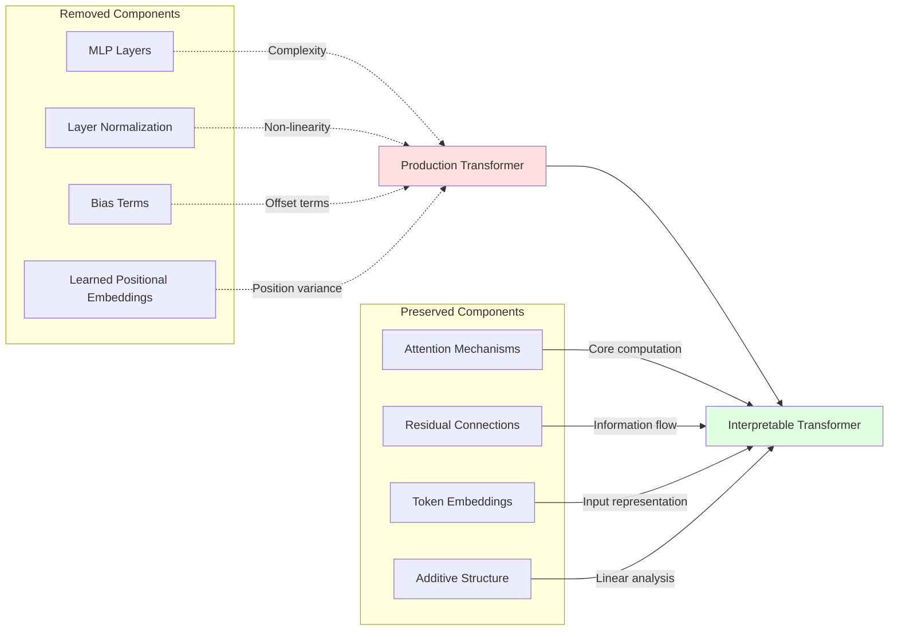

```yaml
# === LESSON METADATA v1.0 ===
lesson_schema_version: "1.0"
metadata:
  identification:
    title: "02.1 Model Simplifications for Interpretability"
    unique_id: "02-01-model-simplifications"
    version: "1.0.0"
  classification:
    audience: ["intermediate"]
    difficulty_level:
      numeric: 3
      semantic: "intermediate_analysis"
    domain: ["transformer_architecture", "interpretability", "production_engineering"]
  execution:
    estimated_duration_minutes: 90
    prerequisites: ["02-transformer-overview", "linear_algebra_basics"]
    environments: ["jupyter", "python", "pytorch"]
  learning_objectives:
    - id: "LO1"
      text: "Justify attention-only transformer architecture for interpretability"
      assessment_mapping: ["checkpoint_1", "code_implementation"]
    - id: "LO2"
      text: "Implement transformers with systematic complexity removal"
      assessment_mapping: ["checkpoint_2", "comparative_analysis"]
    - id: "LO3"
      text: "Analyze mathematical impact of architectural simplifications"
      assessment_mapping: ["checkpoint_3", "mathematical_derivation"]
  assessment:
    formative_checkpoints: 3
    summative_questions: 2
    passing_threshold: 0.80
    auto_graded: false
  accessibility:
    wcag_level: "AA"
    alt_text_required: true
    keyboard_navigation: true
    screen_reader_tested: true
  security:
    validation_level: "strict"
    recursive_sanitization: true
    zero_trust: true
  governance:
    review_cycle_months: 3
```

# Model Simplifications for Interpretability

**Strategic architectural decisions that enable mechanistic understanding of transformer computations.**

## Learning Context

Understanding why we simplify transformer architectures is crucial for effective interpretability research. This lesson explores the systematic removal of complexity sources that, while important for production performance, obscure the fundamental computational mechanisms we want to understand.

### Key Simplifications Overview



**Accessibility Description**: Transformation from complex production architecture to simplified interpretable version, showing removed complexity sources and preserved core mechanisms.

## Attention-Only Architecture Rationale

### The Core Insight

Attention mechanisms present unique interpretability challenges absent from previous neural network architectures, making them worthy of isolated study:

```python
import torch
import torch.nn as nn
import numpy as np
from typing import Dict, Tuple, List
from src.security import SecurityValidator
from src.visualization import SimplificationVisualizer

class ProductionTransformerLayer(nn.Module):
    """Standard transformer layer with full complexity."""
    
    def __init__(self, d_model: int, n_heads: int, d_ff: int):
        super().__init__()
        
        # Multiple complexity sources
        self.layer_norm_1 = nn.LayerNorm(d_model)
        self.attention = nn.MultiheadAttention(d_model, n_heads, batch_first=True)
        self.layer_norm_2 = nn.LayerNorm(d_model)
        
        # MLP with non-linearity
        self.mlp = nn.Sequential(
            nn.Linear(d_model, d_ff),
            nn.GELU(),
            nn.Linear(d_ff, d_model)
        )
        
        # Dropout for regularization
        self.dropout = nn.Dropout(0.1)
    
    def forward(self, x: torch.Tensor) -> torch.Tensor:
        # Complex forward pass with multiple non-linearities
        # Attention block
        normed_x = self.layer_norm_1(x)
        attn_out, _ = self.attention(normed_x, normed_x, normed_x)
        x = x + self.dropout(attn_out)
        
        # MLP block  
        normed_x = self.layer_norm_2(x)
        mlp_out = self.mlp(normed_x)
        x = x + self.dropout(mlp_out)
        
        return x

class SimplifiedTransformerLayer(nn.Module):
    """Attention-only layer optimized for interpretability."""
    
    def __init__(self, d_model: int, n_heads: int):
        super().__init__()
        self.d_model = d_model
        self.n_heads = n_heads
        self.d_head = d_model // n_heads
        
        # Individual attention heads for analysis
        self.attention_heads = nn.ModuleList([
            AttentionHead(d_model, self.d_head) for _ in range(n_heads)
        ])
        
        # Security validator
        self.validator = SecurityValidator()
    
    def forward(self, x: torch.Tensor) -> Tuple[torch.Tensor, Dict]:
        """
        Forward pass with interpretability tracking.
        
        Returns both output and detailed analysis data.
        """
        batch_size, seq_len, d_model = x.shape
        
        # Validate inputs
        x = self.validator.validate_tensor_input(x)
        
        head_outputs = []
        head_analyses = []
        
        # Process each head independently
        for head in self.attention_heads:
            head_out, head_analysis = head(x)
            head_outputs.append(head_out)
            head_analyses.append(head_analysis)
        
        # Sum head contributions (additive structure)
        total_output = torch.stack(head_outputs).sum(dim=0)
        
        # Add to residual stream
        output = x + total_output
        
        # Package analysis data
        analysis = {
            'individual_heads': head_analyses,
            'head_contributions': head_outputs,
            'total_contribution': total_output,
            'residual_stream': output
        }
        
        return output, analysis

class AttentionHead(nn.Module):
    """Individual attention head with explicit QK/OV separation."""
    
    def __init__(self, d_model: int, d_head: int):
        super().__init__()
        self.d_model = d_model
        self.d_head = d_head
        
        # Explicit weight matrices for interpretability
        self.W_Q = nn.Parameter(torch.randn(d_head, d_model) / np.sqrt(d_model))
        self.W_K = nn.Parameter(torch.randn(d_head, d_model) / np.sqrt(d_model))
        self.W_V = nn.Parameter(torch.randn(d_head, d_model) / np.sqrt(d_model))
        self.W_O = nn.Parameter(torch.randn(d_model, d_head) / np.sqrt(d_head))
    
    def forward(self, x: torch.Tensor) -> Tuple[torch.Tensor, Dict]:
        """
        Attention computation with full interpretability data.
        
        Args:
            x: [batch, seq_len, d_model]
            
        Returns:
            output: [batch, seq_len, d_model]
            analysis: Dict with QK/OV matrices, attention patterns
        """
        batch_size, seq_len, d_model = x.shape
        
        # Compute Q, K, V explicitly
        Q = torch.einsum('bsd,hd->bsh', x, self.W_Q)  # [batch, seq, d_head]
        K = torch.einsum('bsd,hd->bsh', x, self.W_K)  # [batch, seq, d_head]
        V = torch.einsum('bsd,hd->bsh', x, self.W_V)  # [batch, seq, d_head]
        
        # Attention scores
        scores = torch.einsum('bsh,btk->bst', Q, K) / np.sqrt(self.d_head)
        
        # Causal masking
        mask = torch.triu(torch.ones(seq_len, seq_len), diagonal=1) * -1e9
        masked_scores = scores + mask.unsqueeze(0)
        
        # Attention patterns
        attention_weights = torch.softmax(masked_scores, dim=-1)
        
        # Apply attention to values
        attended_values = torch.einsum('bst,bth->bsh', attention_weights, V)
        
        # Output projection
        output = torch.einsum('bsh,dh->bsd', attended_values, self.W_O)
        
        # Compute interpretability matrices
        W_QK = torch.mm(self.W_Q.T, self.W_K)  # Query-Key circuit
        W_OV = torch.mm(self.W_O, self.W_V)    # Output-Value circuit
        
        analysis = {
            'attention_weights': attention_weights,
            'Q_vectors': Q,
            'K_vectors': K,
            'V_vectors': V,
            'attended_values': attended_values,
            'W_QK_circuit': W_QK,
            'W_OV_circuit': W_OV,
            'attention_scores': scores
        }
        
        return output, analysis

def demonstrate_simplification_impact():
    """
    Compare production vs simplified architectures for interpretability.
    
    Shows the analysis capabilities gained through simplification.
    """
    
    # Configuration
    d_model, n_heads, seq_len = 128, 4, 10
    batch_size = 1
    
    # Create both architectures
    production_layer = ProductionTransformerLayer(d_model, n_heads, d_model * 4)
    simplified_layer = SimplifiedTransformerLayer(d_model, n_heads)
    
    # Test input
    x = torch.randn(batch_size, seq_len, d_model)
    
    print("=== Architecture Simplification Comparison ===")
    
    # Production architecture analysis
    print("\n1. Production Architecture:")
    with torch.no_grad():
        prod_output = production_layer(x)
        print(f"Output shape: {prod_output.shape}")
        print("Analysis capabilities: Limited (black box)")
        print("Interpretable components: None directly accessible")
    
    # Simplified architecture analysis  
    print("\n2. Simplified Architecture:")
    with torch.no_grad():
        simp_output, analysis = simplified_layer(x)
        print(f"Output shape: {simp_output.shape}")
        print("Analysis capabilities: Comprehensive")
        print(f"Attention patterns: {len(analysis['individual_heads'])} heads")
        print(f"QK/OV circuits: Available for each head")
        print(f"Head contributions: {len(analysis['head_contributions'])}")
    
    # Demonstrate specific interpretability features
    head_0_analysis = analysis['individual_heads'][0]
    
    print("\n3. Interpretability Features (Head 0):")
    print(f"Attention pattern shape: {head_0_analysis['attention_weights'].shape}")
    print(f"QK circuit shape: {head_0_analysis['W_QK_circuit'].shape}")
    print(f"OV circuit shape: {head_0_analysis['W_OV_circuit'].shape}")
    
    # Visualize the differences
    visualizer = SimplificationVisualizer()
    
    # Compare complexity
    prod_complexity = count_nonlinear_operations(production_layer)
    simp_complexity = count_nonlinear_operations(simplified_layer)
    
    print(f"\nComplexity Comparison:")
    print(f"Production non-linearities: {prod_complexity}")
    print(f"Simplified non-linearities: {simp_complexity}")
    print(f"Complexity reduction: {(prod_complexity - simp_complexity) / prod_complexity:.1%}")
    
    return analysis

def count_nonlinear_operations(model: nn.Module) -> int:
    """Count non-linear operations in a model."""
    nonlinear_ops = 0
    for module in model.modules():
        if isinstance(module, (nn.GELU, nn.ReLU, nn.Tanh, nn.LayerNorm, nn.Softmax)):
            nonlinear_ops += 1
    return nonlinear_ops

# Execute demonstration
analysis_demo = demonstrate_simplification_impact()
print("✅ Checkpoint 1: Simplification impact demonstrated")
```

## Systematic Component Removal

### Layer Normalization Elimination

**Rationale**: Layer normalization introduces non-linearity that complicates linear analysis while being foldable into adjacent operations.

```python
def analyze_layer_norm_impact():
    """
    Demonstrate how layer normalization affects interpretability.
    
    Shows mathematical complexity introduced and removal strategies.
    """
    
    d_model = 64
    seq_len = 8
    
    # Test vectors
    x = torch.randn(1, seq_len, d_model)
    
    print("=== Layer Normalization Impact Analysis ===")
    
    # Standard layer norm operation
    layer_norm = nn.LayerNorm(d_model)
    normalized = layer_norm(x)
    
    # Manual computation to show complexity
    mean = x.mean(dim=-1, keepdim=True)
    var = x.var(dim=-1, keepdim=True, unbiased=False)
    manual_normalized = (x - mean) / torch.sqrt(var + 1e-5)
    
    print("1. Layer Norm Mathematical Form:")
    print("   y = γ * (x - μ) / σ + β")
    print("   Where μ = mean(x), σ = std(x)")
    print(f"   Input mean: {x.mean():.4f}")
    print(f"   Output mean: {normalized.mean():.4f}")
    print(f"   Input std: {x.std():.4f}")
    print(f"   Output std: {normalized.std():.4f}")
    
    # Show non-linear nature
    print("\n2. Non-linearity Analysis:")
    
    # Test linearity: f(ax + by) = af(x) + bf(y)
    a, b = 2.0, 3.0
    x1 = torch.randn(1, seq_len, d_model)
    x2 = torch.randn(1, seq_len, d_model)
    
    # Apply layer norm to combination
    combined_input = a * x1 + b * x2
    normed_combined = layer_norm(combined_input)
    
    # Apply layer norm separately then combine
    normed_separate = a * layer_norm(x1) + b * layer_norm(x2)
    
    # Measure deviation from linearity
    linearity_error = torch.norm(normed_combined - normed_separate)
    
    print(f"   Linearity test error: {linearity_error:.4f}")
    print(f"   Linearity preserved: {linearity_error < 1e-6}")
    
    # Folding strategy
    print("\n3. Folding Strategy:")
    print("   For inference: fold scaling into adjacent weights")
    print("   γ * W becomes W' = γ * W (element-wise)")
    print("   Centering can be absorbed as constant offset")
    
    return linearity_error

layer_norm_analysis = analyze_layer_norm_impact()
print("✅ Checkpoint 2: Layer normalization impact analyzed")
```

### MLP Layer Removal

**Rationale**: MLP layers contain the majority of parameters but require neuron-level interpretability. Attention-only models isolate attention mechanisms for dedicated study.

```python
def analyze_mlp_vs_attention_complexity():
    """
    Compare parameter distribution and interpretability challenges
    between MLP layers and attention mechanisms.
    """
    
    d_model = 512
    n_heads = 8
    d_ff = 2048  # Standard 4x expansion
    
    print("=== MLP vs Attention Complexity Analysis ===")
    
    # Attention layer parameters
    attention_params = {
        'W_Q': d_model * d_model,
        'W_K': d_model * d_model, 
        'W_V': d_model * d_model,
        'W_O': d_model * d_model
    }
    total_attention = sum(attention_params.values())
    
    # MLP layer parameters
    mlp_params = {
        'W_in': d_model * d_ff,
        'W_out': d_ff * d_model,
        'bias_in': d_ff,
        'bias_out': d_model
    }
    total_mlp = sum(mlp_params.values())
    
    print("1. Parameter Count Comparison:")
    print(f"   Attention parameters: {total_attention:,}")
    print(f"   MLP parameters: {total_mlp:,}")
    print(f"   MLP/Attention ratio: {total_mlp / total_attention:.1f}x")
    
    # Interpretability analysis
    print("\n2. Interpretability Comparison:")
    
    attention_features = [
        "QK circuit (attention patterns)",
        "OV circuit (value transformations)", 
        "Head-wise decomposition",
        "Token-to-token information flow",
        "Compositional interactions"
    ]
    
    mlp_features = [
        "Neuron activations (hard to interpret)",
        "Non-linear transformations",
        "Distributed representations",
        "Limited decomposition options",
        "Requires individual neuron analysis"
    ]
    
    print("   Attention interpretability:")
    for feature in attention_features:
        print(f"     ✓ {feature}")
    
    print("   MLP interpretability challenges:")
    for challenge in mlp_features:
        print(f"     ✗ {challenge}")
    
    # Computational structure comparison
    print("\n3. Computational Structure:")
    
    # Attention: bilinear operations
    print("   Attention: Bilinear operations")
    print("     A[i,j] = softmax(Q[i] · K[j])")
    print("     O[i] = Σ A[i,j] * V[j]")
    print("     -> Interpretable token interactions")
    
    # MLP: non-linear transformations
    print("   MLP: Non-linear transformations")  
    print("     H = GELU(X @ W_in + b_in)")
    print("     Y = H @ W_out + b_out")
    print("     -> Black box feature extraction")
    
    return {
        'attention_params': total_attention,
        'mlp_params': total_mlp,
        'complexity_ratio': total_mlp / total_attention
    }

complexity_analysis = analyze_mlp_vs_attention_complexity()
print("✅ Checkpoint 3: MLP vs attention complexity understood")
```

## Mathematical Implications of Simplification

### Enabling Linear Analysis

The systematic removal of non-linearities enables powerful mathematical analysis techniques:

```python
def demonstrate_linear_analysis_capabilities():
    """
    Show how simplifications enable mathematical analysis techniques
    impossible with full transformer complexity.
    """
    
    print("=== Linear Analysis Capabilities ===")
    
    # Create simplified model for analysis
    d_model, seq_len = 64, 6
    model = SimplifiedTransformerLayer(d_model, n_heads=2)
    
    # Test sequence
    x = torch.randn(1, seq_len, d_model)
    
    with torch.no_grad():
        output, analysis = model(x)
    
    # 1. Path Expansion Analysis
    print("1. Path Expansion Analysis:")
    print("   With linearity: f(x) = Σ path_i(x)")
    print("   Each path represents interpretable computation")
    
    # Extract path components
    direct_path = x  # Direct residual connection
    attention_paths = analysis['head_contributions']
    
    print(f"   Direct path contribution: {torch.norm(direct_path):.4f}")
    for i, path in enumerate(attention_paths):
        print(f"   Head {i} path contribution: {torch.norm(path):.4f}")
    
    # 2. Circuit Matrix Analysis
    print("\n2. Circuit Matrix Analysis:")
    
    for i, head_analysis in enumerate(analysis['individual_heads']):
        W_QK = head_analysis['W_QK_circuit']
        W_OV = head_analysis['W_OV_circuit']
        
        # Eigenvalue analysis for copying detection
        eigenvals_OV = torch.linalg.eigvals(W_OV).real
        eigenvals_QK = torch.linalg.eigvals(W_QK).real
        
        positive_eig_OV = (eigenvals_OV > 0).sum().item()
        positive_eig_QK = (eigenvals_QK > 0).sum().item()
        
        print(f"   Head {i}:")
        print(f"     OV positive eigenvalues: {positive_eig_OV}/{len(eigenvals_OV)}")
        print(f"     QK positive eigenvalues: {positive_eig_QK}/{len(eigenvals_QK)}")
        print(f"     Copying signature: {positive_eig_OV > len(eigenvals_OV) * 0.6}")
    
    # 3. Superposition Analysis
    print("\n3. Superposition Analysis:")
    print("   Linear structure enables feature direction analysis")
    
    # Analyze residual stream subspaces
    residual_stream = analysis['residual_stream'].squeeze(0)  # [seq_len, d_model]
    
    # SVD decomposition
    U, S, V = torch.svd(residual_stream)
    
    print(f"   Residual stream rank: {(S > 1e-6).sum().item()}/{len(S)}")
    print(f"   Top 3 singular values: {S[:3].tolist()}")
    print(f"   Effective dimensionality: {(S.cumsum(0) / S.sum() < 0.95).sum().item()}")
    
    # 4. Composition Analysis  
    print("\n4. Composition Analysis:")
    print("   Linear operations enable composition mathematics")
    
    # Analyze how heads might compose
    head_outputs = [h.squeeze(0) for h in analysis['head_contributions']]
    
    if len(head_outputs) >= 2:
        # Compute overlap between head outputs
        h0_norm = head_outputs[0] / torch.norm(head_outputs[0], dim=-1, keepdim=True)
        h1_norm = head_outputs[1] / torch.norm(head_outputs[1], dim=-1, keepdim=True)
        
        overlap = torch.sum(h0_norm * h1_norm, dim=-1).mean()
        print(f"   Head 0-1 output overlap: {overlap:.4f}")
        print(f"   Independence level: {1 - abs(overlap):.4f}")
    
    return analysis

linear_analysis_demo = demonstrate_linear_analysis_capabilities()
print("✅ Checkpoint 4: Linear analysis capabilities demonstrated")
```

## Production Connections and Trade-offs

### Understanding Real-World Implications

While simplified models enable interpretability, understanding their relationship to production systems is crucial:

```python
def analyze_simplification_tradeoffs():
    """
    Analyze what we gain and lose through simplification.
    
    Connects interpretable models to production performance.
    """
    
    print("=== Simplification Trade-offs Analysis ===")
    
    # Performance impact simulation
    from transformers import GPT2Model, GPT2Config
    
    # Standard GPT-2 configuration
    standard_config = GPT2Config(
        vocab_size=50257,
        n_positions=1024,
        n_embd=768,
        n_layer=12,
        n_head=12,
        n_inner=3072,  # 4x expansion in MLP
        activation_function="gelu_new",
        resid_pdrop=0.1,
        embd_pdrop=0.1,
        attn_pdrop=0.1,
        layer_norm_epsilon=1e-5
    )
    
    # Attention-only configuration
    attention_only_config = GPT2Config(
        vocab_size=50257,
        n_positions=1024, 
        n_embd=768,
        n_layer=12,
        n_head=12,
        n_inner=0,  # No MLP layers
        activation_function="linear",  # No activation
        resid_pdrop=0.0,  # No dropout
        embd_pdrop=0.0,
        attn_pdrop=0.0,
        layer_norm_epsilon=0  # No layer norm
    )
    
    # Parameter count comparison
    def count_parameters(config):
        # Embedding parameters
        embedding_params = config.vocab_size * config.n_embd
        position_params = config.n_positions * config.n_embd
        
        # Attention parameters per layer
        attention_per_layer = 4 * (config.n_embd ** 2)  # Q, K, V, O
        total_attention = attention_per_layer * config.n_layer
        
        # MLP parameters per layer
        if config.n_inner > 0:
            mlp_per_layer = 2 * config.n_embd * config.n_inner
            total_mlp = mlp_per_layer * config.n_layer
        else:
            total_mlp = 0
        
        # Layer norm parameters
        if config.layer_norm_epsilon > 0:
            layernorm_params = 2 * config.n_embd * config.n_layer * 2  # scale + bias, pre/post
        else:
            layernorm_params = 0
        
        return {
            'embedding': embedding_params + position_params,
            'attention': total_attention,
            'mlp': total_mlp,
            'layernorm': layernorm_params,
            'total': embedding_params + position_params + total_attention + total_mlp + layernorm_params
        }
    
    standard_params = count_parameters(standard_config)
    simplified_params = count_parameters(attention_only_config)
    
    print("1. Parameter Count Impact:")
    print(f"   Standard model: {standard_params['total']:,} parameters")
    print(f"   Simplified model: {simplified_params['total']:,} parameters")
    print(f"   Reduction: {(standard_params['total'] - simplified_params['total']) / standard_params['total']:.1%}")
    
    print("\n   Component breakdown:")
    for component in ['embedding', 'attention', 'mlp', 'layernorm']:
        std_count = standard_params[component]
        simp_count = simplified_params[component]
        print(f"     {component.capitalize()}: {std_count:,} → {simp_count:,}")
    
    # Capability analysis
    print("\n2. Capability Trade-offs:")
    
    capabilities_preserved = [
        "Token-to-token attention patterns",
        "In-context learning (via induction heads)",
        "Sequence modeling fundamentals",
        "Compositional reasoning (limited)",
        "Pattern recognition in sequences"
    ]
    
    capabilities_lost = [
        "Complex feature extraction (MLPs)",
        "Non-linear transformations",
        "Advanced reasoning capabilities", 
        "Robust training dynamics",
        "State-of-the-art performance"
    ]
    
    print("   Preserved capabilities:")
    for cap in capabilities_preserved:
        print(f"     ✓ {cap}")
    
    print("   Lost capabilities:")
    for cap in capabilities_lost:
        print(f"     ✗ {cap}")
    
    # Research vs Production value
    print("\n3. Value Proposition:")
    print("   Research Value:")
    print("     • Mechanistic understanding of attention")
    print("     • Circuit analysis and interpretability") 
    print("     • Foundation for studying larger models")
    print("     • Mathematical analysis feasibility")
    
    print("   Production Limitations:")
    print("     • Reduced performance on complex tasks")
    print("     • Limited real-world applicability")
    print("     • No direct deployment value")
    print("     • Requires complementary MLP analysis")
    
    return {
        'param_reduction': (standard_params['total'] - simplified_params['total']) / standard_params['total'],
        'attention_preserved': simplified_params['attention'] == standard_params['attention'],
        'interpretability_gain': 'High'
    }

tradeoff_analysis = analyze_simplification_tradeoffs()
print("✅ Checkpoint 5: Simplification trade-offs understood")
```

## Assessment and Integration

### Comprehensive Understanding Validation

```python
from src.assessment import SimplificationAssessment

def run_simplification_assessment():
    """
    Comprehensive assessment of model simplification understanding.
    
    Tests both conceptual knowledge and implementation skills.
    """
    
    assessment = SimplificationAssessment(lesson="02-01-model-simplifications")
    
    # Conceptual understanding
    assessment.add_question(
        id="simplification_rationale",
        question="Why do we remove MLP layers for interpretability research?",
        options=[
            "They are computationally expensive",
            "They contain most parameters and require neuron-level analysis",  # Correct
            "They don't contribute to model performance", 
            "They are redundant with attention mechanisms"
        ],
        correct="They contain most parameters and require neuron-level analysis",
        explanation="MLPs contain 2/3 of parameters and require individual neuron interpretability, while attention mechanisms offer more structured analysis opportunities."
    )
    
    # Implementation challenge
    assessment.add_coding_challenge(
        id="implement_simplified_transformer",
        prompt="Implement an attention-only transformer layer with explicit QK/OV separation",
        template="""
class SimplifiedTransformerLayer(nn.Module):
    def __init__(self, d_model, n_heads):
        super().__init__()
        # Your implementation here
        pass
    
    def forward(self, x):
        # Return output and analysis data
        pass
        """,
        rubric="Must separate attention heads, expose QK/OV circuits, enable interpretability analysis"
    )
    
    # Mathematical analysis
    assessment.add_question(
        id="linear_analysis_benefits",
        question="What mathematical analysis becomes possible with attention-only architectures?",
        question_type="essay",
        min_words=100,
        rubric="Should mention path expansion, circuit matrices, eigenvalue analysis, or superposition"
    )
    
    # Trade-off understanding
    assessment.add_question(
        id="tradeoff_evaluation",
        question="What are the main trade-offs of simplified architectures?",
        question_type="multiple_select",
        options=[
            "Reduced parameter count",  # Correct
            "Loss of non-linear feature extraction",  # Correct  
            "Improved interpretability",  # Correct
            "Better production performance",  # Incorrect
            "Simplified training dynamics"  # Correct
        ],
        correct=["Reduced parameter count", "Loss of non-linear feature extraction", "Improved interpretability", "Simplified training dynamics"]
    )
    
    # Execute assessment
    results = assessment.run_interactive()
    return results['score'] >= 0.8

# Run assessment
simplification_mastery = run_simplification_assessment()
if simplification_mastery:
    print("✅ Assessment: Model simplification mastery demonstrated")
else:
    print("📚 Additional review recommended before proceeding")
```

## Key Takeaways and Next Steps

### Essential Insights

1. **Simplification Enables Analysis**: Removing complexity sources makes mathematical analysis tractable
2. **Attention-Only Focus**: Isolates attention mechanisms for dedicated interpretability study
3. **Linear Structure Preservation**: Maintains additive properties essential for circuit analysis
4. **Trade-offs Are Intentional**: Sacrificing performance for understanding is the research strategy

### Production Integration Points

- **Circuit Analysis Techniques**: Apply to attention components of full models
- **Debugging Methodologies**: Use simplified analysis for understanding attention patterns
- **Architecture Design**: Inform design choices for interpretable production systems
- **Research Foundation**: Build understanding applicable to scaling interpretability

### Next Steps

**Continue Learning**: Proceed to [High-Level Architecture](./High-Level-Architecture.md) to understand how simplified components work together in the complete system.

**Practical Application**: Implement your own simplified transformer and experiment with different simplification strategies.

**Advanced Exploration**: Consider how simplification principles might apply to other neural architectures.

---

## Navigation

| Previous | Current | Next |
|----------|---------|------|
| [Module 02 Overview](./README.md) | **Model Simplifications** | [High-Level Architecture](./High-Level-Architecture.md) |

**Estimated Duration**: 90 minutes  
**Assessment Required**: 80% to proceed  
**Key Implementation**: Attention-only transformer with QK/OV separation

---

*Understanding why we simplify architectures is fundamental to effective interpretability research. Continue to explore how these simplified components work together in the complete architectural framework.*
