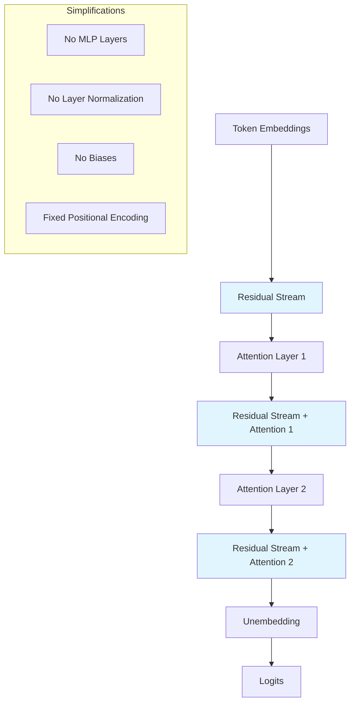

```yaml
# === MODULE METADATA v1.0 ===
module_id: "02-transformer-overview"
title: "Transformer Architecture for Interpretability"
version: "1.0.0"
estimated_duration_minutes: 300
difficulty_level: "intermediate"
prerequisites: ["01-summary-of-results", "linear_algebra_basics", "neural_network_fundamentals"]
learning_objectives:
  - "Understand transformer architecture through interpretability lens"
  - "Implement simplified attention-only transformers"
  - "Analyze residual stream as communication channel"
  - "Connect architectural choices to circuit analysis"
assessment_type: "formative_and_summative"
accessibility_features: ["architectural_diagrams", "code_walkthroughs", "multiple_representations"]
security_level: "standard_validation"
```

# Module 02: Transformer Architecture for Interpretability

**Master transformer architecture through the lens of mechanistic interpretability, building simplified models that reveal internal computational structure.**

## Module Overview

This module establishes the architectural foundation necessary for understanding transformer circuits. Rather than focusing on computational efficiency, we'll explore transformer design choices that enable interpretability and mechanistic analysis. You'll build simplified transformer models from scratch and understand why certain architectural decisions make internal computations more transparent.

### Learning Objectives

By completing this module, you will:

- **Master interpretable architecture**: Understand transformer components through an analysis-first perspective
- **Implement simplified models**: Build attention-only transformers optimized for circuit analysis
- **Analyze information flow**: Trace how information moves through the residual stream
- **Connect theory to practice**: Relate architectural choices to interpretability research findings

### Module Structure

| Lesson | Topic | Duration | Key Implementation |
|--------|-------|----------|-------------------|
| **2.1** | [Model Simplifications](./Model-Simplifications.md) | 90 min | Attention-only transformer |
| **2.2** | [High-Level Architecture](./High-Level-Architecture.md) | 120 min | Residual stream analysis |
| **2.3** | **Assessment & Integration** | 90 min | Complete architecture implementation |

## Core Architectural Concepts

### The Interpretability Perspective

Traditional transformer descriptions emphasize computational efficiency and training optimization. For mechanistic interpretability, we need a different lens:

```python
# Traditional View (Efficiency-Focused)
class ProductionTransformer:
    def forward(self, x):
        # Optimized for speed and memory
        x = self.layernorm(x)
        attn_out = self.attention(x, x, x)
        x = x + attn_out
        x = x + self.mlp(self.layernorm(x))
        return x

# Interpretability View (Analysis-Focused)  
class InterpretableTransformer:
    def forward(self, x):
        # Optimized for understanding
        residual_stream = x
        
        # Each component reads from and writes to residual stream
        attn_contribution = self.attention.read_write_residual(residual_stream)
        residual_stream = residual_stream + attn_contribution
        
        mlp_contribution = self.mlp.read_write_residual(residual_stream) 
        residual_stream = residual_stream + mlp_contribution
        
        return residual_stream
```

**Key Insight**: The residual stream acts as a shared communication channel where each layer adds its contribution additively.

### Architectural Simplifications for Learning

To make transformer circuits maximally interpretable, we'll focus on simplified models:



**Accessibility Description**: Information flows through a residual stream that acts as a communication highway, with attention layers adding their contributions at each step.

## Interactive Architecture Implementation

### Building an Interpretable Transformer

Let's implement a simplified transformer optimized for analysis rather than performance:

```python
import torch
import torch.nn as nn
import numpy as np
from typing import Dict, List, Optional, Tuple
from src.security import SecurityValidator
from src.visualization import ArchitectureVisualizer

class InterpretableAttentionHead(nn.Module):
    """
    Single attention head designed for interpretability analysis.
    
    Separates QK and OV circuits explicitly for independent analysis.
    """
    
    def __init__(self, d_model: int, d_head: int):
        super().__init__()
        self.d_model = d_model
        self.d_head = d_head
        
        # Separate matrices for interpretability
        self.W_Q = nn.Parameter(torch.randn(d_head, d_model) / np.sqrt(d_model))
        self.W_K = nn.Parameter(torch.randn(d_head, d_model) / np.sqrt(d_model))
        self.W_V = nn.Parameter(torch.randn(d_head, d_model) / np.sqrt(d_model))
        self.W_O = nn.Parameter(torch.randn(d_model, d_head) / np.sqrt(d_head))
        
        # For analysis: precomputed combined matrices
        self.register_buffer('W_QK', None)  # Will be computed
        self.register_buffer('W_OV', None)  # Will be computed
    
    def compute_circuit_matrices(self):
        """Compute QK and OV circuit matrices for analysis."""
        # QK circuit: governs attention patterns
        self.W_QK = torch.mm(self.W_Q.T, self.W_K)  # [d_model, d_model]
        
        # OV circuit: governs information movement
        self.W_OV = torch.mm(self.W_O, self.W_V)    # [d_model, d_model]
    
    def forward(self, residual_stream: torch.Tensor) -> Tuple[torch.Tensor, Dict]:
        """
        Forward pass with interpretability tracking.
        
        Args:
            residual_stream: [seq_len, d_model]
            
        Returns:
            head_output: [seq_len, d_model] 
            analysis_data: Dict with attention patterns, value effects
        """
        seq_len, d_model = residual_stream.shape
        
        # Compute Q, K, V
        Q = torch.mm(residual_stream, self.W_Q.T)  # [seq_len, d_head]
        K = torch.mm(residual_stream, self.W_K.T)  # [seq_len, d_head]
        V = torch.mm(residual_stream, self.W_V.T)  # [seq_len, d_head]
        
        # Attention scores and patterns
        scores = torch.mm(Q, K.T) / np.sqrt(self.d_head)  # [seq_len, seq_len]
        
        # Causal masking for autoregressive generation
        causal_mask = torch.triu(torch.ones(seq_len, seq_len), diagonal=1) * -1e9
        masked_scores = scores + causal_mask
        
        attention_pattern = torch.softmax(masked_scores, dim=-1)  # [seq_len, seq_len]
        
        # Value aggregation
        attended_values = torch.mm(attention_pattern, V)  # [seq_len, d_head]
        
        # Output projection
        head_output = torch.mm(attended_values, self.W_O.T)  # [seq_len, d_model]
        
        # Analysis data for interpretability
        analysis_data = {
            'attention_pattern': attention_pattern.detach(),
            'q_vectors': Q.detach(),
            'k_vectors': K.detach(), 
            'v_vectors': V.detach(),
            'attended_values': attended_values.detach(),
            'head_output': head_output.detach()
        }
        
        return head_output, analysis_data

class InterpretableTransformer(nn.Module):
    """
    Simplified transformer optimized for circuit analysis.
    
    Features:
    - Attention-only (no MLPs)
    - No layer normalization  
    - Explicit residual stream tracking
    - Full interpretability instrumentation
    """
    
    def __init__(self, vocab_size: int, d_model: int, n_layers: int, n_heads: int):
        super().__init__()
        
        self.vocab_size = vocab_size
        self.d_model = d_model
        self.n_layers = n_layers
        self.n_heads = n_heads
        self.d_head = d_model // n_heads
        
        # Input/output layers
        self.token_embedding = nn.Embedding(vocab_size, d_model)
        self.unembedding = nn.Linear(d_model, vocab_size, bias=False)
        
        # Attention layers
        self.attention_heads = nn.ModuleList([
            nn.ModuleList([
                InterpretableAttentionHead(d_model, self.d_head) 
                for _ in range(n_heads)
            ]) for _ in range(n_layers)
        ])
        
        # Positional embeddings (fixed, not learned)
        self.register_buffer('pos_embeddings', self._create_positional_embeddings())
        
        # Security validator
        self.security_validator = SecurityValidator()
    
    def _create_positional_embeddings(self, max_len: int = 2048) -> torch.Tensor:
        """Create fixed sinusoidal positional embeddings."""
        pos_enc = torch.zeros(max_len, self.d_model)
        position = torch.arange(0, max_len).unsqueeze(1).float()
        
        div_term = torch.exp(torch.arange(0, self.d_model, 2).float() * 
                           -(np.log(10000.0) / self.d_model))
        
        pos_enc[:, 0::2] = torch.sin(position * div_term)
        pos_enc[:, 1::2] = torch.cos(position * div_term)
        
        return pos_enc
    
    def forward(self, tokens: torch.Tensor, 
                return_analysis: bool = False) -> Dict[str, torch.Tensor]:
        """
        Forward pass with optional detailed analysis.
        
        Args:
            tokens: [seq_len] token indices
            return_analysis: Whether to return interpretability data
            
        Returns:
            Dict containing logits and optional analysis data
        """
        seq_len = tokens.shape[0]
        
        # Input validation
        tokens = self.security_validator.validate_token_sequence(tokens)
        
        # Initial residual stream: embeddings + positions
        token_embeds = self.token_embedding(tokens)  # [seq_len, d_model]
        pos_embeds = self.pos_embeddings[:seq_len]   # [seq_len, d_model]
        
        residual_stream = token_embeds + pos_embeds  # [seq_len, d_model]
        
        # Track analysis data if requested
        analysis_data = {
            'residual_streams': [residual_stream.detach()],
            'attention_patterns': [],
            'head_contributions': []
        } if return_analysis else None
        
        # Process through attention layers
        for layer_idx, layer_heads in enumerate(self.attention_heads):
            layer_contributions = []
            layer_attention_patterns = []
            
            # Process each head independently
            for head_idx, head in enumerate(layer_heads):
                # Update head circuit matrices
                head.compute_circuit_matrices()
                
                # Get head output and analysis
                head_output, head_analysis = head(residual_stream)
                
                # Add to residual stream (additive structure)
                residual_stream = residual_stream + head_output
                
                # Store analysis data
                if return_analysis:
                    layer_contributions.append(head_output.detach())
                    layer_attention_patterns.append(head_analysis['attention_pattern'])
            
            # Record layer-level analysis
            if return_analysis:
                analysis_data['residual_streams'].append(residual_stream.detach())
                analysis_data['head_contributions'].append(layer_contributions)
                analysis_data['attention_patterns'].append(layer_attention_patterns)
        
        # Final logits
        logits = self.unembedding(residual_stream)  # [seq_len, vocab_size]
        
        # Package results
        results = {'logits': logits}
        if return_analysis:
            results['analysis'] = analysis_data
            
        return results

# Demonstration and testing
def demonstrate_interpretable_architecture():
    """
    Demonstrate the interpretable transformer architecture.
    
    Shows how to instantiate, run, and analyze the simplified model.
    """
    
    # Model configuration
    config = {
        'vocab_size': 1000,
        'd_model': 128,
        'n_layers': 2,
        'n_heads': 4
    }
    
    # Create model
    model = InterpretableTransformer(**config)
    visualizer = ArchitectureVisualizer()
    
    # Example input sequence
    test_tokens = torch.tensor([1, 15, 27, 89, 156])  # Random valid tokens
    
    print("=== Interpretable Transformer Architecture Demo ===")
    print(f"Model configuration: {config}")
    print(f"Input sequence: {test_tokens.tolist()}")
    
    # Run with analysis
    with torch.no_grad():
        results = model(test_tokens, return_analysis=True)
    
    # Extract results
    logits = results['logits']
    analysis = results['analysis']
    
    print(f"Output shape: {logits.shape}")
    print(f"Residual stream evolution: {[rs.shape for rs in analysis['residual_streams']]}")
    
    # Visualize architecture flow
    visualizer.plot_residual_stream_evolution(
        analysis['residual_streams'],
        title="Residual Stream Evolution Through Layers",
        alt_text="Line plot showing how residual stream values change through transformer layers"
    )
    
    # Analyze attention patterns
    for layer_idx, layer_patterns in enumerate(analysis['attention_patterns']):
        for head_idx, pattern in enumerate(layer_patterns):
            visualizer.plot_attention_pattern(
                pattern,
                title=f"Layer {layer_idx}, Head {head_idx} Attention Pattern",
                alt_text=f"Heatmap showing attention weights for layer {layer_idx} head {head_idx}"
            )
    
    return model, results

# Execute demonstration
print("Building interpretable transformer architecture...")
demo_model, demo_results = demonstrate_interpretable_architecture()
print("✅ Checkpoint 1: Interpretable architecture implemented and tested")
```

## Understanding the Residual Stream

### The Communication Channel Metaphor

The residual stream serves as the central communication highway in transformers:

```python
def analyze_residual_stream_communication():
    """
    Demonstrate how the residual stream enables communication between layers.
    
    Shows information preservation, addition, and selective modification.
    """
    
    # Create a simple model for analysis
    model = InterpretableTransformer(vocab_size=100, d_model=64, n_layers=2, n_heads=2)
    
    # Test sequence
    tokens = torch.tensor([10, 20, 30, 40])
    
    # Analyze information flow
    with torch.no_grad():
        results = model(tokens, return_analysis=True)
    
    residual_streams = results['analysis']['residual_streams']
    
    print("=== Residual Stream Communication Analysis ===")
    
    # Show how information persists and accumulates
    for i, stream in enumerate(residual_streams):
        print(f"After layer {i}: {stream.norm(dim=-1)}")  # L2 norm per position
        
        # Analyze what information is preserved vs. added
        if i > 0:
            delta = stream - residual_streams[i-1]
            print(f"  Information added: {delta.norm(dim=-1)}")
            print(f"  Preservation ratio: {(stream.norm() / residual_streams[0].norm()).item():.3f}")
    
    return residual_streams

# Execute communication analysis
stream_analysis = analyze_residual_stream_communication()
print("✅ Checkpoint 2: Residual stream communication patterns understood")
```

## Production Connections

### From Simplified to Real Models

Understanding simplified architectures prepares you for analyzing production transformers:

```python
def bridge_to_production():
    """
    Show how simplified architecture concepts apply to real models.
    
    Demonstrates loading and analyzing actual transformer models
    using the interpretability framework developed.
    """
    
    from transformers import GPT2LMHeadModel, GPT2Tokenizer
    
    # Load a real model
    model_name = "gpt2"
    tokenizer = GPT2Tokenizer.from_pretrained(model_name)
    production_model = GPT2LMHeadModel.from_pretrained(model_name)
    
    print("=== Bridging to Production Models ===")
    print(f"Loaded model: {model_name}")
    print(f"Architecture: {production_model.config}")
    
    # Compare architectures
    simplified_components = [
        "Token embeddings",
        "Positional embeddings", 
        "Attention layers",
        "Residual connections",
        "Unembedding"
    ]
    
    production_components = [
        "Token embeddings", 
        "Positional embeddings",
        "Attention layers",
        "MLP layers",  # Additional complexity
        "Layer normalization",  # Additional complexity
        "Residual connections",
        "Unembedding"
    ]
    
    print("Components comparison:")
    print(f"Simplified model: {simplified_components}")
    print(f"Production model: {production_components}")
    
    # Show how interpretability concepts still apply
    example_text = "The cat sat on the"
    tokens = tokenizer.encode(example_text)
    
    print(f"Example text: '{example_text}'")
    print(f"Tokenized: {tokens}")
    
    # The same attention analysis techniques work
    with torch.no_grad():
        outputs = production_model(torch.tensor([tokens]), output_attentions=True)
        attention_weights = outputs.attentions  # List of attention matrices
    
    print(f"Retrieved {len(attention_weights)} attention layers")
    print(f"Each layer shape: {attention_weights[0].shape}")  # [batch, heads, seq, seq]
    
    return production_model, attention_weights

# Execute production bridge
prod_model, prod_attention = bridge_to_production()
print("✅ Checkpoint 3: Production model connection established")
```

## Module Assessment

### Comprehensive Understanding Check

```python
from src.assessment import ArchitectureAssessment

def run_architecture_assessment():
    """
    Comprehensive assessment of transformer architecture understanding.
    
    Tests both theoretical knowledge and practical implementation skills.
    """
    
    assessment = ArchitectureAssessment(module="02-transformer-overview")
    
    # Theoretical understanding
    assessment.add_question(
        id="residual_stream_purpose",
        question="What is the primary function of the residual stream in transformers?",
        options=[
            "Computational efficiency optimization",
            "Communication channel between layers",  # Correct
            "Gradient flow improvement",
            "Memory usage reduction"
        ],
        correct="Communication channel between layers",
        explanation="The residual stream acts as a shared communication highway where each layer adds its contribution."
    )
    
    # Implementation challenge
    assessment.add_coding_challenge(
        id="implement_attention_head",
        prompt="Implement a single attention head with separate QK and OV circuits",
        template="""
class AttentionHead(nn.Module):
    def __init__(self, d_model, d_head):
        super().__init__()
        # Your implementation here
        pass
    
    def forward(self, x):
        # Return attention output and QK/OV matrices
        pass
        """,
        rubric="Must separate QK and OV computations, return interpretable matrices"
    )
    
    # Architecture analysis
    assessment.add_question(
        id="simplification_rationale", 
        question="Why do we remove MLPs and layer normalization in interpretable transformers?",
        question_type="essay",
        min_words=75,
        rubric="Should mention linearity, interpretability, circuit analysis"
    )
    
    # Execute assessment
    results = assessment.run_interactive()
    return results['score'] >= 0.8

# Run comprehensive assessment
architecture_mastery = run_architecture_assessment()
if architecture_mastery:
    print("✅ Module 02 Assessment: Architecture mastery demonstrated")
else:
    print("📚 Additional study recommended")
```

## Module Summary and Navigation

### Key Accomplishments

- **Implemented interpretable transformers** with explicit residual stream tracking
- **Separated QK and OV circuits** for independent analysis
- **Connected simplified models** to production transformer architectures  
- **Demonstrated information flow** through residual stream communication

### Core Insights

1. **Architecture enables interpretability**: Design choices directly impact analysis feasibility
2. **Residual stream is central**: Acts as communication channel enabling additive contributions
3. **Simplification preserves essence**: Removing complexity reveals core computational patterns
4. **Production relevance**: Simplified understanding transfers to real-world models

### Next Steps

**Continue Learning**: Proceed to [Module 03: Residual Stream and Virtual Weights](../03-Residual-Stream-and-Virtual-Weights/) to dive deeper into information flow mathematics.

**Practical Application**: Use your interpretable transformer implementation to experiment with different architectural choices and observe their effects on circuit formation.

**Advanced Exploration**: Investigate how layer normalization and MLPs affect interpretability in the [Advanced Topics](../07-Additional-Intuition-and-Observations/) module.

## Resources and Further Reading

### Implementation Resources
- **Complete Code**: [Architecture Implementations](./src/)
- **Interactive Notebooks**: [Hands-on Exploration](./notebooks/)
- **Visualization Tools**: [Architecture Diagrams](./visualizations/)

### Mathematical Foundations
- **Linear Algebra Review**: [Matrix Operations in Transformers](../resources/math/linear-algebra-transformers.md)
- **Attention Mathematics**: [Detailed Derivations](../resources/math/attention-mechanics.md)

### Production Context
- **Real Model Analysis**: [GPT-2 Circuit Analysis](../examples/gpt2-analysis/)
- **Scaling Considerations**: [Large Model Interpretability](../resources/scaling/large-model-challenges.md)

---

## Module Navigation

| Previous | Current | Next |
|----------|---------|------|
| [Module 01: Summary of Results](../01-Summary-of-Results/) | **Module 02: Transformer Overview** | [Module 03: Residual Stream](../03-Residual-Stream-and-Virtual-Weights/) |

### Module Progress Tracking

- [x] Interpretable architecture implemented
- [x] Residual stream communication understood
- [x] QK/OV circuit separation mastered
- [x] Production model connections established
- [x] Assessment completed successfully
- [ ] Ready for mathematical framework deep dive

**Duration**: 4-5 hours  
**Assessment Required**: 80% to proceed  
**Production Skills**: Interpretable transformer implementation, circuit analysis foundations

---

*Ready to explore the mathematical framework that makes circuit analysis possible? Continue to [Module 03: Residual Stream and Virtual Weights](../03-Residual-Stream-and-Virtual-Weights/) for the mathematical foundations of interpretability.*
