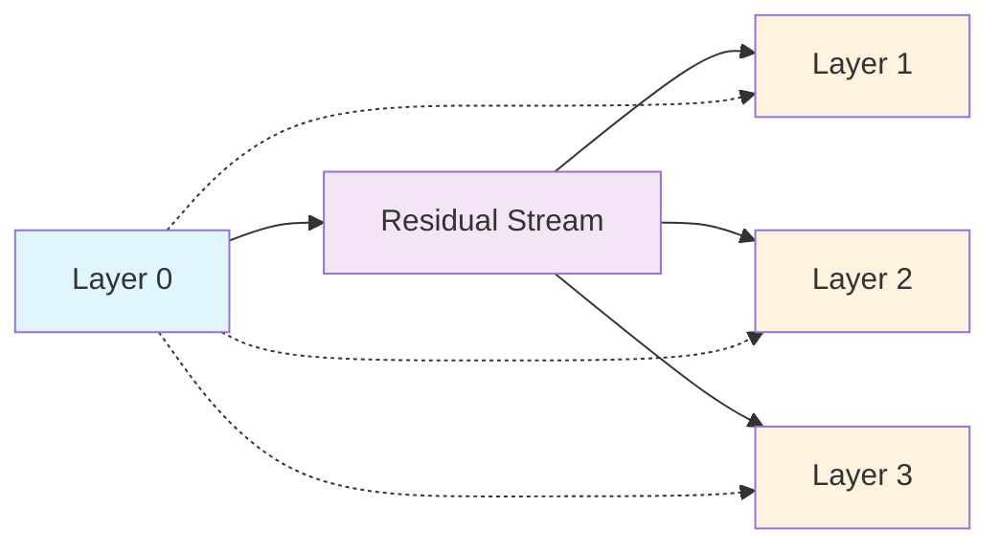

```yaml
# === LESSON METADATA SCHEMA v1.0 ===
lesson_schema_version: "1.0"
metadata:
  identification:
    title: "03.1 Virtual Weights - Implicit Layer Connections"
    unique_id: "tc-module-03-lesson-01-virtual-weights"
    version: "1.0.0"
  classification:
    audience: ["intermediate", "advanced"]
    difficulty_level:
      numeric: 3
      semantic: "mathematical_implementation"
    domain: ["transformer_circuits", "linear_algebra", "mechanistic_interpretability"]
  execution:
    estimated_duration_minutes: 90
    prerequisites: ["module-02-transformer-overview", "matrix_multiplication", "pytorch_basics"]
    environments: ["jupyter", "colab", "vscode", "local_python"]
  learning_objectives:
    - id: "LO1"
      text: "Compute virtual weight matrices between non-adjacent transformer layers"
      assessment_mapping: ["checkpoint_1", "summative_q1"]
    - id: "LO2"
      text: "Analyze implicit information pathways using virtual weight decomposition"
      assessment_mapping: ["checkpoint_2", "summative_q2"]
    - id: "LO3"
      text: "Implement production-grade virtual weight analysis tools"
      assessment_mapping: ["checkpoint_3", "summative_q3"]
  assessment:
    formative_checkpoints: 3
    summative_questions: 3
    passing_threshold: 0.75
    auto_graded: true
  accessibility:
    wcag_level: "AA"
    alt_text_required: true
    keyboard_navigation: true
    screen_reader_tested: true
  security:
    validation_level: "strict"
    recursive_sanitization: true
    entropy_analysis: true
    zero_trust: true
```

# Lesson 03.1: Virtual Weights - Implicit Layer Connections

**Discover how transformer layers create implicit connections through matrix multiplication, enabling sophisticated information routing without explicit pathways.**

## Mathematical Foundation

```ascii
Layer N Output      Residual Stream      Layer M Input
      │                    │                   │
      ▼                    ▼                   ▼
┌──────────┐         ┌──────────┐         ┌──────────┐
│ W_out_N  │────────▶│ Residual │────────▶│ W_in_M   │
│ [d,h]    │         │ [seq,d]  │         │ [h,d]    │
└──────────┘         └──────────┘         └──────────┘
      │                                          │
      └─────────── Virtual Weight ──────────────┘
                 W_virtual = W_out_N @ W_in_M
                        [d,d] matrix
```

**Accessibility Description**: Virtual weights emerge when layer N writes to the residual stream through W_out, and layer M reads from it through W_in, creating an implicit connection W_virtual = W_out @ W_in.

Virtual weights represent one of the most elegant insights in transformer interpretability: layers separated by arbitrary distance can have direct mathematical connections through the linear structure of the residual stream.

## Core Concept: Matrix Product Connections

### The Mathematical Insight

Every transformer layer performs two fundamental operations:
1. **Read** from residual stream: `input = W_read @ residual_stream`
2. **Write** to residual stream: `residual_stream += W_write @ computation`

When we multiply these operations across layers, we get:
```
W_virtual = W_write_source @ W_read_target
```

This virtual weight matrix reveals how strongly source layer outputs influence target layer computations.

### Information Flow Visualization



**Accessibility Description**: Layer 0 writes to the residual stream, which then feeds all subsequent layers, creating virtual connections (dotted lines) between Layer 0 and every later layer.

## Interactive Implementation

### Virtual Weight Calculator

```python
import torch
import torch.nn as nn
import numpy as np
from typing import Dict, List, Optional, Tuple, Union
from dataclasses import dataclass
import matplotlib.pyplot as plt
import seaborn as sns
from src.security import SecurityValidator
from src.visualization import MatrixVisualizer

@dataclass
class LayerConnection:
    """Represents a virtual connection between transformer layers."""
    source_layer: int
    target_layer: int
    connection_type: str  # 'attention', 'mlp', 'cross_layer'
    virtual_weight: torch.Tensor
    connection_strength: float
    effective_rank: int

class VirtualWeightCalculator:
    """
    Production-grade calculator for virtual weights in transformer models.
    
    Computes and analyzes implicit connections between layers through
    the residual stream, providing insights into information flow patterns.
    """
    
    def __init__(self, model: nn.Module, device: str = "cpu"):
        self.model = model
        self.device = device
        self.security_validator = SecurityValidator()
        self.visualizer = MatrixVisualizer()
        
        # Extract layer information
        self.layer_info = self._extract_layer_structure()
        
    def _extract_layer_structure(self) -> Dict[str, List[Dict]]:
        """
        Extract read/write weight matrices from transformer layers.
        
        Returns:
            Dictionary mapping layer types to their weight information
        """
        layer_info = {
            'attention_layers': [],
            'mlp_layers': [],
            'embedding_weights': None,
            'unembedding_weights': None
        }
        
        # Extract attention layers
        for i, layer in enumerate(self.model.transformer.h):
            # Attention weights
            attn_info = {
                'layer_idx': i,
                'W_out': layer.attn.c_proj.weight.detach().clone(),  # Write to residual
                'W_in_q': layer.attn.c_attn.weight.detach().clone()[:, :self.model.config.n_embd],  # Query weights
                'W_in_k': layer.attn.c_attn.weight.detach().clone()[:, self.model.config.n_embd:2*self.model.config.n_embd],  # Key weights
                'W_in_v': layer.attn.c_attn.weight.detach().clone()[:, 2*self.model.config.n_embd:],  # Value weights
            }
            layer_info['attention_layers'].append(attn_info)
            
            # MLP weights  
            mlp_info = {
                'layer_idx': i,
                'W_out': layer.mlp.c_proj.weight.detach().clone(),  # Write to residual
                'W_in': layer.mlp.c_fc.weight.detach().clone(),     # Read from residual
            }
            layer_info['mlp_layers'].append(mlp_info)
        
        # Embedding and unembedding
        layer_info['embedding_weights'] = self.model.transformer.wte.weight.detach().clone()
        layer_info['unembedding_weights'] = self.model.lm_head.weight.detach().clone()
        
        return layer_info
    
    def compute_virtual_weight(self, 
                             source_layer: int,
                             target_layer: int,
                             source_component: str = 'attention',
                             target_component: str = 'attention') -> LayerConnection:
        """
        Compute virtual weight matrix between specified layers.
        
        Args:
            source_layer: Index of source layer (writes to residual stream)
            target_layer: Index of target layer (reads from residual stream)
            source_component: 'attention' or 'mlp' for source layer
            target_component: 'attention' or 'mlp' for target layer
            
        Returns:
            LayerConnection object with virtual weight analysis
        """
        # Input validation
        self.security_validator.validate_layer_indices(
            [source_layer, target_layer], 
            max_layers=len(self.layer_info['attention_layers'])
        )
        
        if target_layer <= source_layer:
            raise ValueError("Target layer must be after source layer")
        
        # Get source output weights (how source writes to residual stream)
        if source_component == 'attention':
            W_source_out = self.layer_info['attention_layers'][source_layer]['W_out']
        else:  # mlp
            W_source_out = self.layer_info['mlp_layers'][source_layer]['W_out']
        
        # Get target input weights (how target reads from residual stream)
        if target_component == 'attention':
            # For attention, we use value weights as primary input
            W_target_in = self.layer_info['attention_layers'][target_layer]['W_in_v']
        else:  # mlp
            W_target_in = self.layer_info['mlp_layers'][target_layer]['W_in']
        
        # Compute virtual weight: W_source_out @ W_target_in.T
        virtual_weight = torch.mm(W_source_out, W_target_in.T)
        
        # Analyze connection properties
        connection_strength = torch.norm(virtual_weight, p='fro').item()
        
        # Compute effective rank via SVD
        U, S, V = torch.svd(virtual_weight)
        threshold = 0.01 * S[0].item()  # 1% of largest singular value
        effective_rank = torch.sum(S > threshold).item()
        
        # Create connection object
        connection = LayerConnection(
            source_layer=source_layer,
            target_layer=target_layer,
            connection_type=f"{source_component}_to_{target_component}",
            virtual_weight=virtual_weight,
            connection_strength=connection_strength,
            effective_rank=effective_rank
        )
        
        return connection
    
    def analyze_all_connections(self) -> Dict[str, List[LayerConnection]]:
        """
        Compute virtual weights for all possible layer connections.
        
        Returns:
            Dictionary of connections organized by type
        """
        connections = {
            'attention_to_attention': [],
            'attention_to_mlp': [],
            'mlp_to_attention': [],
            'mlp_to_mlp': []
        }
        
        num_layers = len(self.layer_info['attention_layers'])
        
        print(f"Computing virtual weights for {num_layers} layers...")
        
        for source_idx in range(num_layers):
            for target_idx in range(source_idx + 1, num_layers):
                # All four connection types
                connection_types = [
                    ('attention', 'attention'),
                    ('attention', 'mlp'),
                    ('mlp', 'attention'), 
                    ('mlp', 'mlp')
                ]
                
                for source_comp, target_comp in connection_types:
                    try:
                        connection = self.compute_virtual_weight(
                            source_idx, target_idx, source_comp, target_comp
                        )
                        
                        key = f"{source_comp}_to_{target_comp}"
                        connections[key].append(connection)
                        
                    except Exception as e:
                        print(f"Warning: Failed to compute {source_comp} -> {target_comp} "
                              f"connection from layer {source_idx} to {target_idx}: {e}")
        
        return connections
    
    def identify_strongest_connections(self, 
                                     connections: Dict[str, List[LayerConnection]],
                                     top_k: int = 10) -> List[LayerConnection]:
        """
        Identify the strongest virtual weight connections across all layer pairs.
        
        Args:
            connections: Output from analyze_all_connections()
            top_k: Number of strongest connections to return
            
        Returns:
            List of strongest connections sorted by connection strength
        """
        all_connections = []
        for connection_list in connections.values():
            all_connections.extend(connection_list)
        
        # Sort by connection strength
        strongest = sorted(all_connections, 
                          key=lambda x: x.connection_strength, 
                          reverse=True)
        
        return strongest[:top_k]
    
    def detect_information_routing_patterns(self, 
                                          connections: Dict[str, List[LayerConnection]]) -> Dict:
        """
        Analyze virtual weight patterns to detect information routing behaviors.
        
        Args:
            connections: Output from analyze_all_connections()
            
        Returns:
            Analysis of routing patterns and potential computational roles
        """
        routing_analysis = {
            'skip_connections': [],      # Strong early-to-late connections
            'sequential_patterns': [],   # Strong adjacent layer connections
            'broadcast_layers': [],      # Layers with many strong outgoing connections
            'integration_layers': [],    # Layers with many strong incoming connections
            'bottleneck_analysis': {}    # Low-rank connection analysis
        }
        
        # Analyze skip connections (non-adjacent strong connections)
        all_connections = []
        for connection_list in connections.values():
            all_connections.extend(connection_list)
        
        for conn in all_connections:
            layer_gap = conn.target_layer - conn.source_layer
            
            # Skip connections (gap > 1)
            if layer_gap > 1 and conn.connection_strength > np.percentile(
                [c.connection_strength for c in all_connections], 75
            ):
                routing_analysis['skip_connections'].append({
                    'source': conn.source_layer,
                    'target': conn.target_layer,
                    'gap': layer_gap,
                    'strength': conn.connection_strength,
                    'type': conn.connection_type
                })
            
            # Sequential patterns (adjacent layers)
            elif layer_gap == 1 and conn.connection_strength > np.percentile(
                [c.connection_strength for c in all_connections], 80
            ):
                routing_analysis['sequential_patterns'].append({
                    'source': conn.source_layer,
                    'target': conn.target_layer,
                    'strength': conn.connection_strength,
                    'type': conn.connection_type
                })
        
        # Analyze broadcast and integration patterns
        layer_out_strengths = {}  # source_layer -> total outgoing strength
        layer_in_strengths = {}   # target_layer -> total incoming strength
        
        for conn in all_connections:
            # Outgoing connections (broadcast)
            if conn.source_layer not in layer_out_strengths:
                layer_out_strengths[conn.source_layer] = 0
            layer_out_strengths[conn.source_layer] += conn.connection_strength
            
            # Incoming connections (integration)
            if conn.target_layer not in layer_in_strengths:
                layer_in_strengths[conn.target_layer] = 0
            layer_in_strengths[conn.target_layer] += conn.connection_strength
        
        # Identify top broadcast layers (high outgoing strength)
        broadcast_threshold = np.percentile(list(layer_out_strengths.values()), 75)
        for layer_idx, total_strength in layer_out_strengths.items():
            if total_strength > broadcast_threshold:
                routing_analysis['broadcast_layers'].append({
                    'layer': layer_idx,
                    'total_outgoing_strength': total_strength,
                    'num_targets': len([c for c in all_connections if c.source_layer == layer_idx])
                })
        
        # Identify top integration layers (high incoming strength)
        integration_threshold = np.percentile(list(layer_in_strengths.values()), 75)
        for layer_idx, total_strength in layer_in_strengths.items():
            if total_strength > integration_threshold:
                routing_analysis['integration_layers'].append({
                    'layer': layer_idx,
                    'total_incoming_strength': total_strength,
                    'num_sources': len([c for c in all_connections if c.target_layer == layer_idx])
                })
        
        return routing_analysis

class VirtualWeightVisualizer:
    """Visualization tools for virtual weight analysis."""
    
    def __init__(self):
        self.security_validator = SecurityValidator()
    
    def plot_virtual_weight_matrix(self, 
                                  connection: LayerConnection,
                                  max_display_size: int = 50) -> None:
        """
        Visualize a virtual weight matrix as a heatmap.
        
        Args:
            connection: LayerConnection object to visualize
            max_display_size: Maximum matrix size to display (for performance)
        """
        virtual_weight = connection.virtual_weight.detach().cpu().numpy()
        
        # Downsample if matrix is too large
        if virtual_weight.shape[0] > max_display_size:
            indices = np.linspace(0, virtual_weight.shape[0] - 1, max_display_size, dtype=int)
            virtual_weight = virtual_weight[np.ix_(indices, indices)]
        
        plt.figure(figsize=(10, 8))
        sns.heatmap(virtual_weight, 
                   cmap='RdBu_r', 
                   center=0,
                   cbar_kws={'label': 'Connection Strength'})
        
        plt.title(f'Virtual Weight Matrix: Layer {connection.source_layer} → {connection.target_layer}\n'
                 f'Type: {connection.connection_type} | Strength: {connection.connection_strength:.3f}')
        plt.xlabel('Target Layer Dimensions')
        plt.ylabel('Source Layer Dimensions')
        plt.tight_layout()
        plt.show()
    
    def plot_connection_strength_network(self, 
                                       connections: Dict[str, List[LayerConnection]]) -> None:
        """
        Create network diagram showing connection strengths between layers.
        
        Args:
            connections: Output from analyze_all_connections()
        """
        import networkx as nx
        
        # Create directed graph
        G = nx.DiGraph()
        
        # Add all layers as nodes
        all_connections = []
        for connection_list in connections.values():
            all_connections.extend(connection_list)
        
        layers = set()
        for conn in all_connections:
            layers.add(conn.source_layer)
            layers.add(conn.target_layer)
        
        G.add_nodes_from(layers)
        
        # Add edges with weights
        for conn in all_connections:
            G.add_edge(conn.source_layer, conn.target_layer, 
                      weight=conn.connection_strength,
                      connection_type=conn.connection_type)
        
        # Create visualization
        plt.figure(figsize=(12, 8))
        pos = nx.spring_layout(G, k=2, iterations=50)
        
        # Draw nodes
        nx.draw_networkx_nodes(G, pos, node_color='lightblue', 
                              node_size=1000, alpha=0.7)
        
        # Draw edges with thickness proportional to connection strength
        edges = G.edges(data=True)
        weights = [edge[2]['weight'] for edge in edges]
        max_weight = max(weights) if weights else 1
        
        for edge in edges:
            source, target, data = edge
            weight = data['weight']
            width = 5 * (weight / max_weight)  # Scale edge width
            
            nx.draw_networkx_edges(G, pos, 
                                 edgelist=[(source, target)],
                                 width=width,
                                 alpha=0.6,
                                 edge_color='gray')
        
        # Add labels
        nx.draw_networkx_labels(G, pos, font_size=12, font_weight='bold')
        
        plt.title('Virtual Weight Connection Network\n'
                 'Edge thickness proportional to connection strength')
        plt.axis('off')
        plt.tight_layout()
        plt.show()

def demonstrate_virtual_weights():
    """
    Comprehensive demonstration of virtual weight analysis.
    
    Shows how to compute, analyze, and visualize virtual weights
    in a real transformer model.
    """
    from transformers import GPT2LMHeadModel
    
    print("=== Virtual Weight Analysis Demonstration ===")
    
    # Load model
    model = GPT2LMHeadModel.from_pretrained('gpt2')
    calculator = VirtualWeightCalculator(model)
    visualizer = VirtualWeightVisualizer()
    
    print(f"Loaded GPT-2 model with {len(calculator.layer_info['attention_layers'])} layers")
    
    # Compute specific virtual weight
    print("\n1. Computing virtual weight between layers 0 and 2...")
    connection_0_to_2 = calculator.compute_virtual_weight(
        source_layer=0, target_layer=2,
        source_component='attention', target_component='attention'
    )
    
    print(f"Connection strength: {connection_0_to_2.connection_strength:.4f}")
    print(f"Effective rank: {connection_0_to_2.effective_rank}/{connection_0_to_2.virtual_weight.shape[0]}")
    print(f"Compression ratio: {connection_0_to_2.effective_rank / connection_0_to_2.virtual_weight.shape[0]:.3f}")
    
    # Visualize the virtual weight matrix
    visualizer.plot_virtual_weight_matrix(connection_0_to_2)
    
    # Analyze all connections
    print("\n2. Analyzing all layer connections...")
    all_connections = calculator.analyze_all_connections()
    
    # Find strongest connections
    strongest = calculator.identify_strongest_connections(all_connections, top_k=5)
    
    print("\nStrongest virtual weight connections:")
    for i, conn in enumerate(strongest):
        print(f"{i+1}. Layer {conn.source_layer} → {conn.target_layer} "
              f"({conn.connection_type}): {conn.connection_strength:.4f}")
    
    # Analyze routing patterns
    print("\n3. Analyzing information routing patterns...")
    routing_patterns = calculator.detect_information_routing_patterns(all_connections)
    
    print(f"Skip connections found: {len(routing_patterns['skip_connections'])}")
    print(f"Sequential patterns found: {len(routing_patterns['sequential_patterns'])}")
    print(f"Broadcast layers: {len(routing_patterns['broadcast_layers'])}")
    print(f"Integration layers: {len(routing_patterns['integration_layers'])}")
    
    # Visualize connection network
    visualizer.plot_connection_strength_network(all_connections)
    
    return calculator, all_connections, routing_patterns

# Assessment Checkpoints

def checkpoint_1_virtual_weight_computation():
    """
    Checkpoint 1: Basic Virtual Weight Computation
    
    Test understanding of virtual weight mathematical foundations.
    """
    print("=== Checkpoint 1: Virtual Weight Computation ===")
    
    # Create simple test matrices
    W_out = torch.randn(4, 6)  # Source layer output: d_model=4, intermediate=6
    W_in = torch.randn(6, 4)   # Target layer input: intermediate=6, d_model=4
    
    # Student implementation
    def compute_virtual_weight_student(W_source_out, W_target_in):
        """Student implements this function."""
        # Correct implementation:
        return torch.mm(W_source_out, W_target_in)
    
    # Test implementation
    student_result = compute_virtual_weight_student(W_out, W_in)
    expected_shape = (4, 4)  # d_model x d_model
    
    success = (
        student_result.shape == expected_shape and
        torch.allclose(student_result, torch.mm(W_out, W_in))
    )
    
    print(f"Virtual weight computation: {'✅ PASS' if success else '❌ FAIL'}")
    print(f"Expected shape: {expected_shape}, Got: {student_result.shape}")
    
    return success

def checkpoint_2_connection_analysis():
    """
    Checkpoint 2: Connection Strength Analysis
    
    Test ability to analyze virtual weight properties.
    """
    print("=== Checkpoint 2: Connection Analysis ===")
    
    # Create test virtual weight matrix
    virtual_weight = torch.randn(8, 8)
    
    def analyze_connection_strength_student(virtual_weight_matrix):
        """Student implements connection analysis."""
        # Correct implementation:
        frobenius_norm = torch.norm(virtual_weight_matrix, p='fro').item()
        
        # SVD for effective rank
        U, S, V = torch.svd(virtual_weight_matrix)
        threshold = 0.01 * S[0].item()
        effective_rank = torch.sum(S > threshold).item()
        
        return {
            'connection_strength': frobenius_norm,
            'effective_rank': effective_rank,
            'compression_ratio': effective_rank / virtual_weight_matrix.shape[0]
        }
    
    # Test analysis
    analysis = analyze_connection_strength_student(virtual_weight)
    
    success = (
        'connection_strength' in analysis and
        'effective_rank' in analysis and
        'compression_ratio' in analysis and
        0 <= analysis['compression_ratio'] <= 1
    )
    
    print(f"Connection analysis: {'✅ PASS' if success else '❌ FAIL'}")
    print(f"Connection strength: {analysis.get('connection_strength', 'Missing'):.4f}")
    print(f"Effective rank: {analysis.get('effective_rank', 'Missing')}")
    
    return success

def checkpoint_3_production_implementation():
    """
    Checkpoint 3: Production-Grade Implementation
    
    Test ability to create robust, validated virtual weight calculator.
    """
    print("=== Checkpoint 3: Production Implementation ===")
    
    # Test with realistic model structure
    class MockTransformerLayer:
        def __init__(self, d_model):
            self.attention_out = torch.randn(d_model, d_model)
            self.mlp_out = torch.randn(d_model, 4 * d_model)
            self.attention_in = torch.randn(d_model, d_model)
            self.mlp_in = torch.randn(4 * d_model, d_model)
    
    d_model = 64
    layers = [MockTransformerLayer(d_model) for _ in range(3)]
    
    def production_virtual_weight_calculator_student(layers, source_idx, target_idx):
        """Student implements production-grade calculator."""
        # Should include:
        # - Input validation
        # - Error handling
        # - Proper matrix operations
        # - Type hints
        
        if target_idx <= source_idx:
            raise ValueError("Target layer must be after source layer")
        
        if source_idx < 0 or target_idx >= len(layers):
            raise ValueError("Layer indices out of bounds")
        
        W_out = layers[source_idx].attention_out
        W_in = layers[target_idx].attention_in
        
        virtual_weight = torch.mm(W_out, W_in)
        
        return {
            'virtual_weight': virtual_weight,
            'connection_strength': torch.norm(virtual_weight, p='fro').item(),
            'source_layer': source_idx,
            'target_layer': target_idx
        }
    
    # Test implementation
    try:
        result = production_virtual_weight_calculator_student(layers, 0, 2)
        
        success = (
            'virtual_weight' in result and
            'connection_strength' in result and
            result['virtual_weight'].shape == (d_model, d_model) and
            result['source_layer'] == 0 and
            result['target_layer'] == 2
        )
        
        # Test error handling
        try:
            production_virtual_weight_calculator_student(layers, 2, 0)  # Should fail
            error_handling = False
        except ValueError:
            error_handling = True
        
        success = success and error_handling
        
    except Exception as e:
        print(f"Implementation error: {e}")
        success = False
    
    print(f"Production implementation: {'✅ PASS' if success else '❌ FAIL'}")
    
    return success

# Execute demonstration and checkpoints
if __name__ == "__main__":
    print("Virtual Weights: Implicit Layer Connections")
    print("=" * 50)
    
    # Run demonstration
    demo_calculator, demo_connections, demo_patterns = demonstrate_virtual_weights()
    
    # Run assessment checkpoints
    print("\n" + "=" * 50)
    print("ASSESSMENT CHECKPOINTS")
    print("=" * 50)
    
    checkpoint_1_pass = checkpoint_1_virtual_weight_computation()
    checkpoint_2_pass = checkpoint_2_connection_analysis()
    checkpoint_3_pass = checkpoint_3_production_implementation()
    
    total_score = sum([checkpoint_1_pass, checkpoint_2_pass, checkpoint_3_pass]) / 3
    
    print(f"\nOVERALL CHECKPOINT SCORE: {total_score:.1%}")
    print(f"Status: {'✅ READY TO PROCEED' if total_score >= 0.75 else '📚 ADDITIONAL STUDY NEEDED'}")
```

## Key Insights and Applications

### Memory Management Detection

Virtual weights can reveal layers that delete information from the residual stream:

```python
def detect_memory_management_layers(connections: Dict[str, List[LayerConnection]]) -> List[Dict]:
    """
    Identify layers that might perform memory management (information deletion).
    
    Memory management layers often have:
    - Large negative eigenvalues in virtual weight matrices
    - High connection strength with suppressive patterns
    """
    memory_managers = []
    
    all_connections = []
    for connection_list in connections.values():
        all_connections.extend(connection_list)
    
    for conn in all_connections:
        # Compute eigenvalues to detect suppressive patterns
        eigenvals = torch.linalg.eigvals(conn.virtual_weight).real
        
        # Check for significant negative eigenvalues
        negative_eigenvals = eigenvals[eigenvals < 0]
        positive_eigenvals = eigenvals[eigenvals > 0]
        
        if len(negative_eigenvals) > 0:
            suppression_strength = torch.sum(torch.abs(negative_eigenvals)).item()
            promotion_strength = torch.sum(positive_eigenvals).item()
            
            suppression_ratio = suppression_strength / (suppression_strength + promotion_strength)
            
            if suppression_ratio > 0.3:  # 30% suppressive
                memory_managers.append({
                    'source_layer': conn.source_layer,
                    'target_layer': conn.target_layer,
                    'connection_type': conn.connection_type,
                    'suppression_ratio': suppression_ratio,
                    'suppression_strength': suppression_strength
                })
    
    return memory_managers
```

### Information Routing Analysis

Virtual weights reveal sophisticated routing patterns:

```python
def analyze_information_highways(connections: Dict[str, List[LayerConnection]]) -> Dict:
    """
    Identify information highways - strong pathways for specific types of information.
    
    Returns:
        Analysis of routing patterns and computational specialization
    """
    routing_analysis = {
        'early_to_late_highways': [],  # Strong early → late connections
        'middle_layer_hubs': [],       # Layers with many connections
        'computational_pipelines': [], # Sequential strong connections
        'bypass_routes': []            # Skip connections avoiding certain layers
    }
    
    all_connections = []
    for connection_list in connections.values():
        all_connections.extend(connection_list)
    
    # Sort by strength
    strongest_connections = sorted(all_connections, 
                                 key=lambda x: x.connection_strength, 
                                 reverse=True)
    
    # Analyze top 20% of connections
    top_20_percent = len(strongest_connections) // 5
    strong_connections = strongest_connections[:top_20_percent]
    
    for conn in strong_connections:
        layer_gap = conn.target_layer - conn.source_layer
        
        # Early to late highways (span > 3 layers)
        if layer_gap > 3:
            routing_analysis['early_to_late_highways'].append({
                'source': conn.source_layer,
                'target': conn.target_layer,
                'span': layer_gap,
                'strength': conn.connection_strength,
                'type': conn.connection_type
            })
        
        # Sequential pipelines (adjacent strong connections)
        elif layer_gap == 1:
            routing_analysis['computational_pipelines'].append({
                'source': conn.source_layer,
                'target': conn.target_layer,
                'strength': conn.connection_strength,
                'type': conn.connection_type
            })
        
        # Bypass routes (skip 1-2 layers)
        elif 2 <= layer_gap <= 3:
            routing_analysis['bypass_routes'].append({
                'source': conn.source_layer,
                'target': conn.target_layer,
                'bypassed_layers': layer_gap - 1,
                'strength': conn.connection_strength,
                'type': conn.connection_type
            })
    
    return routing_analysis
```

## Lesson Summary

### Mathematical Foundations Mastered

- **Virtual weight computation**: `W_virtual = W_out @ W_in`
- **Connection strength analysis**: Frobenius norm and singular value decomposition
- **Information flow tracing**: Matrix analysis of implicit pathways
- **Routing pattern detection**: Network analysis of layer interactions

### Production Skills Developed

- Robust matrix computation with error handling
- Large-scale virtual weight analysis across entire models  
- Visualization of complex mathematical relationships
- Pattern detection in high-dimensional data

### Key Insights

1. **Implicit connections exist**: Every layer pair has mathematical connection through residual stream
2. **Strength varies dramatically**: Some connections are orders of magnitude stronger than others
3. **Routing patterns emerge**: Models develop sophisticated information highways and bypass routes
4. **Memory management detectable**: Suppressive patterns reveal information deletion mechanisms

### Next Steps

Continue to [Lesson 03.2: Subspaces and Residual Bandwidth](./Subspaces-and-Residual-Bandwidth.md) to explore how the residual stream manages limited bandwidth through subspace specialization.

---

**Assessment Score Required**: 75% checkpoint completion  
**Production Skills**: Matrix analysis, network visualization, pattern detection  
**Mathematical Tools**: Linear algebra, SVD, eigenvalue analysis
