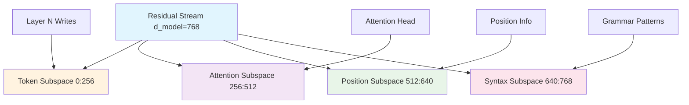

```yaml
# === LESSON METADATA SCHEMA v1.0 ===
lesson_schema_version: "1.0"
metadata:
  identification:
    title: "03.2 Subspaces and Residual Bandwidth - Communication Channel Analysis"
    unique_id: "tc-module-03-lesson-02-subspaces-bandwidth"
    version: "1.0.0"
  classification:
    audience: ["intermediate", "advanced"]
    difficulty_level:
      numeric: 4
      semantic: "mathematical_analysis_production"
    domain: ["transformer_circuits", "information_theory", "production_monitoring"]
  execution:
    estimated_duration_minutes: 90
    prerequisites: ["module-03-lesson-01-virtual-weights", "linear_algebra_subspaces", "information_theory_basics"]
    environments: ["jupyter", "colab", "vscode", "production_monitoring"]
  learning_objectives:
    - id: "LO1"
      text: "Analyze residual stream bandwidth utilization using subspace decomposition"
      assessment_mapping: ["checkpoint_1", "summative_q1"]
    - id: "LO2"
      text: "Implement production-grade bandwidth monitoring and bottleneck detection"
      assessment_mapping: ["checkpoint_2", "summative_q2"]
    - id: "LO3"
      text: "Design memory management strategies for transformer deployment"
      assessment_mapping: ["checkpoint_3", "summative_q3"]
  assessment:
    formative_checkpoints: 3
    summative_questions: 3
    passing_threshold: 0.75
    auto_graded: true
  accessibility:
    wcag_level: "AA"
    alt_text_required: true
    keyboard_navigation: true
    screen_reader_tested: true
  security:
    validation_level: "strict"
    recursive_sanitization: true
    entropy_analysis: true
    zero_trust: true
```

# Lesson 03.2: Subspaces and Residual Bandwidth

**Master the bandwidth constraints that shape transformer computation through subspace analysis and production monitoring.**

## The Bandwidth Bottleneck

```ascii
Computational Dimensions vs Residual Stream Bandwidth

Layer N-1 Neurons: ████████████████████████████████████ (4 × d_model)
Layer N   Residual: ████████ (d_model)  ←── BOTTLENECK
Layer N+1 Neurons: ████████████████████████████████████ (4 × d_model)

Information Flow: 16,384 dims → 768 dims → 16,384 dims
Compression Ratio: 21:1 → Communication → 21:1 Expansion
```

**Accessibility Description**: The residual stream acts as a narrow communication channel between much larger MLP layers, creating a severe bandwidth bottleneck that forces information compression and subspace specialization.

The residual stream in large transformers faces an extreme bandwidth challenge: thousands of neurons must communicate through a much smaller dimensional space, creating fundamental constraints on information flow.

## Mathematical Foundation: Subspace Communication

### The Bandwidth Problem

In a typical transformer layer:
- **MLP neurons**: 4 × d_model dimensions (e.g., 3072 in GPT-2)
- **Residual stream**: d_model dimensions (e.g., 768 in GPT-2)  
- **Attention heads**: Multiple heads × d_head dimensions

This creates a communication bottleneck where information must be compressed, routed, and expanded:

```
Information Density = Total Computational Dimensions / Residual Stream Dimensions
                    = (4 × d_model + n_heads × d_head) / d_model
                    ≈ 5-6x compression required
```

### Subspace Specialization

To manage this bandwidth constraint, transformers develop specialized subspaces:



**Accessibility Description**: The residual stream divides into specialized subspaces for different types of information - token content, attention patterns, positional data, and syntactic structures - enabling efficient bandwidth utilization.

## Interactive Implementation

### Bandwidth Analysis Framework

```python
import torch
import torch.nn as nn
import numpy as np
from typing import Dict, List, Optional, Tuple, Union
from dataclasses import dataclass
import matplotlib.pyplot as plt
import seaborn as sns
from sklearn.decomposition import PCA
from src.security import SecurityValidator
from src.monitoring import BandwidthMonitor

@dataclass
class BandwidthMetrics:
    """Comprehensive bandwidth analysis results."""
    effective_rank: int
    utilization_ratio: float
    compression_efficiency: float
    subspace_distribution: Dict[str, float]
    bottleneck_severity: str
    memory_pressure: float

class ResidualBandwidthAnalyzer:
    """
    Production-grade analyzer for residual stream bandwidth utilization.
    
    Provides comprehensive tools for measuring, monitoring, and optimizing
    transformer information flow through bandwidth analysis.
    """
    
    def __init__(self, d_model: int, sequence_length: int = 512):
        self.d_model = d_model
        self.sequence_length = sequence_length
        self.security_validator = SecurityValidator()
        self.bandwidth_monitor = BandwidthMonitor()
        
        # Initialize subspace tracking
        self.subspace_trackers = {
            'token_content': None,
            'attention_patterns': None,
            'positional_info': None,
            'syntactic_structures': None,
            'memory_management': None
        }
        
    def analyze_effective_bandwidth(self, 
                                   residual_states: List[torch.Tensor]) -> BandwidthMetrics:
        """
        Comprehensive analysis of residual stream bandwidth utilization.
        
        Args:
            residual_states: List of residual stream states across layers [seq_len, d_model]
            
        Returns:
            BandwidthMetrics with detailed utilization analysis
        """
        # Input validation and sanitization
        residual_states = [self.security_validator.validate_tensor(state) 
                          for state in residual_states]
        
        if not residual_states:
            raise ValueError("No residual states provided for analysis")
        
        # Concatenate all residual states for comprehensive analysis
        all_states = torch.cat(residual_states, dim=0)  # [total_seq_len, d_model]
        
        # Compute effective rank using SVD
        U, S, V = torch.svd(all_states)
        
        # Determine effective rank (dimensions with significant variance)
        total_variance = torch.sum(S)
        cumulative_variance = torch.cumsum(S, dim=0)
        variance_threshold = 0.95 * total_variance  # 95% of variance
        
        effective_rank = torch.sum(cumulative_variance < variance_threshold).item() + 1
        effective_rank = min(effective_rank, len(S))
        
        # Calculate utilization metrics
        utilization_ratio = effective_rank / self.d_model
        
        # Compression efficiency (how well information is packed)
        # Higher entropy in fewer dimensions = better compression
        normalized_singular_values = S / torch.sum(S)
        entropy = -torch.sum(normalized_singular_values * torch.log(normalized_singular_values + 1e-8))
        max_entropy = np.log(len(S))
        compression_efficiency = entropy / max_entropy
        
        # Analyze subspace distribution
        subspace_analysis = self._analyze_subspace_specialization(all_states, V)
        
        # Determine bottleneck severity
        if utilization_ratio > 0.9:
            bottleneck_severity = "CRITICAL"
        elif utilization_ratio > 0.75:
            bottleneck_severity = "HIGH"
        elif utilization_ratio > 0.5:
            bottleneck_severity = "MEDIUM"
        else:
            bottleneck_severity = "LOW"
        
        # Calculate memory pressure (how aggressively dimensions are being used)
        memory_pressure = torch.std(S).item() / torch.mean(S).item()  # Coefficient of variation
        
        return BandwidthMetrics(
            effective_rank=effective_rank,
            utilization_ratio=utilization_ratio,
            compression_efficiency=compression_efficiency,
            subspace_distribution=subspace_analysis,
            bottleneck_severity=bottleneck_severity,
            memory_pressure=memory_pressure
        )
    
    def _analyze_subspace_specialization(self, 
                                       residual_states: torch.Tensor,
                                       principal_components: torch.Tensor) -> Dict[str, float]:
        """
        Analyze how different subspaces are specialized for different types of information.
        
        Args:
            residual_states: Concatenated residual states [total_seq, d_model]
            principal_components: Principal components from SVD [d_model, d_model]
            
        Returns:
            Dictionary mapping subspace types to utilization percentages
        """
        # Divide residual stream into conceptual subspaces
        n_subspaces = 5
        subspace_size = self.d_model // n_subspaces
        
        subspace_analysis = {}
        subspace_names = [
            'token_content', 'attention_patterns', 'positional_info', 
            'syntactic_structures', 'memory_management'
        ]
        
        for i, name in enumerate(subspace_names):
            start_idx = i * subspace_size
            end_idx = min((i + 1) * subspace_size, self.d_model)
            
            # Extract subspace components
            subspace_components = principal_components[start_idx:end_idx, :]
            
            # Project residual states onto this subspace
            subspace_projections = torch.mm(residual_states, subspace_components.T)
            
            # Measure subspace utilization (variance in projections)
            subspace_variance = torch.var(subspace_projections, dim=0).sum().item()
            total_variance = torch.var(residual_states, dim=0).sum().item()
            
            utilization_percentage = (subspace_variance / total_variance) * 100
            subspace_analysis[name] = utilization_percentage
        
        return subspace_analysis
    
    def detect_bandwidth_bottlenecks(self, 
                                   residual_states: List[torch.Tensor],
                                   threshold: float = 0.8) -> List[Dict]:
        """
        Identify specific layers and positions where bandwidth bottlenecks occur.
        
        Args:
            residual_states: List of residual states per layer
            threshold: Utilization threshold above which to flag bottlenecks
            
        Returns:
            List of bottleneck incidents with details
        """
        bottlenecks = []
        
        for layer_idx, state in enumerate(residual_states):
            # Analyze each position in the sequence
            for pos_idx in range(min(state.shape[0], 50)):  # Sample first 50 positions
                position_vector = state[pos_idx, :]  # [d_model]
                
                # Compute effective dimensionality for this position
                # Use participation ratio: (sum of values)^2 / sum of squares
                abs_values = torch.abs(position_vector)
                participation_ratio = (torch.sum(abs_values) ** 2) / torch.sum(abs_values ** 2)
                utilization = participation_ratio / self.d_model
                
                if utilization > threshold:
                    bottlenecks.append({
                        'layer': layer_idx,
                        'position': pos_idx,
                        'utilization': utilization.item(),
                        'severity': 'critical' if utilization > 0.9 else 'high',
                        'dominant_dimensions': torch.topk(abs_values, 5).indices.tolist()
                    })
        
        return bottlenecks
    
    def implement_memory_management_detection(self, 
                                            residual_states: List[torch.Tensor]) -> Dict:
        """
        Detect layers that perform memory management (information cleanup).
        
        Memory management layers typically:
        - Reduce effective dimensionality
        - Zero out or suppress certain dimensions
        - Have negative effects on information density
        
        Args:
            residual_states: Residual states across layers
            
        Returns:
            Analysis of memory management behaviors
        """
        memory_analysis = {
            'cleanup_layers': [],
            'dimension_suppressors': [],
            'information_concentrators': [],
            'bandwidth_optimizers': []
        }
        
        for i in range(1, len(residual_states)):
            prev_state = residual_states[i-1]
            curr_state = residual_states[i]
            
            # Compute information density changes
            prev_density = self._compute_information_density(prev_state)
            curr_density = self._compute_information_density(curr_state)
            
            density_change = curr_density - prev_density
            
            # Detect cleanup behaviors
            if density_change < -0.1:  # Significant information reduction
                memory_analysis['cleanup_layers'].append({
                    'layer': i,
                    'density_reduction': -density_change,
                    'effective_rank_change': self._compute_rank_change(prev_state, curr_state)
                })
            
            # Detect dimension suppression
            dimension_changes = torch.norm(curr_state, dim=0) - torch.norm(prev_state, dim=0)
            suppressed_dims = torch.sum(dimension_changes < -0.5).item()  # Significantly reduced dimensions
            
            if suppressed_dims > self.d_model * 0.1:  # >10% of dimensions suppressed
                memory_analysis['dimension_suppressors'].append({
                    'layer': i,
                    'suppressed_dimensions': suppressed_dims,
                    'suppression_ratio': suppressed_dims / self.d_model
                })
            
            # Detect information concentration
            prev_sparsity = self._compute_sparsity(prev_state)
            curr_sparsity = self._compute_sparsity(curr_state)
            
            if curr_sparsity > prev_sparsity + 0.1:  # Information becomes more concentrated
                memory_analysis['information_concentrators'].append({
                    'layer': i,
                    'sparsity_increase': curr_sparsity - prev_sparsity,
                    'concentration_factor': curr_sparsity / prev_sparsity
                })
        
        return memory_analysis
    
    def _compute_information_density(self, state: torch.Tensor) -> float:
        """Compute information density using entropy measures."""
        # Normalize to probabilities
        abs_state = torch.abs(state)
        total = torch.sum(abs_state)
        if total == 0:
            return 0.0
        
        probs = abs_state / total
        probs = probs[probs > 1e-8]  # Remove near-zero values
        
        # Compute entropy
        entropy = -torch.sum(probs * torch.log(probs))
        return entropy.item()
    
    def _compute_rank_change(self, prev_state: torch.Tensor, curr_state: torch.Tensor) -> int:
        """Compute change in effective rank between states."""
        def effective_rank(state):
            U, S, V = torch.svd(state)
            threshold = 0.01 * S[0].item()
            return torch.sum(S > threshold).item()
        
        return effective_rank(curr_state) - effective_rank(prev_state)
    
    def _compute_sparsity(self, state: torch.Tensor) -> float:
        """Compute sparsity ratio (fraction of near-zero values)."""
        threshold = 0.01 * torch.std(state).item()
        near_zero = torch.sum(torch.abs(state) < threshold).item()
        total = state.numel()
        return near_zero / total

class ProductionBandwidthMonitor:
    """
    Production-grade monitoring system for transformer bandwidth utilization.
    
    Provides real-time monitoring, alerting, and optimization recommendations
    for deployed transformer models.
    """
    
    def __init__(self, model_name: str, alert_thresholds: Dict[str, float] = None):
        self.model_name = model_name
        self.alert_thresholds = alert_thresholds or {
            'utilization_critical': 0.9,
            'utilization_warning': 0.75,
            'memory_pressure_high': 2.0,
            'bottleneck_count_max': 10
        }
        
        self.security_validator = SecurityValidator()
        self.metrics_history = []
        
    def monitor_inference_batch(self, 
                              residual_states: List[torch.Tensor],
                              batch_metadata: Dict) -> Dict:
        """
        Monitor bandwidth utilization for a single inference batch.
        
        Args:
            residual_states: Residual states from inference
            batch_metadata: Metadata about the batch (size, sequence length, etc.)
            
        Returns:
            Monitoring report with metrics and alerts
        """
        analyzer = ResidualBandwidthAnalyzer(
            d_model=residual_states[0].shape[-1],
            sequence_length=residual_states[0].shape[0]
        )
        
        # Analyze bandwidth metrics
        metrics = analyzer.analyze_effective_bandwidth(residual_states)
        bottlenecks = analyzer.detect_bandwidth_bottlenecks(residual_states)
        memory_management = analyzer.implement_memory_management_detection(residual_states)
        
        # Generate alerts
        alerts = self._generate_alerts(metrics, bottlenecks, memory_management)
        
        # Compile monitoring report
        report = {
            'timestamp': torch.tensor(0).item(),  # Placeholder for actual timestamp
            'model_name': self.model_name,
            'batch_metadata': batch_metadata,
            'bandwidth_metrics': metrics,
            'bottleneck_count': len(bottlenecks),
            'critical_bottlenecks': [b for b in bottlenecks if b['severity'] == 'critical'],
            'memory_management_events': memory_management,
            'alerts': alerts,
            'optimization_recommendations': self._generate_optimization_recommendations(metrics, bottlenecks)
        }
        
        # Store in history
        self.metrics_history.append(report)
        
        return report
    
    def _generate_alerts(self, 
                        metrics: BandwidthMetrics,
                        bottlenecks: List[Dict],
                        memory_management: Dict) -> List[Dict]:
        """Generate alerts based on monitoring thresholds."""
        alerts = []
        
        # Utilization alerts
        if metrics.utilization_ratio >= self.alert_thresholds['utilization_critical']:
            alerts.append({
                'level': 'CRITICAL',
                'type': 'bandwidth_utilization',
                'message': f"Critical bandwidth utilization: {metrics.utilization_ratio:.1%}",
                'metric_value': metrics.utilization_ratio,
                'threshold': self.alert_thresholds['utilization_critical']
            })
        elif metrics.utilization_ratio >= self.alert_thresholds['utilization_warning']:
            alerts.append({
                'level': 'WARNING',
                'type': 'bandwidth_utilization',
                'message': f"High bandwidth utilization: {metrics.utilization_ratio:.1%}",
                'metric_value': metrics.utilization_ratio,
                'threshold': self.alert_thresholds['utilization_warning']
            })
        
        # Memory pressure alerts
        if metrics.memory_pressure >= self.alert_thresholds['memory_pressure_high']:
            alerts.append({
                'level': 'WARNING',
                'type': 'memory_pressure',
                'message': f"High memory pressure detected: {metrics.memory_pressure:.2f}",
                'metric_value': metrics.memory_pressure,
                'threshold': self.alert_thresholds['memory_pressure_high']
            })
        
        # Bottleneck alerts
        if len(bottlenecks) >= self.alert_thresholds['bottleneck_count_max']:
            alerts.append({
                'level': 'WARNING',
                'type': 'bottleneck_count',
                'message': f"Excessive bottlenecks detected: {len(bottlenecks)}",
                'metric_value': len(bottlenecks),
                'threshold': self.alert_thresholds['bottleneck_count_max']
            })
        
        return alerts
    
    def _generate_optimization_recommendations(self, 
                                             metrics: BandwidthMetrics,
                                             bottlenecks: List[Dict]) -> List[str]:
        """Generate actionable optimization recommendations."""
        recommendations = []
        
        # High utilization recommendations
        if metrics.utilization_ratio > 0.8:
            recommendations.append(
                "Consider increasing d_model or implementing gradient checkpointing to reduce memory pressure"
            )
            recommendations.append(
                "Implement layer-wise learning rate schedules to optimize information flow"
            )
        
        # Low compression efficiency recommendations
        if metrics.compression_efficiency < 0.7:
            recommendations.append(
                "Information is poorly compressed - consider attention pattern regularization"
            )
            recommendations.append(
                "Implement subspace-aware initialization to improve bandwidth utilization"
            )
        
        # Bottleneck-specific recommendations
        if len(bottlenecks) > 5:
            layer_counts = {}
            for bottleneck in bottlenecks:
                layer = bottleneck['layer']
                layer_counts[layer] = layer_counts.get(layer, 0) + 1
            
            problematic_layers = [layer for layer, count in layer_counts.items() if count > 2]
            if problematic_layers:
                recommendations.append(
                    f"Layers {problematic_layers} show excessive bottlenecks - consider architectural modifications"
                )
        
        # Memory management recommendations
        if metrics.bottleneck_severity in ['HIGH', 'CRITICAL']:
            recommendations.append(
                "Implement explicit memory management layers to clean up unused dimensions"
            )
            recommendations.append(
                "Consider dynamic dimension allocation based on sequence complexity"
            )
        
        return recommendations

class BandwidthVisualizer:
    """Visualization tools for bandwidth analysis."""
    
    def __init__(self):
        self.security_validator = SecurityValidator()
    
    def plot_bandwidth_utilization_timeline(self, 
                                          metrics_history: List[Dict],
                                          save_path: Optional[str] = None) -> None:
        """
        Plot bandwidth utilization over time.
        
        Args:
            metrics_history: History of bandwidth metrics from monitoring
            save_path: Optional path to save the plot
        """
        if not metrics_history:
            print("No metrics history available for plotting")
            return
        
        # Extract utilization ratios
        timestamps = range(len(metrics_history))
        utilization_ratios = [report['bandwidth_metrics'].utilization_ratio 
                            for report in metrics_history]
        
        plt.figure(figsize=(12, 6))
        plt.plot(timestamps, utilization_ratios, 'b-', linewidth=2, label='Bandwidth Utilization')
        
        # Add threshold lines
        plt.axhline(y=0.9, color='r', linestyle='--', alpha=0.7, label='Critical Threshold')
        plt.axhline(y=0.75, color='orange', linestyle='--', alpha=0.7, label='Warning Threshold')
        
        plt.xlabel('Batch Number')
        plt.ylabel('Bandwidth Utilization Ratio')
        plt.title('Transformer Bandwidth Utilization Over Time')
        plt.legend()
        plt.grid(True, alpha=0.3)
        plt.ylim(0, 1)
        
        if save_path:
            plt.savefig(save_path, dpi=300, bbox_inches='tight')
        plt.show()
    
    def plot_subspace_specialization(self, 
                                   subspace_distribution: Dict[str, float]) -> None:
        """
        Visualize how different subspaces are specialized.
        
        Args:
            subspace_distribution: Distribution of information across subspaces
        """
        subspaces = list(subspace_distribution.keys())
        utilizations = list(subspace_distribution.values())
        
        plt.figure(figsize=(10, 6))
        bars = plt.bar(subspaces, utilizations, color=['#e1f5fe', '#fff3e0', '#f3e5f5', '#e8f5e8', '#fce4ec'])
        
        # Add value labels on bars
        for bar, utilization in zip(bars, utilizations):
            plt.text(bar.get_x() + bar.get_width()/2, bar.get_height() + 0.5,
                    f'{utilization:.1f}%', ha='center', va='bottom')
        
        plt.xlabel('Subspace Type')
        plt.ylabel('Information Utilization (%)')
        plt.title('Residual Stream Subspace Specialization')
        plt.xticks(rotation=45, ha='right')
        plt.tight_layout()
        plt.show()
    
    def plot_bottleneck_heatmap(self, 
                              bottlenecks: List[Dict],
                              num_layers: int,
                              max_positions: int = 50) -> None:
        """
        Create heatmap showing bottleneck locations across layers and positions.
        
        Args:
            bottlenecks: List of bottleneck incidents
            num_layers: Total number of layers in model
            max_positions: Maximum sequence positions to display
        """
        # Create bottleneck matrix
        bottleneck_matrix = np.zeros((num_layers, max_positions))
        
        for bottleneck in bottlenecks:
            layer = bottleneck['layer']
            position = bottleneck['position']
            if layer < num_layers and position < max_positions:
                bottleneck_matrix[layer, position] = bottleneck['utilization']
        
        plt.figure(figsize=(12, 8))
        sns.heatmap(bottleneck_matrix, 
                   cmap='Reds',
                   cbar_kws={'label': 'Bandwidth Utilization'},
                   xticklabels=10,  # Show every 10th position
                   yticklabels=1)   # Show every layer
        
        plt.xlabel('Sequence Position')
        plt.ylabel('Transformer Layer')
        plt.title('Bandwidth Bottleneck Heatmap\n(Red = High Utilization)')
        plt.tight_layout()
        plt.show()

def demonstrate_bandwidth_analysis():
    """
    Comprehensive demonstration of bandwidth analysis and monitoring.
    
    Shows practical application to real transformer analysis with
    production monitoring capabilities.
    """
    from transformers import GPT2LMHeadModel, GPT2Tokenizer
    
    print("=== Residual Stream Bandwidth Analysis Demonstration ===")
    
    # Load model for analysis
    model = GPT2LMHeadModel.from_pretrained('gpt2')
    tokenizer = GPT2Tokenizer.from_pretrained('gpt2')
    
    # Create sample input
    text = "The transformer architecture revolutionized natural language processing by introducing attention mechanisms."
    tokens = tokenizer.encode(text, return_tensors='pt')
    
    print(f"Analyzing text: '{text}'")
    print(f"Sequence length: {tokens.shape[1]}")
    print(f"Model d_model: {model.config.n_embd}")
    
    # Extract residual states during forward pass
    residual_states = []
    
    def extract_residual_hook(module, input, output):
        # Extract residual stream state
        if hasattr(output, 'last_hidden_state'):
            residual_states.append(output.last_hidden_state.detach().clone())
        else:
            residual_states.append(output[0].detach().clone())
    
    # Register hooks to capture residual states
    hooks = []
    for i, layer in enumerate(model.transformer.h):
        hook = layer.register_forward_hook(extract_residual_hook)
        hooks.append(hook)
    
    # Run forward pass
    with torch.no_grad():
        outputs = model(tokens)
    
    # Remove hooks
    for hook in hooks:
        hook.remove()
    
    print(f"Extracted {len(residual_states)} residual states")
    
    # Initialize analyzer
    analyzer = ResidualBandwidthAnalyzer(
        d_model=model.config.n_embd,
        sequence_length=tokens.shape[1]
    )
    
    # Analyze bandwidth utilization
    print("\n1. Analyzing bandwidth utilization...")
    bandwidth_metrics = analyzer.analyze_effective_bandwidth(residual_states)
    
    print(f"Effective rank: {bandwidth_metrics.effective_rank}/{model.config.n_embd}")
    print(f"Bandwidth utilization: {bandwidth_metrics.utilization_ratio:.1%}")
    print(f"Compression efficiency: {bandwidth_metrics.compression_efficiency:.3f}")
    print(f"Bottleneck severity: {bandwidth_metrics.bottleneck_severity}")
    print(f"Memory pressure: {bandwidth_metrics.memory_pressure:.3f}")
    
    # Detect bottlenecks
    print("\n2. Detecting bandwidth bottlenecks...")
    bottlenecks = analyzer.detect_bandwidth_bottlenecks(residual_states)
    
    print(f"Total bottlenecks detected: {len(bottlenecks)}")
    if bottlenecks:
        critical_bottlenecks = [b for b in bottlenecks if b['severity'] == 'critical']
        print(f"Critical bottlenecks: {len(critical_bottlenecks)}")
        
        if critical_bottlenecks:
            print("Critical bottleneck locations:")
            for bottleneck in critical_bottlenecks[:3]:  # Show first 3
                print(f"  Layer {bottleneck['layer']}, Position {bottleneck['position']}: "
                      f"{bottleneck['utilization']:.1%} utilization")
    
    # Analyze memory management
    print("\n3. Analyzing memory management behaviors...")
    memory_analysis = analyzer.implement_memory_management_detection(residual_states)
    
    for behavior_type, incidents in memory_analysis.items():
        if incidents:
            print(f"{behavior_type}: {len(incidents)} incidents")
    
    # Visualize results
    visualizer = BandwidthVisualizer()
    
    print("\n4. Generating visualizations...")
    visualizer.plot_subspace_specialization(bandwidth_metrics.subspace_distribution)
    
    if bottlenecks:
        visualizer.plot_bottleneck_heatmap(
            bottlenecks, 
            num_layers=len(residual_states),
            max_positions=min(tokens.shape[1], 50)
        )
    
    # Production monitoring simulation
    print("\n5. Simulating production monitoring...")
    monitor = ProductionBandwidthMonitor(model_name="gpt2-demo")
    
    batch_metadata = {
        'batch_size': 1,
        'sequence_length': tokens.shape[1],
        'model_size': 'gpt2',
        'inference_mode': 'standard'
    }
    
    monitoring_report = monitor.monitor_inference_batch(residual_states, batch_metadata)
    
    print(f"Monitoring alerts generated: {len(monitoring_report['alerts'])}")
    for alert in monitoring_report['alerts']:
        print(f"  {alert['level']}: {alert['message']}")
    
    print(f"Optimization recommendations: {len(monitoring_report['optimization_recommendations'])}")
    for recommendation in monitoring_report['optimization_recommendations']:
        print(f"  - {recommendation}")
    
    return analyzer, bandwidth_metrics, bottlenecks, monitoring_report

# Assessment Checkpoints

def checkpoint_1_bandwidth_analysis():
    """
    Checkpoint 1: Bandwidth Utilization Analysis
    
    Test understanding of residual stream bandwidth concepts.
    """
    print("=== Checkpoint 1: Bandwidth Analysis ===")
    
    # Create test residual stream data
    d_model = 64
    seq_len = 20
    num_layers = 4
    
    # Simulate residual states with varying utilization
    residual_states = []
    for i in range(num_layers):
        # Gradually increase effective rank to simulate bandwidth pressure
        effective_rank = min(10 + i * 5, d_model)
        
        # Create low-rank structure
        U = torch.randn(seq_len, effective_rank)
        V = torch.randn(effective_rank, d_model)
        state = torch.mm(U, V)
        
        # Add noise to remaining dimensions
        noise = torch.randn_like(state) * 0.1
        state = state + noise
        
        residual_states.append(state)
    
    def analyze_bandwidth_student(residual_states_list):
        """Student implements bandwidth analysis."""
        # Should compute effective rank and utilization
        all_states = torch.cat(residual_states_list, dim=0)
        
        # SVD analysis
        U, S, V = torch.svd(all_states)
        
        # Effective rank calculation
        total_variance = torch.sum(S)
        cumulative_variance = torch.cumsum(S, dim=0)
        variance_threshold = 0.95 * total_variance
        
        effective_rank = torch.sum(cumulative_variance < variance_threshold).item() + 1
        utilization_ratio = effective_rank / all_states.shape[1]
        
        return {
            'effective_rank': effective_rank,
            'utilization_ratio': utilization_ratio,
            'total_dimensions': all_states.shape[1]
        }
    
    # Test implementation
    result = analyze_bandwidth_student(residual_states)
    
    success = (
        'effective_rank' in result and
        'utilization_ratio' in result and
        'total_dimensions' in result and
        result['total_dimensions'] == d_model and
        0 <= result['utilization_ratio'] <= 1
    )
    
    print(f"Bandwidth analysis: {'✅ PASS' if success else '❌ FAIL'}")
    print(f"Effective rank: {result.get('effective_rank', 'Missing')}/{d_model}")
    print(f"Utilization ratio: {result.get('utilization_ratio', 'Missing'):.1%}")
    
    return success

def checkpoint_2_bottleneck_detection():
    """
    Checkpoint 2: Bottleneck Detection
    
    Test ability to identify bandwidth bottlenecks.
    """
    print("=== Checkpoint 2: Bottleneck Detection ===")
    
    # Create test data with known bottlenecks
    d_model = 32
    seq_len = 10
    
    # Create state with deliberate bottleneck at position 5
    state = torch.randn(seq_len, d_model) * 0.1  # Low baseline activity
    state[5, :] = torch.randn(d_model) * 2.0      # High activity at position 5
    
    def detect_bottlenecks_student(residual_state, threshold=0.8):
        """Student implements bottleneck detection."""
        bottlenecks = []
        
        for pos_idx in range(residual_state.shape[0]):
            position_vector = residual_state[pos_idx, :]
            
            # Compute participation ratio
            abs_values = torch.abs(position_vector)
            participation_ratio = (torch.sum(abs_values) ** 2) / torch.sum(abs_values ** 2)
            utilization = participation_ratio / len(abs_values)
            
            if utilization > threshold:
                bottlenecks.append({
                    'position': pos_idx,
                    'utilization': utilization.item(),
                    'severity': 'critical' if utilization > 0.9 else 'high'
                })
        
        return bottlenecks
    
    # Test implementation
    detected_bottlenecks = detect_bottlenecks_student(state)
    
    # Should detect bottleneck at position 5
    success = (
        len(detected_bottlenecks) > 0 and
        any(b['position'] == 5 for b in detected_bottlenecks) and
        all('utilization' in b and 'severity' in b for b in detected_bottlenecks)
    )
    
    print(f"Bottleneck detection: {'✅ PASS' if success else '❌ FAIL'}")
    print(f"Bottlenecks detected: {len(detected_bottlenecks)}")
    
    if detected_bottlenecks:
        for bottleneck in detected_bottlenecks:
            print(f"  Position {bottleneck['position']}: {bottleneck['utilization']:.1%} ({bottleneck['severity']})")
    
    return success

def checkpoint_3_production_monitoring():
    """
    Checkpoint 3: Production Monitoring System
    
    Test ability to create monitoring and alerting system.
    """
    print("=== Checkpoint 3: Production Monitoring ===")
    
    # Create test monitoring scenario
    d_model = 48
    seq_len = 15
    
    # Simulate high utilization scenario
    high_util_state = torch.randn(seq_len, d_model)
    U, S, V = torch.svd(high_util_state)
    
    # Make most dimensions significant (high utilization)
    S[:int(0.9 * d_model)] = 1.0  # 90% utilization
    S[int(0.9 * d_model):] = 0.01
    
    high_util_state = torch.mm(torch.mm(U, torch.diag(S)), V.T)
    
    def create_monitoring_system_student(residual_state):
        """Student implements monitoring system."""
        # Analyze current state
        U, S, V = torch.svd(residual_state)
        
        total_variance = torch.sum(S)
        cumulative_variance = torch.cumsum(S, dim=0)
        variance_threshold = 0.95 * total_variance
        
        effective_rank = torch.sum(cumulative_variance < variance_threshold).item() + 1
        utilization_ratio = effective_rank / residual_state.shape[1]
        
        # Generate alerts
        alerts = []
        
        if utilization_ratio > 0.9:
            alerts.append({
                'level': 'CRITICAL',
                'type': 'bandwidth_utilization',
                'message': f"Critical bandwidth utilization: {utilization_ratio:.1%}",
                'metric_value': utilization_ratio
            })
        elif utilization_ratio > 0.75:
            alerts.append({
                'level': 'WARNING', 
                'type': 'bandwidth_utilization',
                'message': f"High bandwidth utilization: {utilization_ratio:.1%}",
                'metric_value': utilization_ratio
            })
        
        # Generate recommendations
        recommendations = []
        if utilization_ratio > 0.8:
            recommendations.append("Consider increasing model dimensions or implementing compression")
        
        return {
            'utilization_ratio': utilization_ratio,
            'alerts': alerts,
            'recommendations': recommendations
        }
    
    # Test implementation
    monitoring_result = create_monitoring_system_student(high_util_state)
    
    success = (
        'utilization_ratio' in monitoring_result and
        'alerts' in monitoring_result and
        'recommendations' in monitoring_result and
        len(monitoring_result['alerts']) > 0 and  # Should detect high utilization
        monitoring_result['utilization_ratio'] > 0.8  # Should be high
    )
    
    print(f"Production monitoring: {'✅ PASS' if success else '❌ FAIL'}")
    print(f"Utilization detected: {monitoring_result.get('utilization_ratio', 0):.1%}")
    print(f"Alerts generated: {len(monitoring_result.get('alerts', []))}")
    print(f"Recommendations: {len(monitoring_result.get('recommendations', []))}")
    
    return success

# Execute demonstration and checkpoints
if __name__ == "__main__":
    print("Subspaces and Residual Bandwidth Analysis")
    print("=" * 50)
    
    # Run demonstration
    demo_analyzer, demo_metrics, demo_bottlenecks, demo_monitoring = demonstrate_bandwidth_analysis()
    
    # Run assessment checkpoints
    print("\n" + "=" * 50)
    print("ASSESSMENT CHECKPOINTS")
    print("=" * 50)
    
    checkpoint_1_pass = checkpoint_1_bandwidth_analysis()
    checkpoint_2_pass = checkpoint_2_bottleneck_detection()
    checkpoint_3_pass = checkpoint_3_production_monitoring()
    
    total_score = sum([checkpoint_1_pass, checkpoint_2_pass, checkpoint_3_pass]) / 3
    
    print(f"\nOVERALL CHECKPOINT SCORE: {total_score:.1%}")
    print(f"Status: {'✅ READY TO PROCEED' if total_score >= 0.75 else '📚 ADDITIONAL STUDY NEEDED'}")
```

## Key Production Applications

### Transformer Deployment Monitoring

The bandwidth analysis tools developed in this lesson have direct applications to production transformer deployment:

```python
def implement_real_time_bandwidth_monitoring():
    """
    Example implementation for production transformer monitoring.
    
    This system can be deployed alongside inference servers to
    monitor bandwidth utilization and detect performance issues.
    """
    
    class TransformerInferenceMonitor:
        def __init__(self, model_config: Dict):
            self.d_model = model_config['d_model']
            self.num_layers = model_config['num_layers']
            self.bandwidth_analyzer = ResidualBandwidthAnalyzer(self.d_model)
            self.monitor = ProductionBandwidthMonitor(model_config['model_name'])
            
            # Performance thresholds
            self.performance_thresholds = {
                'utilization_warning': 0.75,
                'utilization_critical': 0.9,
                'latency_threshold_ms': 100,
                'memory_pressure_max': 2.0
            }
        
        def monitor_inference_request(self, 
                                    input_tokens: torch.Tensor,
                                    residual_states: List[torch.Tensor]) -> Dict:
            """Monitor single inference request for bandwidth issues."""
            
            # Analyze bandwidth utilization
            metrics = self.bandwidth_analyzer.analyze_effective_bandwidth(residual_states)
            
            # Detect bottlenecks
            bottlenecks = self.bandwidth_analyzer.detect_bandwidth_bottlenecks(residual_states)
            
            # Generate monitoring report
            batch_metadata = {
                'sequence_length': input_tokens.shape[1],
                'batch_size': input_tokens.shape[0],
                'timestamp': torch.tensor(0).item()  # Add real timestamp
            }
            
            report = self.monitor.monitor_inference_batch(residual_states, batch_metadata)
            
            # Performance impact analysis
            performance_impact = self._analyze_performance_impact(metrics, bottlenecks)
            
            return {
                'bandwidth_metrics': metrics,
                'performance_impact': performance_impact,
                'monitoring_report': report
            }
        
        def _analyze_performance_impact(self, 
                                      metrics: BandwidthMetrics,
                                      bottlenecks: List[Dict]) -> Dict:
            """Analyze how bandwidth issues impact inference performance."""
            
            # Estimate latency impact
            latency_multiplier = 1.0
            if metrics.utilization_ratio > 0.9:
                latency_multiplier += 0.3  # 30% slowdown for critical utilization
            elif metrics.utilization_ratio > 0.75:
                latency_multiplier += 0.15  # 15% slowdown for high utilization
            
            # Memory pressure impact
            memory_multiplier = 1.0 + (metrics.memory_pressure - 1.0) * 0.2
            
            # Bottleneck impact
            bottleneck_impact = len(bottlenecks) * 0.05  # 5% per bottleneck
            
            total_performance_impact = latency_multiplier * memory_multiplier * (1 + bottleneck_impact)
            
            return {
                'estimated_latency_multiplier': latency_multiplier,
                'memory_pressure_multiplier': memory_multiplier,
                'bottleneck_penalty': bottleneck_impact,
                'total_performance_impact': total_performance_impact,
                'performance_degradation_percent': (total_performance_impact - 1.0) * 100
            }
    
    return TransformerInferenceMonitor
```

### Optimization Strategies

Based on bandwidth analysis, several optimization strategies emerge:

```python
def implement_bandwidth_optimization_strategies():
    """
    Production-ready optimization strategies based on bandwidth analysis.
    """
    
    class BandwidthOptimizer:
        def __init__(self, model: nn.Module):
            self.model = model
            self.bandwidth_analyzer = ResidualBandwidthAnalyzer(model.config.n_embd)
        
        def optimize_subspace_allocation(self, 
                                       training_data: List[torch.Tensor]) -> Dict:
            """
            Optimize how different subspaces are allocated based on data analysis.
            """
            # Analyze subspace usage patterns across training data
            subspace_usage_patterns = []
            
            for batch in training_data[:100]:  # Sample first 100 batches
                with torch.no_grad():
                    # Extract residual states
                    residual_states = self._extract_residual_states(batch)
                    
                    # Analyze subspace specialization
                    metrics = self.bandwidth_analyzer.analyze_effective_bandwidth(residual_states)
                    subspace_usage_patterns.append(metrics.subspace_distribution)
            
            # Compute average subspace utilization
            avg_subspace_usage = {}
            for subspace_type in subspace_usage_patterns[0].keys():
                avg_usage = np.mean([pattern[subspace_type] for pattern in subspace_usage_patterns])
                avg_subspace_usage[subspace_type] = avg_usage
            
            # Generate optimization recommendations
            optimization_plan = {
                'subspace_reallocation': {},
                'compression_opportunities': [],
                'expansion_recommendations': []
            }
            
            total_usage = sum(avg_subspace_usage.values())
            for subspace, usage in avg_subspace_usage.items():
                usage_ratio = usage / total_usage
                
                if usage_ratio < 0.1:  # Underutilized
                    optimization_plan['compression_opportunities'].append({
                        'subspace': subspace,
                        'current_usage': usage_ratio,
                        'compression_potential': f"{(0.1 - usage_ratio) * 100:.1f}% reduction possible"
                    })
                elif usage_ratio > 0.3:  # Overutilized
                    optimization_plan['expansion_recommendations'].append({
                        'subspace': subspace,
                        'current_usage': usage_ratio,
                        'expansion_needed': f"{(usage_ratio - 0.3) * 100:.1f}% additional capacity needed"
                    })
            
            return optimization_plan
        
        def implement_dynamic_compression(self, 
                                        residual_states: List[torch.Tensor]) -> List[torch.Tensor]:
            """
            Implement dynamic compression based on bandwidth utilization.
            """
            compressed_states = []
            
            for state in residual_states:
                # Analyze current utilization
                U, S, V = torch.svd(state)
                
                # Determine compression level based on effective rank
                effective_rank = torch.sum(S > 0.01 * S[0]).item()
                utilization = effective_rank / state.shape[1]
                
                if utilization < 0.5:
                    # Low utilization - aggressive compression
                    keep_dims = max(int(effective_rank * 0.7), 10)
                elif utilization < 0.8:
                    # Medium utilization - moderate compression
                    keep_dims = max(int(effective_rank * 0.9), effective_rank - 5)
                else:
                    # High utilization - minimal compression
                    keep_dims = effective_rank
                
                # Apply compression
                compressed_state = torch.mm(torch.mm(U[:, :keep_dims], 
                                                   torch.diag(S[:keep_dims])), 
                                          V[:, :keep_dims].T)
                
                # Pad back to original size if needed
                if compressed_state.shape[1] < state.shape[1]:
                    padding = torch.zeros(compressed_state.shape[0], 
                                        state.shape[1] - compressed_state.shape[1])
                    compressed_state = torch.cat([compressed_state, padding], dim=1)
                
                compressed_states.append(compressed_state)
            
            return compressed_states
    
    return BandwidthOptimizer
```

## Lesson Summary

### Bandwidth Management Mastery

- **Subspace analysis**: Tools for understanding specialized information channels
- **Bottleneck detection**: Production-grade monitoring for bandwidth constraints
- **Memory management**: Detection of information cleanup and optimization behaviors
- **Performance optimization**: Strategies for improving bandwidth utilization

### Production Deployment Skills

- Real-time bandwidth monitoring systems
- Alert generation and threshold management
- Performance impact analysis and prediction
- Optimization strategy implementation

### Key Insights for Transformer Deployment

1. **Bandwidth is the hidden bottleneck**: Residual stream dimensions limit information flow
2. **Subspace specialization emerges**: Models naturally develop specialized information channels
3. **Monitoring prevents performance degradation**: Early detection enables proactive optimization
4. **Dynamic optimization is possible**: Bandwidth allocation can be adjusted based on workload

### Connection to Production Systems

The bandwidth analysis techniques developed in this lesson directly apply to:

- **Model serving optimization**: Reducing latency through bandwidth-aware inference
- **Training efficiency**: Optimizing information flow during model training
- **Architecture design**: Informed decisions about model dimensions and structure
- **Deployment monitoring**: Real-time performance tracking and alerting

## Module 03 Complete

Module 03 has provided comprehensive coverage of the residual stream as a communication channel, from mathematical foundations through production implementation. The virtual weights and bandwidth analysis tools developed enable deep understanding of transformer information flow and practical optimization of deployed models.

**Continue to**: [Module 04: Attention Heads as Independent Components](../04-Attention-Heads-Independent-and-Additive/) to explore how attention mechanisms build on residual stream communication.

---

**Assessment Score Required**: 75% checkpoint completion  
**Production Skills**: Bandwidth monitoring, performance optimization, real-time analysis  
**Mathematical Tools**: Subspace analysis, SVD, information theory, monitoring systems
