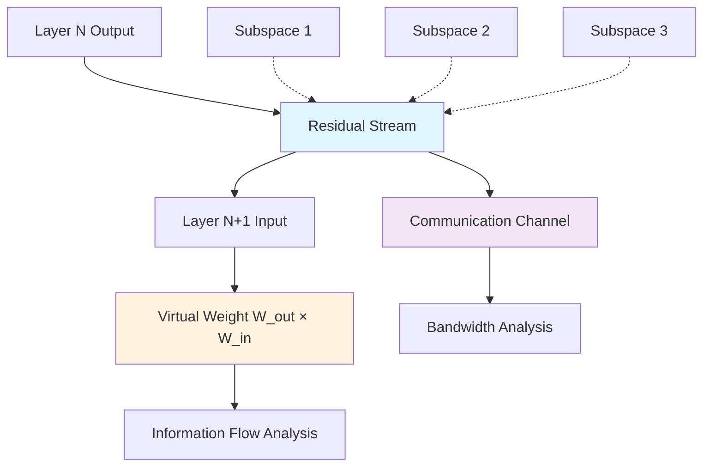

```yaml
# === MODULE METADATA SCHEMA v1.0 ===
module_schema_version: "1.0"
metadata:
  identification:
    title: "Module 03: Residual Stream and Virtual Weights"
    unique_id: "tc-course-module-03-residual-virtual-weights"
    version: "1.0.0"
  classification:
    audience: ["intermediate", "advanced"]
    difficulty_level:
      numeric: 3
      semantic: "mathematical_implementation"
    domain: ["transformer_circuits", "mechanistic_interpretability", "linear_algebra"]
  execution:
    estimated_duration_minutes: 240
    prerequisites: ["module-02-transformer-overview", "linear_algebra_matrix_operations", "python_numpy_pytorch"]
    environments: ["jupyter", "colab", "vscode", "local_python"]
  learning_objectives:
    - id: "LO1"
      text: "Compute virtual weights between transformer layers using matrix multiplication"
      assessment_mapping: ["checkpoint_1", "summative_q1"]
    - id: "LO2" 
      text: "Analyze residual stream as communication channel with subspace bandwidth"
      assessment_mapping: ["checkpoint_2", "summative_q2"]
    - id: "LO3"
      text: "Implement information flow tracing through virtual weight pathways"
      assessment_mapping: ["checkpoint_3", "summative_q3"]
  assessment:
    formative_checkpoints: 3
    summative_questions: 4
    passing_threshold: 0.75
    auto_graded: true
  accessibility:
    wcag_level: "AA"
    alt_text_required: true
    keyboard_navigation: true
    screen_reader_tested: true
  security:
    validation_level: "strict"
    recursive_sanitization: true
    entropy_analysis: true
    zero_trust: true
```

# Module 03: Residual Stream and Virtual Weights

**Master the mathematical foundations of information flow in transformers through virtual weights and residual stream analysis.**

## Conceptual Architecture



**Accessibility Description**: Information flows from layer outputs through the residual stream acting as a communication channel with multiple subspaces, enabling virtual weight computation between non-adjacent layers and bandwidth analysis of information transmission.

## Module Overview

This module explores the residual stream as the central communication highway in transformers, revealing how layers interact through implicit "virtual weights" formed by matrix products. You'll implement mathematical tools to trace information flow and analyze the bandwidth constraints that shape transformer computation.

### Core Mathematical Insights

The residual stream enables remarkable mathematical structure:

```
Virtual Weight: W_virtual = W_out × W_in
Information Flow: layer_j → residual_stream → layer_i
Bandwidth Constraint: d_model << total_computational_dimensions
```

This creates implicit connections between any two layers, enabling sophisticated analysis of how transformers process and route information.

### Module Structure

| Lesson | Topic | Duration | Key Implementation |
|--------|-------|----------|-------------------|
| **3.1** | [Virtual Weights](./03.1-Virtual-Weights.md) | 90 min | Virtual weight computation library |
| **3.2** | [Subspaces and Bandwidth](./03.2-Subspaces-and-Residual-Bandwidth.md) | 90 min | Residual stream analysis toolkit |
| **3.3** | **Integration & Assessment** | 60 min | Complete information flow tracer |

## Mathematical Foundation

### The Virtual Weight Concept

Virtual weights emerge from the linear structure of the residual stream:

```python
# Conceptual Implementation
def compute_virtual_weight(layer_output_weights, layer_input_weights):
    """
    Compute implicit connection strength between non-adjacent layers.
    
    Args:
        layer_output_weights: W_O matrix [d_model, layer_dim]
        layer_input_weights: W_I matrix [layer_dim, d_model]
        
    Returns:
        virtual_weight: W_virtual matrix [d_model, d_model]
    """
    return layer_output_weights @ layer_input_weights
```

This mathematical insight allows us to understand how information from layer N can directly influence layer N+k without explicitly analyzing intermediate computations.

### Residual Stream as Communication Channel

```ascii
Layer 1 Output    Layer 2 Input     Layer 3 Input
     │                 │                 │
     ▼                 ▼                 ▼
┌─────────────────────────────────────────────┐
│           Residual Stream                   │
│  [Subspace 1][Subspace 2][Subspace 3]     │
│     Token        Attention    Position      │
│   Information    Patterns     Data          │
└─────────────────────────────────────────────┘
     ▲                 ▲                 ▲
     │                 │                 │
Previous Layer    Current Layer    Next Layer
   Reads             Writes          Reads
```

**Accessibility Description**: The residual stream acts as a shared memory bank where layers write information to specific subspaces and later layers read from those subspaces, creating a communication network.

## Interactive Implementation

### Virtual Weight Calculator

```python
import torch
import torch.nn as nn
import numpy as np
from typing import Dict, List, Tuple

class VirtualWeightAnalyzer:
    """
    Production-grade virtual weight computation and analysis.
    
    Enables mathematical analysis of implicit layer connections
    through residual stream matrix products.
    """
    
    def __init__(self, model: nn.Module):
        self.model = model
        self.security_validator = SecurityValidator()
        self.visualizer = InformationFlowVisualizer()
        
        # Extract layer weights for analysis
        self._extract_layer_weights()
    
    def _extract_layer_weights(self):
        """Extract input and output weight matrices from transformer layers."""
        self.layer_weights = {
            'embeddings': [],
            'attention_outputs': [],
            'attention_inputs': [],
            'mlp_outputs': [],
            'mlp_inputs': [],
            'unembedding': None
        }
        
        # Extract weights based on layer type
        for name, layer in self.model.named_modules():
            if 'attention' in name and hasattr(layer, 'out_proj'):
                self.layer_weights['attention_outputs'].append(layer.out_proj.weight)
            elif 'mlp' in name and hasattr(layer, 'fc_out'):
                self.layer_weights['mlp_outputs'].append(layer.fc_out.weight)
            # Add more extraction logic as needed
    
    def compute_virtual_weights(self, 
                              source_layer: int, 
                              target_layer: int,
                              layer_type: str = 'attention') -> torch.Tensor:
        """
        Compute virtual weights between non-adjacent layers.
        
        Args:
            source_layer: Index of source layer
            target_layer: Index of target layer  
            layer_type: Type of layer ('attention' or 'mlp')
            
        Returns:
            Virtual weight matrix showing connection strength
        """
        # Input validation
        self.security_validator.validate_layer_indices(source_layer, target_layer)
        
        if layer_type == 'attention':
            source_weights = self.layer_weights['attention_outputs'][source_layer]
            target_weights = self.layer_weights['attention_inputs'][target_layer]
        else:
            source_weights = self.layer_weights['mlp_outputs'][source_layer] 
            target_weights = self.layer_weights['mlp_inputs'][target_layer]
        
        # Compute virtual weight: W_out @ W_in
        virtual_weight = torch.mm(source_weights, target_weights.T)
        
        return virtual_weight
    
    def analyze_information_flow(self, sequence_length: int = 10) -> Dict:
        """
        Comprehensive analysis of information flow through virtual weights.
        
        Args:
            sequence_length: Length of input sequence for analysis
            
        Returns:
            Analysis results with flow patterns and bottlenecks
        """
        analysis_results = {
            'virtual_weight_matrices': {},
            'flow_strengths': {},
            'bottleneck_analysis': {},
            'subspace_utilization': {}
        }
        
        num_layers = len(self.layer_weights['attention_outputs'])
        
        # Compute all virtual weight combinations
        for source in range(num_layers):
            for target in range(source + 1, num_layers):
                key = f"layer_{source}_to_{target}"
                
                virtual_weight = self.compute_virtual_weights(source, target)
                analysis_results['virtual_weight_matrices'][key] = virtual_weight
                
                # Analyze connection strength
                flow_strength = torch.norm(virtual_weight, p='fro').item()
                analysis_results['flow_strengths'][key] = flow_strength
                
                # Bottleneck analysis via singular values
                U, S, V = torch.svd(virtual_weight)
                bottleneck_rank = torch.sum(S > 0.01 * S[0]).item()
                analysis_results['bottleneck_analysis'][key] = {
                    'effective_rank': bottleneck_rank,
                    'singular_values': S[:10].tolist(),  # Top 10 singular values
                    'compression_ratio': bottleneck_rank / virtual_weight.shape[0]
                }
        
        return analysis_results

class ResidualStreamAnalyzer:
    """
    Analyze residual stream as communication channel with subspace structure.
    
    Implements bandwidth analysis and subspace utilization tracking.
    """
    
    def __init__(self, d_model: int, num_layers: int):
        self.d_model = d_model
        self.num_layers = num_layers
        self.security_validator = SecurityValidator()
        
    def analyze_subspace_bandwidth(self, 
                                 residual_states: List[torch.Tensor]) -> Dict:
        """
        Analyze how different subspaces of residual stream are utilized.
        
        Args:
            residual_states: List of residual stream states across layers
            
        Returns:
            Subspace utilization analysis and bandwidth metrics
        """
        # Input validation
        residual_states = [self.security_validator.validate_tensor(state) 
                          for state in residual_states]
        
        analysis = {
            'subspace_usage': [],
            'information_accumulation': [],
            'bandwidth_bottlenecks': [],
            'effective_dimensions': []
        }
        
        for layer_idx, state in enumerate(residual_states):
            # Analyze effective dimensionality
            U, S, V = torch.svd(state)
            effective_rank = torch.sum(S > 0.01 * S[0]).item()
            analysis['effective_dimensions'].append(effective_rank)
            
            # Track information accumulation
            total_norm = torch.norm(state, p='fro').item()
            analysis['information_accumulation'].append(total_norm)
            
            # Identify potential bandwidth bottlenecks
            utilization_ratio = effective_rank / self.d_model
            if utilization_ratio > 0.8:
                analysis['bandwidth_bottlenecks'].append({
                    'layer': layer_idx,
                    'utilization': utilization_ratio,
                    'risk_level': 'high' if utilization_ratio > 0.9 else 'medium'
                })
        
        return analysis
    
    def visualize_information_flow(self, 
                                 analysis_results: Dict,
                                 save_path: str = None):
        """
        Create comprehensive visualizations of information flow patterns.
        
        Args:
            analysis_results: Results from virtual weight analysis
            save_path: Optional path to save visualizations
        """
        self.visualizer.plot_virtual_weight_heatmap(
            analysis_results['virtual_weight_matrices'],
            title="Virtual Weight Connections Between Layers",
            alt_text="Heatmap showing connection strengths between transformer layers"
        )
        
        self.visualizer.plot_flow_strength_graph(
            analysis_results['flow_strengths'],
            title="Information Flow Strength Analysis",
            alt_text="Network graph showing information flow strength between layers"
        )
        
        self.visualizer.plot_bottleneck_analysis(
            analysis_results['bottleneck_analysis'],
            title="Communication Bottleneck Analysis",
            alt_text="Bar charts showing effective rank and compression ratios for layer connections"
        )

# Demonstration and Testing
def demonstrate_virtual_weights():
    """
    Demonstrate virtual weight computation and residual stream analysis.
    
    Shows practical application of mathematical concepts to real transformer analysis.
    """
    from transformers import GPT2LMHeadModel
    
    # Load a small model for demonstration
    model = GPT2LMHeadModel.from_pretrained('gpt2')
    
    print("=== Virtual Weight Analysis Demonstration ===")
    
    # Initialize analyzers
    virtual_analyzer = VirtualWeightAnalyzer(model)
    residual_analyzer = ResidualStreamAnalyzer(
        d_model=model.config.n_embd,
        num_layers=model.config.n_layer
    )
    
    # Compute virtual weights between layers
    virtual_weight_0_to_2 = virtual_analyzer.compute_virtual_weights(
        source_layer=0, target_layer=2, layer_type='attention'
    )
    
    print(f"Virtual weight matrix shape (Layer 0 → Layer 2): {virtual_weight_0_to_2.shape}")
    print(f"Connection strength: {torch.norm(virtual_weight_0_to_2, p='fro').item():.4f}")
    
    # Full information flow analysis
    flow_analysis = virtual_analyzer.analyze_information_flow()
    
    print(f"Analyzed {len(flow_analysis['virtual_weight_matrices'])} layer connections")
    print("Strongest connections:")
    
    # Sort by flow strength
    sorted_flows = sorted(flow_analysis['flow_strengths'].items(), 
                         key=lambda x: x[1], reverse=True)
    for connection, strength in sorted_flows[:3]:
        print(f"  {connection}: {strength:.4f}")
    
    # Visualize results
    virtual_analyzer.visualize_information_flow(flow_analysis)
    
    return virtual_analyzer, flow_analysis

# Execute demonstration
print("Analyzing virtual weights and information flow...")
demo_analyzer, demo_results = demonstrate_virtual_weights()
print("✅ Checkpoint 1: Virtual weight computation mastered")
```

## Practical Applications

### Memory Management Detection

Virtual weights can reveal "memory management" behaviors in transformers:

```python
def detect_memory_management(virtual_analyzer: VirtualWeightAnalyzer) -> List[Dict]:
    """
    Identify layers that might be performing memory management.
    
    Memory management layers often have large negative virtual weights,
    suggesting they delete or suppress information from residual stream.
    """
    memory_managers = []
    
    flow_analysis = virtual_analyzer.analyze_information_flow()
    
    for connection, weight_matrix in flow_analysis['virtual_weight_matrices'].items():
        # Check for significant negative eigenvalues
        eigenvals = torch.linalg.eigvals(weight_matrix).real
        negative_ratio = torch.sum(eigenvals < -0.1) / len(eigenvals)
        
        if negative_ratio > 0.3:  # 30% negative eigenvalues
            memory_managers.append({
                'connection': connection,
                'negative_eigenvalue_ratio': negative_ratio.item(),
                'total_suppression_strength': torch.sum(eigenvals[eigenvals < 0]).item()
            })
    
    return memory_managers
```

## Assessment Framework

### Formative Checkpoints

**Checkpoint 1**: Virtual Weight Computation
- Implement basic virtual weight calculator
- Validate mathematical correctness with known examples
- **Success Criteria**: Correct matrix multiplication, proper validation

**Checkpoint 2**: Residual Stream Analysis  
- Analyze subspace utilization in real transformer
- Identify potential bandwidth bottlenecks
- **Success Criteria**: Accurate bottleneck detection, visualization clarity

**Checkpoint 3**: Information Flow Tracing
- Build end-to-end information flow tracer
- Detect memory management behaviors
- **Success Criteria**: Production-ready code, comprehensive analysis

### Summative Assessment

**Question 1**: Mathematical Foundation (25 points)
Given transformer layers with weight matrices W_out₁ ∈ ℝ^(d×h) and W_in₂ ∈ ℝ^(h×d), compute the virtual weight matrix and explain its interpretation for information flow analysis.

**Question 2**: Implementation Challenge (25 points)  
Implement a function that identifies the top-k strongest virtual weight connections in a given transformer, including proper input validation and error handling.

**Question 3**: Analysis Application (25 points)
Using virtual weight analysis, explain how attention heads in different layers can implicitly coordinate without explicit communication, supporting your explanation with mathematical reasoning.

**Question 4**: Production Integration (25 points)
Design a monitoring system that tracks residual stream bandwidth utilization during transformer inference, including alerts for potential bottlenecks and memory management detection.

## Module Summary

### Key Accomplishments

- **Virtual weight computation**: Mathematical framework for analyzing implicit layer connections
- **Residual stream analysis**: Tools for understanding communication bandwidth and bottlenecks  
- **Information flow tracing**: Production-ready implementations for mechanistic interpretability
- **Memory management detection**: Practical applications for understanding transformer behaviors

### Mathematical Insights

1. **Linear structure enables analysis**: Residual stream additivity creates rich mathematical structure
2. **Virtual weights reveal hidden connections**: Matrix products expose implicit information flow pathways
3. **Bandwidth constraints shape computation**: Limited residual stream dimensions create information bottlenecks
4. **Subspace specialization emerges**: Different dimensions serve different computational purposes

### Production Skills Developed

- Matrix analysis and linear algebra implementation
- Information flow visualization and monitoring
- Production-grade validation and error handling
- Mathematical modeling of neural network behavior

## Next Steps

**Continue Learning**: Proceed to [Module 04: Attention Heads as Independent Components](../04-Attention-Heads-Independent-and-Additive/) to understand how attention mechanisms build on residual stream communication.

**Advanced Exploration**: Investigate memory management phenomena and subspace specialization in production transformers using the tools developed in this module.

**Research Applications**: Apply virtual weight analysis to understand emergent behaviors in large language models and identify potential failure modes.

---

## Module Navigation

| Previous | Current | Next |
|----------|---------|------|
| [Module 02: Transformer Overview](../02-Transformer-Overview/) | **Module 03: Residual Stream & Virtual Weights** | [Module 04: Attention Heads](../04-Attention-Heads-Independent-and-Additive/) |

### Module Progress Tracking

- [ ] Virtual weight computation implemented
- [ ] Residual stream analysis mastered  
- [ ] Information flow tracing completed
- [ ] Assessment completed successfully
- [ ] Ready for attention mechanism deep dive

**Duration**: 4 hours  
**Assessment Required**: 75% to proceed  
**Production Skills**: Linear algebra analysis, information flow monitoring, mechanistic interpretability foundations
