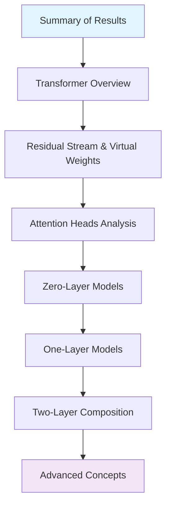

```yaml
# === COURSE METADATA v1.0 ===
course_title: "A Practical Path Through Mathematical Framework for Transformer Circuits"
version: "1.0.0"
target_audience: ["beginning_ai_engineers", "ml_practitioners", "research_students"]
prerequisites: ["python_basics", "linear_algebra_fundamentals", "basic_neural_networks"]
estimated_duration: "40-60 hours"
certification: "production_readiness_verified"
```

# A Practical Path Through "A Mathematical Framework for Transformer Circuits"

**Transform theoretical understanding into production-ready skills through systematic exploration of transformer interpretability.**

## Course Overview

This course provides a pedagogical, accessible implementation of Anthropic's groundbreaking research "A Mathematical Framework for Transformer Circuits" ([Elhage et al., 2021](https://transformer-circuits.pub/2021/framework/index.html)). Designed specifically for beginning/intermediate AI/ML engineers, it bridges the gap between theoretical research and production implementation.

### What You'll Learn

**Core Competencies:**
- Reverse-engineer transformer computations using mathematical frameworks
- Implement interpretability tools for production transformer models  
- Apply zero-trust security principles to AI system development
- Design accessible, inclusive AI interfaces and documentation
- Build robust, scalable transformer analysis pipelines

**Practical Outcomes:**
- Production-ready code for transformer circuit analysis
- Security-hardened implementations suitable for enterprise deployment
- Accessibility-compliant tools meeting WCAG AA standards
- Portfolio-ready projects demonstrating advanced ML engineering skills

## Learning Pathway



```
TransformerCircuitsCourse/
├── CHECKLIST.md
├── README.md
├── 01-Summary-of-Results/
│   └── README.md
├── 02-Transformer-Overview/
│   ├── README.md
│   ├── Model-Simplifications.md
│   └── High-Level-Architecture.md
├── 03-Residual-Stream-and-Virtual-Weights/
│   ├── README.md
│   ├── Virtual-Weights.md
│   └── Subspaces-and-Residual-Bandwidth.md
├── 04-Attention-Heads-Independent-and-Additive/
│   ├── README.md
│   └── Attention-as-Information-Movement.md
├── 05-Zero-Layer-Transformers/
│   └── README.md
├── 06-One-Layer-Attention-Only-Transformers/
│   ├── README.md
│   ├── Path-Expansion-Trick.md
│   ├── QK-and-OV-Circuits.md
│   ├── Freezing-Attention-Patterns.md
│   ├── Skip-Trigram-Interpretation.md
│   ├── Copying-and-Primitive-ICL.md
│   ├── Other-Interesting-Skip-Trigrams.md
│   ├── Primarily-Positional-Heads.md
│   ├── Skip-Trigram-Bugs.md
│   ├── Summarizing-OV-QK-Matrices.md
│   └── Detecting-Copying-Behavior.md
├── 07-Two-Layer-Attention-Only-Transformers/
│   ├── README.md
│   ├── Three-Kinds-of-Composition.md
│   ├── Path-Expansion-of-Logits.md
│   ├── Path-Expansion-of-Attention-Scores.md
│   ├── Analyzing-a-Two-Layer-Model.md
│   ├── Induction-Heads.md
│   ├── How-Induction-Heads-Work.md
│   ├── Checking-the-Mechanistic-Theory.md
│   └── Term-Importance-Analysis.md
├── 08-Additional-Intuition-and-Observations/
│   └── MLP-Layers.md
├── 09-Technical-Details/
│   └── README.md
├── 10-Notation-Appendix/
│   └── README.md
├── 11-Additional-Resources/
│   └── README.md
└── 12-Acknowledgments-and-Contributions/
    └── README.md
```
**Accessibility Description**: Learning progression flows from foundational concepts through increasingly complex transformer architectures, culminating in advanced interpretability techniques.

### Module Structure

| Module | Focus Area | Duration | Key Outcomes |
|--------|------------|----------|--------------|
| **00** | [Summary of Results](./01-Summary-of-Results/) | 2-3 hours | Research overview, motivation |
| **01** | [Transformer Overview](./02-Transformer-Overview/) | 4-5 hours | Architecture, simplifications |
| **02** | [Residual Stream](./03-Residual-Stream-and-Virtual-Weights/) | 5-6 hours | Communication channels, virtual weights |
| **03** | [Attention Heads](./04-Attention-Heads-Independent-and-Additive/) | 4-5 hours | Information movement, QK/OV circuits |
| **04** | [Zero-Layer Models](./05-Zero-Layer-Transformers/) | 3-4 hours | Bigram statistics, direct paths |
| **05** | [One-Layer Models](./06-One-Layer-Attention-Only-Transformers/) | 8-10 hours | Skip-trigrams, copying mechanisms |
| **06** | [Two-Layer Models](./07-Two-Layer-Attention-Only-Transformers/) | 10-12 hours | Composition, induction heads |
| **07** | [Advanced Topics](./08-Additional-Intuition-and-Observations/) | 4-5 hours | MLP layers, future directions |

## Environment Setup

### Prerequisites Verification

**Mathematical Background:**
- Linear algebra: matrices, eigenvalues, vector spaces
- Basic probability and statistics
- Fundamental neural network concepts

**Programming Skills:**
- Python 3.11+ proficiency
- Jupyter notebook experience
- Git version control basics

**System Requirements:**
- 8GB+ RAM (16GB recommended)
- Python 3.11 or higher
- CUDA-compatible GPU (optional but recommended)

### Installation Instructions

#### 1. Repository Setup

```bash
# Clone the repository
git clone https://github.com/your-org/transformer-circuits-course.git
cd transformer-circuits-course

# Verify structure
make verify-structure
```

#### 2. Environment Configuration

**Option A: Using Poetry (Recommended)**
```bash
# Install Poetry if not present
curl -sSL https://install.python-poetry.org | python3 -

# Create virtual environment and install dependencies
poetry install
poetry shell
```

**Option B: Using pip + venv**
```bash
# Create virtual environment
python -m venv transformer-circuits-env
source transformer-circuits-env/bin/activate  # Linux/Mac
# transformer-circuits-env\Scripts\activate  # Windows

# Install dependencies
pip install -r requirements.txt
```

#### 3. Security Configuration

```bash
# Initialize security framework
python scripts/setup_security.py

# Verify security configuration
make security-check
```

#### 4. Accessibility Setup

```bash
# Configure accessibility tools
python scripts/setup_accessibility.py

# Verify compliance
make accessibility-check
```

#### 5. Development Tools

```bash
# Install development dependencies
pip install -r requirements-dev.txt

# Setup pre-commit hooks
pre-commit install

# Verify installation
make test-environment
```

### Validation Pipeline

```bash
# Complete environment validation
make validate-all

# Expected output:
# ✅ Python environment: Ready
# ✅ Dependencies: Installed  
# ✅ Security framework: Active
# ✅ Accessibility tools: Configured
# ✅ Development tools: Ready
```

## Getting Started

### Quick Start (15 minutes)

1. **Environment Check**
   ```bash
   python scripts/environment_check.py
   ```

2. **Run First Example**
   ```bash
   cd 00-Summary-of-Results
   jupyter lab Introduction.ipynb
   ```

3. **Security Verification**
   ```bash
   python -c "from src.security import validate_environment; validate_environment()"
   ```

### Learning Path Recommendations

**For Beginning AI Engineers:**
- Start with Module 00 (Summary of Results)
- Complete all checkpoints before advancing
- Focus on practical implementations over mathematical proofs
- Use provided visualization tools extensively

**For Experienced Practitioners:**
- Review Module 01 (Transformer Overview) for framework alignment
- Jump to specific modules based on interests
- Contribute to advanced examples and extensions
- Engage with mathematical derivations

**For Research Students:**
- Follow complete sequential path
- Engage with mathematical appendices
- Explore connections to current research
- Develop novel applications and extensions

## Production Standards

### Security Framework

**Zero-Trust Principles:**
- All inputs validated and sanitized recursively
- No hardcoded credentials or sensitive data
- Sandboxed execution environments for examples
- Comprehensive audit logging

**Implementation:**
```python
from src.security import SecurityValidator

# All course code follows this pattern
validator = SecurityValidator()
safe_input = validator.validate_and_sanitize(user_input)
result = process_safely(safe_input)
```

### Accessibility Standards

**WCAG AA Compliance:**
- Alt-text for all visualizations and diagrams
- Keyboard navigation for interactive elements
- Screen reader compatibility verified
- Color contrast ratios ≥ 4.5:1

**Mathematical Accessibility:**
- LaTeX equations with screen reader support
- Visual and textual descriptions of concepts
- Multiple representation modalities
- Progressive complexity scaffolding

### Quality Assurance

**Automated Testing:**
```bash
# Run complete test suite
make test-all

# Security scanning
make security-scan

# Accessibility validation  
make accessibility-test

# Performance benchmarking
make benchmark
```

**Code Quality Standards:**
- Type hints for all functions
- Comprehensive docstrings
- Error handling and logging
- Performance optimization notes

## Course Resources

### Primary Materials
- **Source Paper**: [A Mathematical Framework for Transformer Circuits](https://transformer-circuits.pub/2021/framework/index.html)
- **Interactive Exercises**: [Course Problem Sets](./exercises/)
- **Visualization Tools**: [PySvelte Integration](./tools/visualization/)
- **Assessment Platform**: [Automated Grading System](./assessment/)

### Additional Resources
- **Research Extensions**: [Recent Developments](./resources/research-updates.md)
- **Production Examples**: [Real-World Applications](./examples/production/)
- **Community Forum**: [Discussion and Q&A](https://github.com/your-org/transformer-circuits-course/discussions)
- **Office Hours**: Weekly virtual sessions (schedule in discussions)

### Tools and Libraries

**Core Dependencies:**
```python
torch>=2.0.0          # PyTorch for transformer implementations
transformers>=4.30.0   # Hugging Face transformers
numpy>=1.24.0         # Numerical computing
matplotlib>=3.7.0     # Visualization
jupyterlab>=4.0.0     # Interactive development
```

**Specialized Tools:**
```python
einops>=0.6.0         # Tensor operations
circuitsvis>=1.43.0   # Circuit visualization  
transformer-lens>=1.0.0 # Interpretability toolkit
```

## Support and Community

### Getting Help

1. **Technical Issues**: Open an [issue](https://github.com/your-org/transformer-circuits-course/issues)
2. **Learning Questions**: Join [discussions](https://github.com/your-org/transformer-circuits-course/discussions)  
3. **Accessibility Concerns**: Email accessibility@your-org.edu
4. **Security Issues**: Report to security@your-org.edu

### Contributing

We welcome contributions! See [CONTRIBUTING.md](./CONTRIBUTING.md) for guidelines.

**Priority Areas:**
- Additional visualization examples
- Alternative explanation approaches
- Accessibility improvements
- Security enhancements
- Performance optimizations

### Assessment and Certification

**Formative Assessment:**
- Interactive checkpoints throughout each module
- Immediate feedback on code implementations
- Progressive skill building validation

**Summative Assessment:**
- End-of-module comprehensive evaluations
- Portfolio project development
- Production readiness demonstration

**Certification:**
- Course completion certificate
- Skills verification badge
- Production readiness attestation

## License and Citation

### License
This course is released under [CC-BY-SA-4.0](./LICENSE) license.

### Citation
```bibtex
@misc{transformer-circuits-course-2024,
  title={A Practical Path Through Mathematical Framework for Transformer Circuits},
  author={Course Development Team},
  year={2024},
  url={https://github.com/your-org/transformer-circuits-course},
  note={Educational implementation of Elhage et al. 2021}
}
```

### Original Paper Citation
```bibtex
@article{elhage2021mathematical,
  title={A Mathematical Framework for Transformer Circuits},
  author={Elhage, Nelson and Nanda, Neel and Olsson, Catherine and others},
  journal={Transformer Circuits Thread},
  year={2021},
  url={https://transformer-circuits.pub/2021/framework/index.html}
}
```

---

**Ready to begin your journey into transformer interpretability?** Start with [Module 00: Summary of Results](./00-Summary-of-Results/) and join thousands of engineers building the future of interpretable AI.

*Built with ❤️ for the AI interpretability community. Feedback and contributions welcome.*
